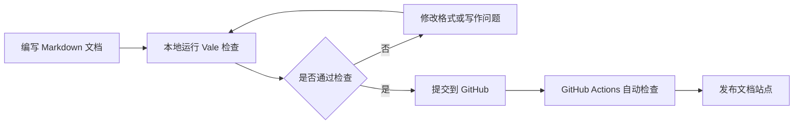

# 文档质量自动化流水线

## 项目概览

这是一个基于 Markdown、Vale、GitHub Actions 和 MkDocs 搭建的文档质量自动化项目。

它模拟了一个轻量级 Docs-as-Code 工作流：作者在本地编写 Markdown 文档，通过 Vale 检查写作风格、术语和格式问题；提交代码后，再由 GitHub Actions 自动运行检查流程，降低人工检查成本，并提升文档的一致性和可维护性。

这个项目从搭建网站开始，继续把写作规则、自动检查、发布和维护接进同一条工作流。

## 背景与问题

在技术文档写作和协作过程中，常见问题包括：

- 中英文混排格式不一致；
- 术语和表达方式不统一；
- 写作风格依赖人工判断；
- 文档提交后才发现格式或风格问题；
- 缺少可重复执行的文档质量检查流程；
- Reviewer 需要花大量时间处理低级格式问题。

如果这些问题只依赖人工审查，文档质量会高度依赖个人经验，也不利于长期维护。

## 解决方案

本项目使用 Docs-as-Code 思路，把文档当作代码一样管理和检查。

整体流程包括：

1. 使用 Markdown 编写结构化文档；
2. 使用 Vale 定义写作规则和格式检查规则；
3. 在本地运行 Vale，提前发现文档问题；
4. 使用 GitHub Actions 在提交后自动运行检查；
5. 使用 MkDocs Material 构建和发布文档站点；
6. 通过 Changelog 记录文档结构和内容变化。

## 文档结构

这个项目下包含以下文档：

- **Quick Start**：帮助读者快速搭建本地文档质量检查环境；
- **Writing Style Guide**：说明本项目采用的写作规范和示例；
- **GitHub Actions Workflow**：说明自动化检查流程如何接入提交过程；
- **Troubleshooting**：整理 Vale、VS Code 插件和 GitHub Actions 常见问题；
- **Changelog**：记录文档结构、规则和内容的更新过程。

## 使用工具

| 工具 | 作用 |
|---|---|
| Markdown | 编写结构化技术文档 |
| Vale | 检查写作风格、术语和自定义规则 |
| GitHub Actions | 在提交后自动运行文档检查 |
| MkDocs Material | 构建和发布静态文档站点 |
| Mermaid | 绘制轻量级流程图 |
| Git | 管理版本历史和协作流程 |

## 工作流

## 我为什么这样组织这个项目

这个项目把同一套内容拆成 Quick Start、Style Guide、Workflow、Troubleshooting 和 Changelog。每个页面负责一类读者任务，事实和规则尽量只维护一份。

Vale 处理可以重复检查的术语与格式，GitHub Actions 把检查接入提交过程，MkDocs 负责导航、搜索和发布。这样安排以后，文档从写完一页继续走到检查、反馈、修复和更新。

## 推荐阅读路径

如果你是第一次阅读这个项目，建议按以下顺序查看：

1. [快速开始](install.md)：先搭建本地文档质量检查环境；
2. [写作风格指南](style-guide.md)：了解本项目采用的写作规则；
3. [故障排查](troubleshooting.md)：查看常见问题和排查方式；
4. [更新记录](changelog.md)：了解这个文档项目的迭代记录。
