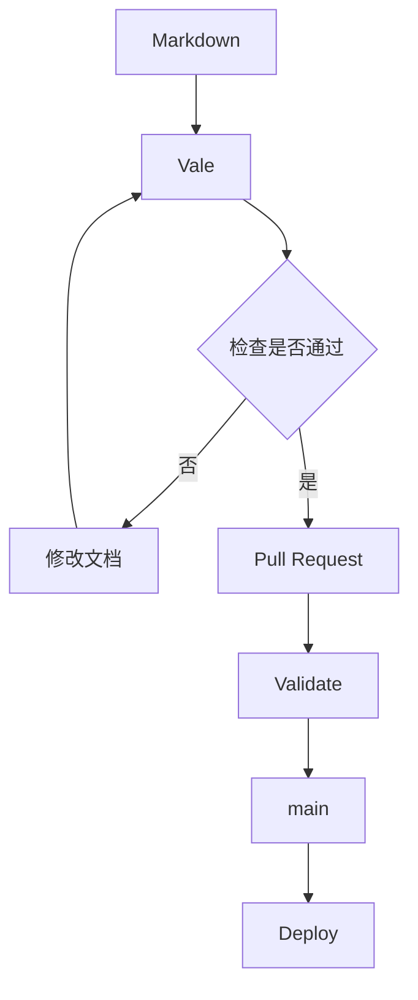

# 文档质量自动化流水线

## 项目概览

技术文档进入版本库之后，写作规范、术语、构建错误和发布问题如果主要依赖人工检查，往往要到 Review 或部署阶段才会暴露。

这个项目尝试把能够自动判断的问题提前到写作和提交阶段处理。

我使用 Markdown、Vale、MkDocs 和 GitHub Actions 搭建了一条 Docs-as-Code 工作流：

**编写文档 → 本地检查 → Pull Request 验证 → main 验证 → 发布**

其中：

- Vale 负责执行可自动化的写作规则检查；
- MkDocs 检查文档站是否能够正常构建；
- GitHub Actions 在提交后自动运行验证流程；
- 验证通过的 main 提交才继续执行部署。

这个项目同时配套 Quick Start、Writing Style Guide、GitHub Actions Workflow、Troubleshooting 和 Changelog，用于使用、解释和维护这套流程。

## 背景与问题

这个项目主要解决三个问题：

- 写作规范和术语缺少统一、可执行的检查；
- 文档构建问题可能直到发布阶段才被发现；
- Review 需要重复处理一些工具本可以提前发现的问题。

## 解决方案

整体流程分为五个阶段：

### 1. 编写

使用 Markdown 编写和维护文档。

### 2. 本地检查

提交之前运行 Vale，提前发现写作规则问题。

### 3. Pull Request 验证

提交 Pull Request 后，由 GitHub Actions 自动执行文档质量检查和 MkDocs 构建验证。

### 4. main 验证

代码合并或直接 push 到 main 后，再次执行验证。

### 5. 发布

验证成功后继续部署文档站。

```mermaid
flowchart TB
    A[Markdown] --> B[Vale]
    B --> C{检查是否通过}
    C -- 否 --> D[修改文档]
    D --> B
    C -- 是 --> E[Pull Request]
    E --> F[Validate]
    F --> G[main]
    G --> H[Deploy]
```

## 文档结构

这个项目按照不同任务拆成多个页面：

- **项目概览**：了解项目为什么存在，以及整体解决方案；
- **验证结果**：查看工作流是否真实运行；
- **快速开始**：搭建本地文档检查环境；
- **写作风格指南**：查看项目使用的写作规则；
- **GitHub Actions 工作流**：理解自动检查和发布逻辑；
- **故障排查**：处理 Vale、MkDocs 和 GitHub Actions 的常见问题；
- **更新记录**：追踪项目结构、规则和工作流的变化。

> 阅读者不需要从头阅读全部内容，可以按照当前任务直接进入对应页面。

## 技术栈

**Markdown · Vale · MkDocs Material · GitHub Actions · Git · Mermaid**

## 我为什么这样组织这个项目

这个项目没有把规则、操作步骤、自动化实现和故障处理全部写在一篇长文里。

我把内容按照任务拆开：

- 想快速理解项目，可以只看项目概览；
- 想判断项目是否真实运行，可以直接看验证结果；
- 想实际使用，可以进入快速开始；
- 想理解自动化机制，再进入 GitHub Actions 工作流；
- 出现问题时，可以直接进入故障排查。

这样做的目的是降低查找成本，同时让每个页面承担一个明确任务。

## 继续查看

1. [查看验证结果](core-projects/docs-engineering/validation-results.md)
2. [搭建本地检查环境](install.md)
3. [查看 GitHub Actions 工作流](github-actions-workflow.md)
4. [阅读写作风格指南](style-guide.md)
5. [故障排查](troubleshooting.md)
