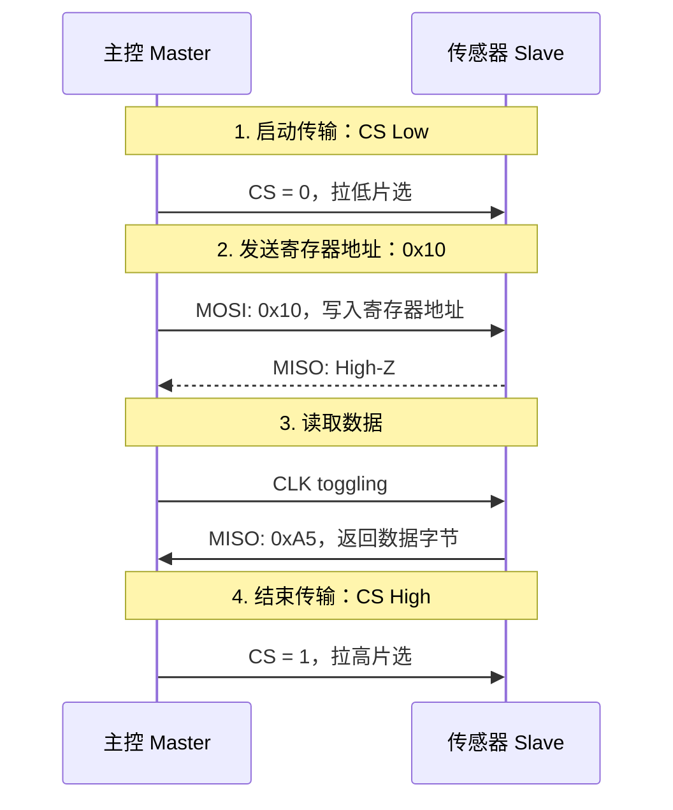

# 芯片数据手册重构：把静态 PDF 改成开发者友好的 Web 文档

## 项目背景

硬件数据手册通常很厚，动不动几百页。里面有寄存器、时序图、电气参数、通信协议、配置说明。信息都在，但开发者真正用起来时，经常还是很痛苦。

我在整理这个案例时，想模拟一个真实场景：

软件工程师需要基于某个传感器芯片写驱动。
他手里有一份 PDF 数据手册，但他真正关心的是：

* SPI 怎么读写；
* 寄存器地址是什么；
* 每个 bit 控制什么功能；
* 初始化代码应该怎么写；
* 配置完之后怎样确认逻辑没错。

如果这些信息散在 PDF 的不同章节里，开发者就会不断翻页、搜索、截图、手敲参数。效率低，也容易出错。

所以我把这个案例当成一次“资料重构”练习：把静态 PDF 里的关键信息，整理成更适合开发者阅读和复用的 Web 文档。

## 原始痛点

我主要关注 3 个问题。

### 1. 信息检索成本高

PDF 数据手册里通常会有大量寄存器和配置说明。
开发者想找一个寄存器地址，可能要在目录、表格、正文之间来回跳。

如果文档没有清楚的结构，`Ctrl + F` 只能解决一部分问题。关键词搜到了，也不一定能马上理解上下文。

### 2. 时序图不够友好

很多数据手册里的时序图是截图或静态图片。
开发者想看清楚片选、时钟、MOSI、MISO 的关系时，经常需要放大缩小。

如果要把时序逻辑讲给别人，截图也不方便修改。

### 3. 寄存器信息难以复用

寄存器地址、bit 位、默认值、访问权限这些内容，如果只存在图片或大段正文里，开发者复制和核对都很麻烦。

手动输入 bit 位配置，很容易出现位移错误、地址错误或配置遗漏。

## 重构目标

这次重构的目标很明确：

让开发者更快找到信息、更容易理解通信流程，也能更安全地复制关键配置。

我把原始资料拆成 3 类内容：

* **协议时序**：用 Mermaid 把通信过程画出来；
* **寄存器定义**：用结构化表格整理地址、bit 位和访问权限；
* **驱动代码示例**：用 C 代码展示如何把寄存器配置落到实际初始化流程里。

这样处理之后，文档不只是“说明芯片有什么功能”，还能帮助开发者更快开始写代码。

## 重构案例：光感传感器 XYZ-2024

下面用一个模拟的光感传感器 `XYZ-2024` 作为示例，展示我会如何重构一份芯片手册。

## 1. 协议时序可视化

原始 PDF 里的 SPI 读取流程，如果只用截图展示，读者需要自己理解每一步发生了什么。

我改用 Mermaid sequence diagram，把一次 SPI 读取拆成几个阶段：

* 拉低片选；
* 发送寄存器地址；
* 读取数据；
* 拉高片选，结束传输。



这个改法的好处是：时序图可以直接维护在 Markdown 里。
如果后续协议流程有变化，不需要重新截图，只要改 Mermaid 代码。

## 2. 寄存器定义重构

寄存器说明是芯片手册里最容易让人眼花的部分。

我会优先把寄存器名称、地址、默认值、bit 定义和访问权限拆出来，让开发者一眼看到最关键的信息。

### `CTRL_REG1` 控制寄存器 1

| 字段    | 说明                         |
| ----- | -------------------------- |
| 寄存器名称 | `CTRL_REG1`                |
| 地址    | `0x20`                     |
| 默认值   | `0x00`                     |
| 作用    | 控制传感器复位、休眠、输出数据速率和 X/Y 轴使能 |

### Bit 定义

| Bit    |     7 |     6 |  5 |  4 |      3 |      2 |    1 |    0 |
| ------ | ----: | ----: | -: | -: | -----: | -----: | ---: | ---: |
| Name   | RESET | SLEEP |  - |  - | ODR[1] | ODR[0] | X_EN | Y_EN |
| Access |    RW |    RW |  R |  R |     RW |     RW |   RW |   RW |

### 字段说明

| 字段         | 说明                 |
| ---------- | ------------------ |
| `RESET`    | 软件复位。写入 `1` 后触发复位。 |
| `SLEEP`    | 休眠模式控制位。           |
| `ODR[1:0]` | 输出数据速率选择。          |
| `X_EN`     | 启用 X 轴数据输出。        |
| `Y_EN`     | 启用 Y 轴数据输出。        |

### `ODR[1:0]` 取值

| 值    | 输出数据速率     |
| ---- | ---------- |
| `00` | Power Down |
| `01` | 10 Hz      |
| `10` | 100 Hz     |
| `11` | Reserved   |

这个表格拆完之后，开发者不需要在大段正文里找 bit 位含义，也更容易把配置映射到代码里。

## 3. 驱动代码示例

寄存器表解决“查信息”的问题，代码示例解决“怎么用”的问题。

下面示例展示如何初始化传感器，并设置 100 Hz 采样率。

```c
// 示例：初始化传感器，设置 100 Hz 采样率
void Sensor_Init(void) {
    uint8_t ctrl_val = 0;

    // 设置 ODR = 100 Hz，Bit 3:2 = 10
    ctrl_val |= (0x02 << 2);

    // 启用 X/Y 轴，Bit 1:0 = 11
    ctrl_val |= 0x03;

    // 写入 CTRL_REG1，地址为 0x20
    SPI_Write(0x20, ctrl_val);
}
```

### 配置逻辑说明

这段代码对应前面的寄存器定义：

| 代码                          | 对应寄存器字段         | 含义               |
| --------------------------- | --------------- | ---------------- |
| `(0x02 << 2)`               | `ODR[1:0]`      | 设置输出数据速率为 100 Hz |
| `0x03`                      | `X_EN` + `Y_EN` | 同时启用 X 轴和 Y 轴    |
| `SPI_Write(0x20, ctrl_val)` | `CTRL_REG1`     | 将配置写入控制寄存器       |

我会尽量把代码和寄存器表放在一起解释。
这样读者不只是复制代码，也能理解每一行对应哪个 bit 位。

## 重构前后对比

| 维度    | 原始 PDF 手册  | 重构后的 Web 文档             |
| ----- | ---------- | ----------------------- |
| 信息查找  | 依赖目录和全文搜索  | 按协议、寄存器、代码示例拆分          |
| 时序说明  | 静态截图，不易修改  | Mermaid 图，可维护、可复用       |
| 寄存器说明 | 表格密集，阅读成本高 | 拆成基本信息、bit 定义、字段说明      |
| 代码落地  | 需要开发者自行推导  | 提供初始化示例和配置解释            |
| 后续维护  | 修改成本高      | Markdown + Mermaid 方便迭代 |

## 这次重构保留了哪些判断

原始资料按照器件结构展开，Web 文档改成按照开发者任务展开。SPI 时序、寄存器字段和初始化代码仍然来自同一组模拟规格，只是被重新放进一次读取任务里。

我用流程图解释顺序，用表格承担查找，用代码示例连接寄存器配置。读者需要回到原始资料核对时，也能知道应该查哪一类信息。

## 下一步阅读

如果你想继续查看其他文档作品，可以阅读：

1. [文档质量自动化流水线](01-automation.md)：查看我如何设计文档工程化案例；
2. [IoT 接口文档](03-api.md)：查看 API / 接口说明写法；
3. [OpenClaw 快速入门](04-openclaw-quickstart.md)：查看 Quick Start 类型文档；
4. [写作样稿](writing-samples/index.md)：查看更多技术写作样稿规划。
