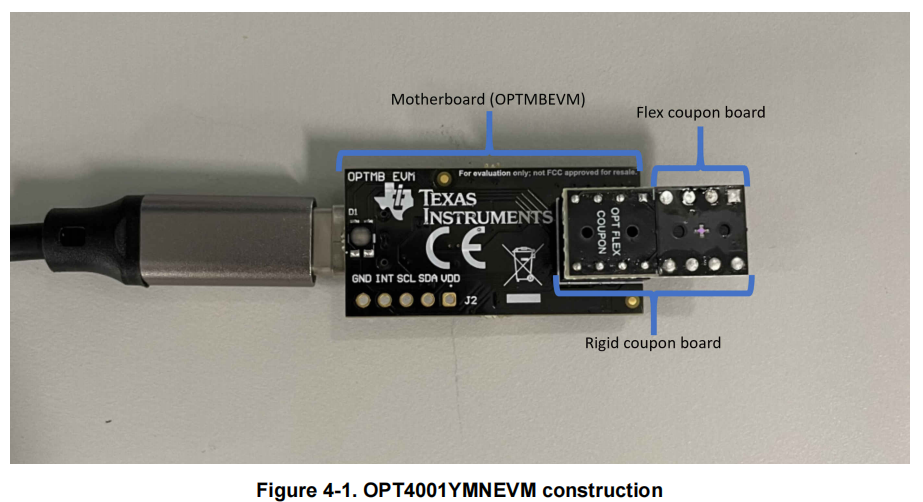
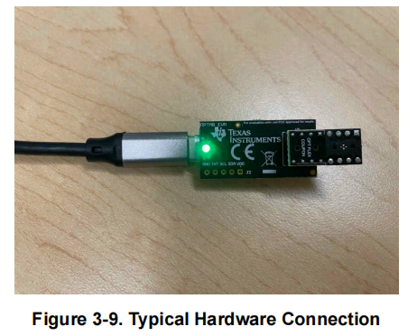
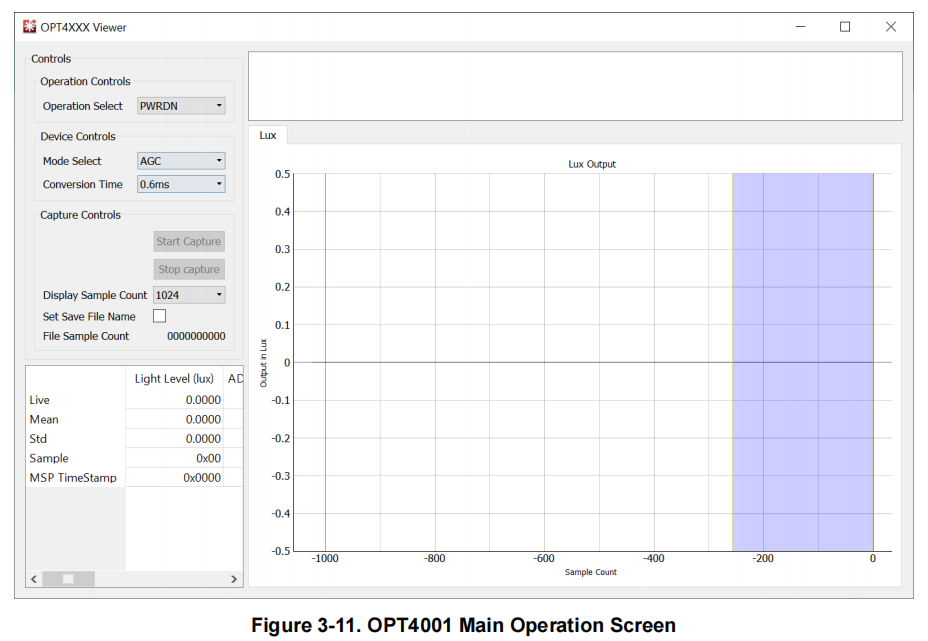
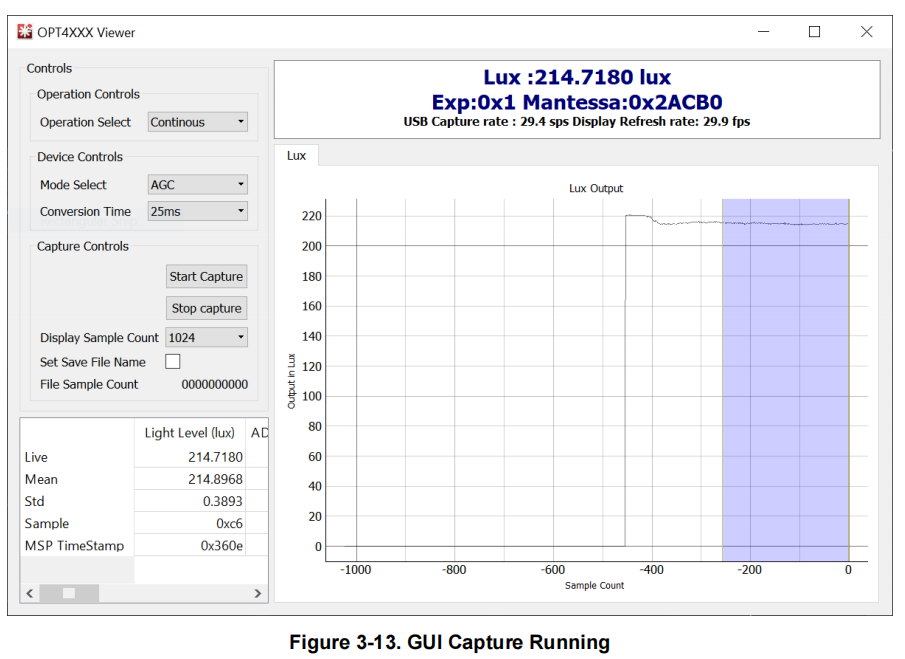

# 快速开始：采集第一组环境光数据

<div class="hardware-doc" markdown>

本页帮助第一次使用 OPT4001YMNEVM 的读者完成首次环境光数据采集。

完成后，EVM GUI 中应显示实时 lux 数值，曲线区域持续出现新的数据点。

预计用时：5—10 分钟，不包括软件安装。

!!! info "验证状态"

    本页根据 TI [《OPT4001YMNEVM User's Guide》](https://www.ti.com/lit/ug/sbou278/sbou278.pdf)和[《OPT4001 Datasheet》](https://www.ti.com/lit/ds/symlink/opt4001.pdf)整理。操作步骤、界面状态和错误提示均有官方资料依据。

    作者目前没有 OPT4001YMNEVM 实物，尚未独立复现软件安装、硬件连接和数据采集过程。页面中的界面图片来自 TI 官方文档，不代表作者的实测结果。

## 完成后你将看到

完成本页操作后，应获得以下结果：

- OPTMBEVM 母板已通过 USB 连接电脑；
- Windows 已识别评估板对应的两个 COM 端口；
- EVM GUI 已正常启动；
- `Operation Select` 已设为 `Continuous`；
- EVM GUI 显示 lux 数值，曲线持续更新。

## 开始前准备

| 项目 | 要求 |
| --- | --- |
| 评估套件 | OPT4001YMNEVM |
| 板卡状态 | OPT4001YMN coupon board 已插入 OPTMBEVM 母板 |
| 连接线 | USB-A 转 USB-C 线 |
| 电脑 | Windows 电脑 |
| 软件 | 已安装 OPT4001 EVM GUI（基于 TI Latte） |

本页从硬件检查开始，假设 EVM GUI 已经安装完成。

软件可从 [TI OPT4001EVM 官方产品页](https://www.ti.com/tool/OPT4001EVM)获取。官方指南第 7—11 页提供了完整安装过程；本页不重复安装向导中的每一步操作。

## 首次采集路径

```text
检查 coupon board
→ 连接 USB
→ 确认母板被 Windows 识别
→ 启动 EVM GUI
→ 选择 Continuous
→ 点击 Start Capture
→ 查看 lux 数值和曲线
```

## 步骤 1：检查 coupon board

OPT4001YMNEVM 出厂时，coupon board 通常已经插在母板上。完成首次采集不需要将它拆下。

开始连接 USB 前，确认：

1. coupon board 已完整插入母板插座；
2. 安装方向与官方图片一致；
3. flex coupon board 没有被按压或弯折。

{ .opt4001-quickstart-figure }

*OPT4001YMN coupon board 的安装位置。来源：TI [《OPT4001YMNEVM User's Guide》](https://www.ti.com/lit/ug/sbou278/sbou278.pdf)，Figure 4-1，第 19 页。*

!!! warning "拿取 coupon board"

    需要插拔 coupon board 时，只握住 rigid coupon board。

    不要按压 flex coupon board。柔性 PCB 较薄，受到压力可能损坏。操作评估板时还应遵守基本的静电防护要求。

### 成功时你会看到

Coupon board 稳固插入母板，安装方向与图片一致，flex PCB 没有受到挤压。

### 如果不确定

暂时不要连接 USB。先对照图片重新确认板卡方向，并检查插针是否完整进入插座。

关于三块板分别承担什么作用，见[评估系统与光学硬件结构](core-projects/hardware/information-architecture.md#board-structure)。

## 步骤 2：连接评估板

1. 将 USB-C 接头插入 OPTMBEVM 母板；
2. 将 USB-A 接头插入 Windows 电脑；
3. 等待 Windows 完成设备识别。

{ .opt4001-quickstart-figure .opt4001-quickstart-compact }

*OPT4001YMNEVM 的 USB 连接方式。来源：TI [《OPT4001YMNEVM User's Guide》](https://www.ti.com/lit/ug/sbou278/sbou278.pdf)，Figure 3-9，第 11 页。*

### 成功时你会看到

- OPTMBEVM 母板上的绿色 LED 亮起；
- Windows 设备管理器中出现两个 COM 端口。

{ .opt4001-quickstart-figure .opt4001-quickstart-medium }

*评估板正常枚举后，Windows 设备管理器中出现两个 COM 端口。来源：TI [《OPT4001YMNEVM User's Guide》](https://www.ti.com/lit/ug/sbou278/sbou278.pdf)，Figure 3-10，第 12 页。*

### 如果没有出现上述结果

依次检查：

1. USB 线两端是否完全插入；
2. 母板绿色 LED 是否亮起；
3. Windows 设备管理器中是否出现未正确安装的设备；
4. 重新连接 USB 后，设备列表是否发生变化。

如果 Windows 提示找不到驱动，请先查看官方指南第 28—34 页的驱动说明。该部分针对 Windows 7，不应直接作为所有 Windows 版本的通用处理方法。

## 步骤 3：启动 EVM GUI

在 Windows 开始菜单中启动 OPT4001 EVM GUI（基于 TI Latte）。

等待软件加载并打开 OPT4001 主操作界面。

{ .opt4001-quickstart-figure }

*OPT4001 EVM GUI 主操作界面。来源：TI [《OPT4001YMNEVM User's Guide》](https://www.ti.com/lit/ug/sbou278/sbou278.pdf)，Figure 3-11，第 13 页。*

### 成功时你会看到

OPT4001 主操作界面正常打开，页面中没有显示母板连接错误。

### 如果出现 `OPT4001 Connection Problem`

该提示表示 EVM GUI 没有检测到 OPTMBEVM 母板。

先检查：

1. USB 是否仍然连接；
2. 母板绿色 LED 是否亮起；
3. Windows 是否识别出两个 COM 端口。

确认硬件连接后，关闭并重新启动 EVM GUI。

## 步骤 4：开始连续采集

在 EVM GUI 主界面中：

1. 打开 `Operation Select`；
2. 选择 `Continuous`；
3. 点击 `Start Capture`。

{ .opt4001-quickstart-figure }

*在 `Operation Select` 中选择 `Continuous`，再点击 `Start Capture`。EVM GUI 随后显示 lux 数据和实时曲线。来源：TI [《OPT4001YMNEVM User's Guide》](https://www.ti.com/lit/ug/sbou278/sbou278.pdf)，Figure 3-13，第 14 页。*

`Continuous` 会让 OPT4001 持续进行环境光测量并更新结果。Quick Start 不展开其中的寄存器配置和数据换算过程。

### 成功时你会看到

- EVM GUI 中出现 lux 数值；
- 曲线区域持续增加新的测量点。

### 如果出现 `REGRx01 Failed`

该错误表示母板未能正常读取 OPT4001 IC 或 coupon board。

先检查：

1. coupon board 是否已经插入母板；
2. coupon board 的安装方向是否正确。

检查时只握住 rigid coupon board，不要按压 flex PCB。

## 完成标准

满足以下条件，即可认为已经完成首次采集：

- [ ] EVM GUI 已正常打开；
- [ ] `Operation Select` 已设为 `Continuous`；
- [ ] 已点击 `Start Capture`；
- [ ] EVM GUI 中出现 lux 数值；
- [ ] 曲线持续出现新的数据点。

本页的完成标准是“EVM GUI 已经显示持续更新的测量结果”。

## 常见问题

### EVM GUI 找不到母板

#### 现象

启动软件后出现 `OPT4001 Connection Problem`。

#### 先检查

- USB 连接；
- 母板绿色 LED；
- Windows 设备管理器中的两个 COM 端口。

这类问题发生在电脑、USB 和母板之间。此时还不能据此判断 OPT4001YMN 传感器是否正常。

### 出现 `REGRx01 Failed`

#### 现象

EVM GUI 可以启动，但 Latte Scripts 窗口显示：

```text
Operation I2C Register Read for command [REGRx01] Failed
```

#### 先检查

- coupon board 是否已经插入；
- coupon board 方向是否正确。

这类问题发生在母板与 coupon board 或传感器之间。

更完整的检查顺序见[故障排查](core-projects/hardware/troubleshooting.md)。

## 资料来源

### [OPT4001YMNEVM User's Guide](https://www.ti.com/lit/ug/sbou278/sbou278.pdf)

文档编号：SBOU278，December 2021

- coupon board 安装与操作注意事项：第 6 页；
- 软件获取与安装：第 7—11 页；
- USB 连接和绿色 LED：第 11 页；
- 两个 COM 端口：第 12 页；
- EVM GUI 启动与母板连接错误：第 13 页；
- `Continuous`、`Start Capture` 和 lux 曲线：第 14 页。

### [OPT4001 Datasheet](https://www.ti.com/lit/ds/symlink/opt4001.pdf)

文档编号：SBOS993A，revised December 2022

- Power-down 与 Continuous 工作模式：第 13 页；
- `OPERATING_MODE` 字段：第 31 页。

## 关于这篇 Quick Start

这篇文档先定义“第一次成功”的完成标准：在 EVM GUI 中看到实时 lux 数值和持续更新的曲线。再从这个结果倒推准备条件、操作步骤、可观察结果，以及失败时最先需要检查的位置。

关于这一写作方法的完整复盘，见[《如何写一篇让读者真正跑通的 Quick Start》](posts/quick-start-reader-success.md)。

## 继续阅读

- [评估系统与光学硬件结构](core-projects/hardware/information-architecture.md)
- [配置测量并读取 lux 数据](core-projects/hardware/configure-and-read-lux.md)
- [故障排查](core-projects/hardware/troubleshooting.md)

</div>
