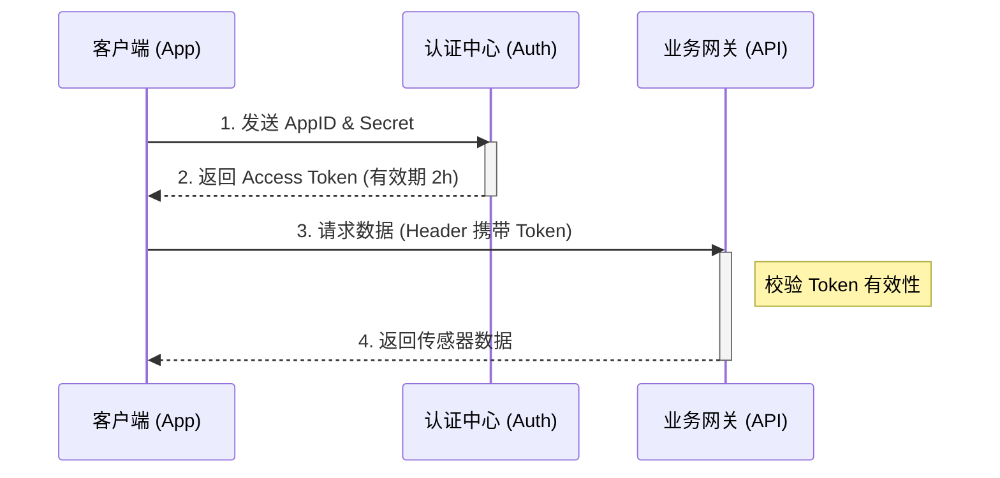

# [03] IoT 接口集成指南 (API Integration)

> **场景**: 开发者如何通过 RESTful API 获取光感传感器 (XYZ-2024) 的实时数据。

## 1. 认证鉴权 (Authentication)
所有 API 请求必须在 Header 中携带 `Authorization` 字段。鉴权流程采用标准的 OAuth 2.0 机制。

### 鉴权时序图

## 2. 获取设备数据
获取指定设备的实时遥测数据。

* **Endpoint**: `GET /v1/devices/{device_id}/telemetry`
* **Content-Type**: `application/json`

### 请求参数 (Parameters)

| 参数名 | 类型 | 必选 | 描述 |
| :--- | :--- | :---: | :--- |
| `device_id` | String | ✅ | 设备唯一标识符 (SN) |
| `limit` | Int | ❌ | 返回数据条数，默认 10 |

### 响应示例 (Response)

```json
{
  "code": 200,
  "message": "success",
  "data": {
    "device_id": "XYZ-2024-001",
    "timestamp": 1678886400,
    "sensors": {
      "light_intensity": 450,
      "battery_level": 85
    }
  }
}
```

### 错误码 (Error Codes)
| 代码 | 含义 | 解决方案 |
| :--- | :--- | :--- | 
| `401` | Unauthorized | Token 过期或无效，请重新获取 |
| `404` | Device Not Found | 检查 `device_id` 是否输入正确 |