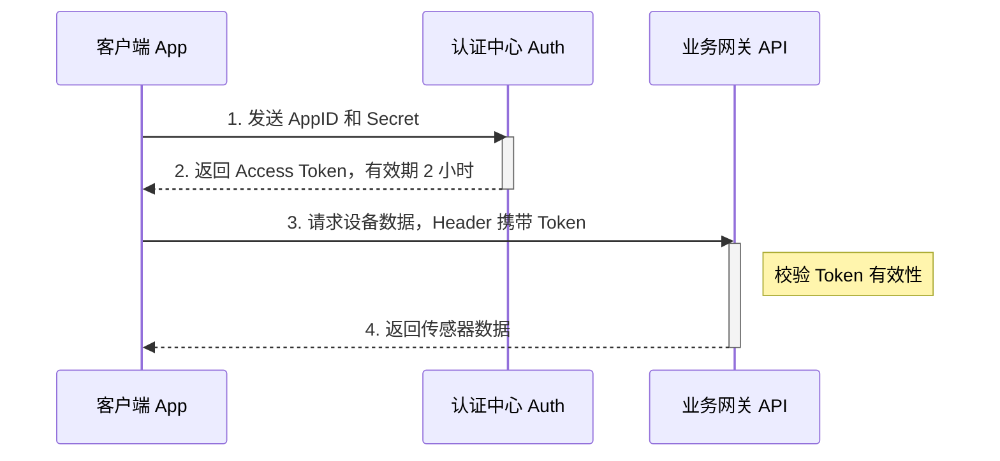

# IoT 接口集成指南：获取光感传感器实时数据

## 页面目标

这篇文档模拟一个 IoT 设备数据接口的集成说明。

场景很具体：开发者需要通过 RESTful API 获取光感传感器 `XYZ-2024` 的实时遥测数据，包括光照强度、电池电量和采集时间。

我写这页时，重点想练习 API 文档里最常见的几件事：

* 认证流程怎么讲清楚；
* Endpoint、Header、参数和响应怎么组织；
* 请求示例怎么写得可以直接复用；
* 错误码和排查建议怎么写得对开发者有帮助。

API 文档很容易写成字段堆叠。我的目标是让读者不只是看到接口定义，也能知道一次完整调用应该怎么跑起来。

## 适用读者

本文档适合以下读者：

* 需要接入 IoT 设备数据的前端或后端开发者；
* 需要了解传感器实时数据接口的技术支持人员；
* 需要查看 API 请求格式、响应结构和错误码的集成方。

## 调用前准备

在调用接口前，请确认你已经具备以下信息：

| 准备项            | 说明                                    |
| -------------- | ------------------------------------- |
| `AppID`        | 客户端应用 ID，用于获取访问令牌                     |
| `Secret`       | 客户端密钥，用于完成 OAuth 2.0 鉴权               |
| `access_token` | 调用业务 API 时需要携带的访问令牌                   |
| `device_id`    | 设备唯一标识符，例如 `XYZ-2024-001`             |
| Base URL       | API 服务地址，例如 `https://api.example.com` |

## 认证鉴权

所有 API 请求都需要在 Header 中携带 `Authorization` 字段。

本示例采用 OAuth 2.0 风格的 Token 鉴权流程：客户端先用 `AppID` 和 `Secret` 向认证中心换取 `access_token`，再用这个 token 调用设备数据接口。

### 鉴权流程


```mermaid
sequenceDiagram
    participant App as 客户端 App
    participant Auth as 认证中心 Auth
    participant API as 业务网关 API

    App->>Auth: 1. 发送 AppID 和 Secret
    activate Auth
    Auth-->>App: 2. 返回 Access Token，有效期 2 小时
    deactivate Auth

    App->>API: 3. 请求设备数据，Header 携带 Token
    activate API
    Note right of API: 校验 Token 有效性
    API-->>App: 4. 返回传感器数据
    deactivate API
```

### Header 示例

调用业务接口时，需要在请求 Header 中加入：

```http
Authorization: Bearer <access_token>
Content-Type: application/json
```

其中，`<access_token>` 需要替换为认证接口返回的实际 token。

## 获取设备实时数据

获取指定设备的实时遥测数据。

### Endpoint

```http
GET /v1/devices/{device_id}/telemetry
```

### 请求说明

| 项目             | 说明                 |
| -------------- | ------------------ |
| Method         | `GET`              |
| Content-Type   | `application/json` |
| Authentication | Bearer Token       |
| Path Parameter | `device_id`        |

## 请求参数

| 参数名         | 位置    | 类型      | 必选 | 描述                        |
| ----------- | ----- | ------- | -- | ------------------------- |
| `device_id` | Path  | String  | 是  | 设备唯一标识符，例如 `XYZ-2024-001` |
| `limit`     | Query | Integer | 否  | 返回数据条数，默认值为 `10`          |

### 请求示例

下面示例获取设备 `XYZ-2024-001` 的最新 10 条遥测数据。

```bash
curl -X GET "https://api.example.com/v1/devices/XYZ-2024-001/telemetry?limit=10" \
  -H "Authorization: Bearer <access_token>" \
  -H "Content-Type: application/json"
```

## 响应示例

请求成功后，接口返回设备的实时传感器数据。

```json
{
  "code": 200,
  "message": "success",
  "data": {
    "device_id": "XYZ-2024-001",
    "timestamp": 1678886400,
    "sensors": {
      "light_intensity": 450,
      "battery_level": 85
    }
  }
}
```

## 响应字段说明

| 字段                             | 类型      | 描述                         |
| ------------------------------ | ------- | -------------------------- |
| `code`                         | Integer | 响应状态码。`200` 表示请求成功。        |
| `message`                      | String  | 响应信息。                      |
| `data.device_id`               | String  | 设备唯一标识符。                   |
| `data.timestamp`               | Integer | 数据采集时间，Unix 时间戳格式。         |
| `data.sensors.light_intensity` | Integer | 光照强度。单位可根据设备配置定义，例如 lux。   |
| `data.sensors.battery_level`   | Integer | 设备电量百分比，取值范围为 `0` 到 `100`。 |

## 错误码

| HTTP 状态码 | 错误含义                  | 可能原因                    | 解决建议                            |
| -------- | --------------------- | ----------------------- | ------------------------------- |
| `401`    | Unauthorized          | Token 过期、缺失或无效          | 重新获取 Access Token，并检查 Header 格式 |
| `404`    | Device Not Found      | 设备不存在或 `device_id` 输入错误 | 检查设备 ID 是否正确                    |
| `429`    | Too Many Requests     | 请求频率过高                  | 降低请求频率，稍后重试                     |
| `500`    | Internal Server Error | 服务端异常                   | 记录请求 ID，并联系技术支持                 |

## 调试建议

如果接口调用失败，可以按下面顺序排查：

1. 检查 `Authorization` Header 是否存在；
2. 确认 token 是否过期；
3. 检查 `device_id` 是否正确；
4. 确认请求路径是否包含 `/v1/devices/{device_id}/telemetry`；
5. 查看响应中的 `code` 和 `message`；
6. 如果是服务端错误，保留请求时间、设备 ID 和响应内容，方便定位问题。

## 这份接口文档的写作取舍

字段表负责查找，时序图负责解释调用顺序，`curl` 和 JSON 示例负责让读者完成一次可以核对的请求。错误码后面继续给出调试动作，避免读者只知道失败，却不知道下一步检查哪里。

这个页面使用虚构设备和模拟接口，没有真实后端。它主要用来检查一条开发者接入路径是否完整，以及示例、字段和错误处理能否互相对应。

## 下一步阅读

如果你想继续查看其他文档作品，可以阅读：

1. [硬件数据手册重构](02-hardware.md)：查看我如何把芯片手册重构为开发者友好的 Web 文档；
2. [OpenClaw 快速入门](04-openclaw-quickstart.md)：查看 Quick Start 类型文档；
3. [文档质量自动化流水线](01-automation.md)：查看文档工程化案例；
4. [写作样稿](writing-samples/index.md)：查看更多技术写作样稿规划。
