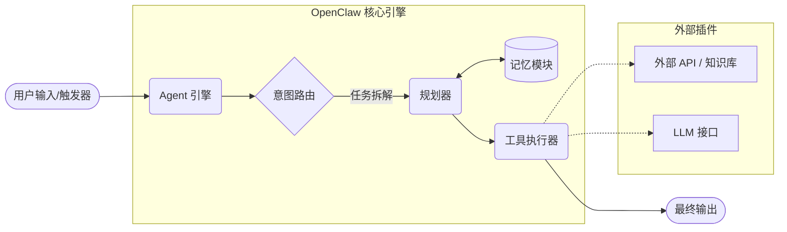

#  OpenClaw 开发者快速入门 (Quick Start)

欢迎来到 OpenClaw！OpenClaw 是一个轻量级、高可扩展的开源 AI 智能体（Agent）编排框架。无论你是想构建自动化的数据分析助手，还是复杂的对话式交互机器人，OpenClaw 都能帮助你用最少的代码实现 LLM（大型语言模型）与外部工具的无缝连接。

本指南将带你了解 OpenClaw 的核心架构，并完成你的第一个“Hello World”智能体。

---

## 🧠 系统架构解析

在编写代码之前，了解 OpenClaw 的工作流将帮助你更好地设计智能体。底层逻辑非常清晰：通过大模型进行意图拆解，并调度外部工具。

> **核心提示：** 下方的架构图展示了单 Agent 的标准流转过程。输入触发后，引擎会将其交由规划器处理。


### 架构组件说明

* **Agent 引擎 (Engine)：** 系统的中枢神经，负责接收指令并协调各模块。
* **规划器 (Planner) & 意图路由 (Router)：** 借助 LLM 的推理能力，将复杂的用户目标拆解为可执行的子任务。
* **记忆模块 (Memory)：** 支持短期上下文记忆和长期向量存储，确保智能体具备连贯的逻辑。
* **工具执行器 (Executor)：** 允许智能体调用外部 API（如传感器数据、硬件接口），打破 LLM 的能力边界。

---

### ⚙️ 前置准备 (Prerequisites)

在开始集成之前，请确保你的本地开发环境满足以下基础依赖：

* **Python 环境：** 3.10 或更高版本。
* **API 密钥：** 已获取 OpenAI API Key 或其他兼容的开源模型 API Key。
### 📦 环境安装

推荐使用虚拟环境进行安装，避免全局依赖冲突。打开你的终端，执行以下命令：

> **版本说明：** 基础安装仅包含核心引擎。如果需要处理复杂的本地文档检索，建议安装带有向量数据库支持的完整版。

``` bash
# 基础安装
pip install openclaw

# 完整安装（包含 ChromaDB 向量检索支持）
pip install openclaw[vector]

```
### 🛠️ 构建你的第一个智能体

环境就绪后，让我们来编写一段核心逻辑。我们将创建一个“天气助手”，它能够自主判断并调用外部工具获取实时数据。

创建一个名为 `hello_agent.py` 的文件，并将以下代码粘贴进去：

> **代码解析**： 下面的代码展示了如何初始化 LLM、注册工具（Tools）并实例化 Agent。注意观察 `system_prompt` 是如何定义 Agent 行为边界的。

```python
import os
from openclaw import Agent, LLMProvider
from openclaw.tools import WeatherTool

# 1. 配置大模型驱动 (LLM Provider)
os.environ["OPENAI_API_KEY"] = "your-api-key-here"
llm = LLMProvider(model="gpt-4-turbo")

# 2. 注册外部工具 (Tools)
# WeatherTool 是一个示例工具，允许 Agent 查询外部天气 API
tools = [WeatherTool()]

# 3. 实例化 Agent
agent = Agent(
    name="WeatherBot",
    llm=llm,
    tools=tools,
    system_prompt="你是一个贴心的天气助手。请调用工具获取准确信息，并用简短、友好的语言回复。"
)

# 4. 执行任务测试
user_input = "请问今天新加坡的天气怎么样？适合去户外跑步吗？"
response = agent.run(user_input)

print(response)
```

### 运行结果示例：
执行脚本后，终端应输出类似如下的内容：

“今天新加坡的天气是多云转晴，气温在 28°C 左右，微风。非常适合去户外跑步哦！不过记得涂防晒霜。”