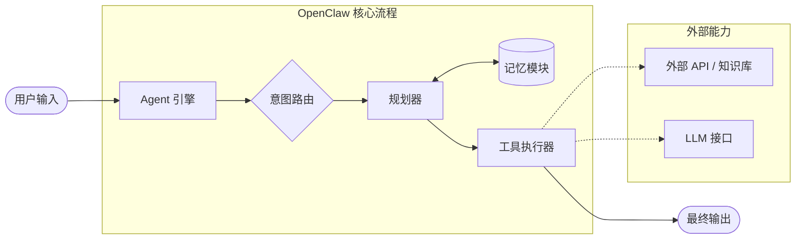

# OpenClaw 开发者快速入门：构建第一个 Agent

## 页面目标

这篇文档模拟一个开源 AI Agent 编排框架的 Quick Start。

我写这页时，主要想练习一件事：怎么让开发者在最短路径里跑通第一个可用示例。

很多框架文档一上来会讲很多概念，Engine、Router、Planner、Memory、Executor 全部铺开。概念当然重要，但第一次接触框架的开发者，最想知道的往往是：

* 我需要准备什么环境；
* 怎么安装；
* 怎么写第一个 Agent；
* 跑完后应该看到什么；
* 如果报错，先查哪里。

所以这篇文档会先带你完成一个最小示例，再解释 OpenClaw 的核心工作流。

## 适用读者

本文适合以下读者：

* 第一次接触 OpenClaw 的开发者；
* 想快速了解 Agent 编排框架基本用法的人；
* 希望用 LLM 连接外部工具、API 或知识库的开发者。

读者需要具备基础 Python 使用经验，并能在本地终端运行命令。

## 完成后你将能够

完成本文后，你将能够：

* 安装 OpenClaw；
* 配置 LLM API Key；
* 创建一个简单的天气助手 Agent；
* 注册外部工具；
* 运行脚本并查看 Agent 输出；
* 理解一次 Agent 调用的大致流程。

## 前置条件

开始前，请确认你已经准备好以下环境：

| 条件      | 说明                                  |
| ------- | ----------------------------------- |
| Python  | 3.10 或更高版本                          |
| 终端      | 可以使用 PowerShell、Terminal 或其他命令行工具   |
| API Key | 已获取 OpenAI API Key 或其他兼容模型的 API Key |
| 基础知识    | 了解 Python 文件、环境变量和命令行运行方式           |

## 步骤 1：安装 OpenClaw

### 目标

安装 OpenClaw 的核心依赖，让本地环境具备创建 Agent 的基础能力。

### 操作

推荐先创建虚拟环境，避免和全局 Python 依赖冲突。

```bash
python -m venv .venv
```

激活虚拟环境。

Windows：

```powershell
.venv\Scripts\activate
```

macOS / Linux：

```bash
source .venv/bin/activate
```

安装 OpenClaw：

```bash
pip install openclaw
```

如果你需要使用本地文档检索或向量数据库能力，可以安装完整版：

```bash
pip install "openclaw[vector]"
```

### 预期结果

安装完成后，终端不应出现依赖安装失败信息。

如果安装过程中出现权限问题或依赖冲突，建议先确认当前是否已经激活虚拟环境。

## 步骤 2：配置 API Key

### 目标

让 OpenClaw 能够调用 LLM 接口。

### 操作

在终端中设置环境变量。

Windows PowerShell：

```powershell
$env:OPENAI_API_KEY="your-api-key-here"
```

macOS / Linux：

```bash
export OPENAI_API_KEY="your-api-key-here"
```

请将 `your-api-key-here` 替换为你自己的 API Key。

### 预期结果

环境变量设置完成后，后续 Python 脚本可以读取该 Key，并调用对应模型。

如果你使用其他兼容 OpenAI API 的模型服务，需要根据服务商要求配置对应的 Base URL 或模型名称。

## 步骤 3：创建第一个 Agent

### 目标

创建一个最小可运行的天气助手 Agent，并让它调用外部工具获取信息。

### 操作

新建文件：

```text
hello_agent.py
```

写入以下代码：

```python
import os
from openclaw import Agent, LLMProvider
from openclaw.tools import WeatherTool

# 1. 配置大模型驱动
llm = LLMProvider(model="gpt-4-turbo")

# 2. 注册外部工具
# WeatherTool 是一个示例工具，用于查询外部天气 API。
tools = [WeatherTool()]

# 3. 创建 Agent
agent = Agent(
    name="WeatherBot",
    llm=llm,
    tools=tools,
    system_prompt="你是一个天气助手。请调用工具获取准确信息，并用简短、友好的语言回复。"
)

# 4. 执行任务测试
user_input = "请问今天新加坡的天气怎么样？适合去户外跑步吗？"
response = agent.run(user_input)

print(response)
```

### 代码说明

| 代码片段            | 作用                |
| --------------- | ----------------- |
| `LLMProvider`   | 配置 Agent 使用的大模型   |
| `WeatherTool`   | 注册可调用的外部工具        |
| `Agent`         | 创建智能体实例           |
| `system_prompt` | 定义 Agent 的角色和回复边界 |
| `agent.run()`   | 传入用户问题并执行任务       |

## 步骤 4：运行脚本

### 目标

验证 Agent 是否能够正常接收输入、调用工具并返回结果。

### 操作

在终端运行：

```bash
python hello_agent.py
```

### 预期结果

终端应输出类似下面的内容：

```text
今天新加坡的天气是多云转晴，气温在 28°C 左右，微风。比较适合户外跑步，但建议注意防晒和补水。
```

实际输出会根据模型、工具和天气 API 返回结果有所不同。

## OpenClaw 的工作流

跑通第一个示例之后，再来看 OpenClaw 的基本工作流会更容易理解。

一次典型 Agent 调用可以拆成几个阶段：

1. 用户输入任务；
2. Agent 引擎接收请求；
3. Router 判断任务意图；
4. Planner 拆解任务步骤；
5. Executor 调用外部工具或模型；
6. Agent 汇总结果并返回输出。



## 核心组件说明

| 组件       | 作用                    |
| -------- | --------------------- |
| Agent 引擎 | 接收输入，并协调路由、规划、工具执行和输出 |
| 意图路由     | 判断用户任务类型，决定后续处理路径     |
| 规划器      | 将复杂目标拆解为可执行步骤         |
| 记忆模块     | 保存短期上下文或长期知识          |
| 工具执行器    | 调用外部 API、知识库、数据库或其他工具 |
| LLM 接口   | 提供自然语言理解、推理和生成能力      |

这个结构里，最值得关注的是工具执行器。
它让 Agent 不只依赖模型本身的回答，还能调用外部能力完成实际任务。

## 常见问题

### 运行脚本时提示 API Key 不存在怎么办？

请确认你已经设置环境变量：

```bash
OPENAI_API_KEY
```

如果你在设置环境变量后仍然报错，可以关闭终端后重新打开，再次运行脚本。

### 安装 `openclaw[vector]` 失败怎么办？

完整版安装可能包含向量数据库或本地检索相关依赖。
如果你只是想完成第一个 Agent 示例，可以先安装基础版本：

```bash
pip install openclaw
```

等基础示例跑通后，再处理向量检索能力。

### 为什么 Agent 输出和示例不一样？

Agent 输出会受到模型版本、工具返回结果、系统提示词和实时数据影响。

只要脚本能够正常运行，并返回与天气相关的回答，就说明最小流程已经跑通。

## 这个页面证明什么能力

这篇 Quick Start 主要展示我的开发者文档写作能力。

通过这页，我想证明：

* 我能把框架上手流程拆成环境准备、安装、配置、示例代码和运行验证；
* 我会先帮助读者跑通最小示例，再解释架构；
* 我能用表格、代码块、流程图和常见问题降低理解成本；
* 我能区分“概念解释”和“任务型文档”的写法；
* 我会补充预期结果，让读者知道自己有没有跑成功。

## 下一步阅读

如果你想继续查看其他文档作品，可以阅读：

1. [IoT 接口集成指南](03-api.md)：查看 API 集成文档写法；
2. [硬件数据手册重构](02-hardware.md)：查看复杂资料重构案例；
3. [文档质量自动化流水线](01-automation.md)：查看文档工程化案例；
4. [写作样稿](writing-samples/index.md)：查看更多技术写作样稿规划。
