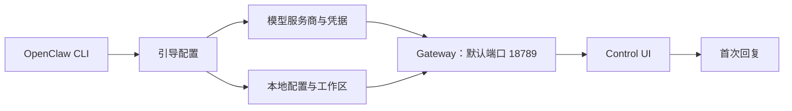

# OpenClaw CLI 快速入门：完成首次本地对话

## 你将完成什么

这份 Quick Start 带你走完一条最短的可验证路径：安装 OpenClaw、完成引导配置、确认 Gateway 正常运行，并在浏览器中收到第一条回复。

本页只使用 OpenClaw 官方文档中可以核对的 CLI 命令，不提供未经验证的 Python SDK 示例。

## 文档核验状态

| 项目 | 状态 |
| --- | --- |
| 资料来源 | OpenClaw 官方文档 |
| 最后核验日期 | 2026-07-16 |
| 命令核验 | 已逐项对照官方安装、入门和故障排查页面 |
| 本机执行 | 未执行完整引导；该过程需要模型服务商凭据，并会安装后台服务 |

这一区分很重要：下面的命令是经过资料核验的操作路径，但不是我已经完成端到端运行的证明。文末列出了补齐运行证据时应记录的内容。

## 适用读者

本文适合已经能够使用终端，并希望在 Windows 上快速体验 OpenClaw 的读者。

本文采用以下范围：

* 使用 PowerShell；
* 已自行管理 Node.js；
* 使用 npm 安装 OpenClaw；
* 通过本地 Control UI 完成首次对话。

如果你没有安装 Node.js，也可以改用官方 PowerShell 安装脚本。官方安装器会检测环境，并在需要时处理 Node.js 安装。

## 前置条件

开始前，请准备：

* Node.js 22.22.3+、24.15+ 或 25.9+；官方推荐 Node.js 24；
* 一个受支持模型服务商的 API Key；
* 可以运行 PowerShell 命令的 Windows 环境。

Node.js 23 不受支持。先检查当前版本：

```powershell
node --version
```

如果输出不在受支持的版本范围内，请先更新 Node.js，再继续安装。

## 步骤 1：安装 OpenClaw

如果你已经自行管理 Node.js，请使用 npm 全局安装：

```powershell
npm install -g openclaw@latest
```

安装结束后，确认终端能够找到 CLI：

```powershell
openclaw --version
```

### 预期结果

终端返回 OpenClaw 版本号，且没有出现“无法识别命令”或 `command not found`。

## 步骤 2：完成引导配置

运行引导程序，并安装用于托管 Gateway 的后台服务：

```powershell
openclaw onboard --install-daemon
```

引导程序会让你选择模型服务商、填写凭据并配置 Gateway。具体选项可能随版本和服务商变化，请以终端中的提示为准。

### 预期结果

引导程序完成配置，并安装可管理的后台服务。不要把 API Key 粘贴到文档、提交到 Git，或保留在公开截图中。

## 步骤 3：检查 Gateway

先运行诊断：

```powershell
openclaw doctor
```

再检查 Gateway 状态：

```powershell
openclaw gateway status
```

### 预期结果

状态信息显示 Gateway 正在运行，并监听默认端口 `18789`。该端口可以修改；输出格式也可能随 OpenClaw 版本变化，因此应核对实际状态和端口，不要逐字比对示例文本。

## 步骤 4：发送第一条消息

打开本地控制面板：

```powershell
openclaw dashboard
```

浏览器打开 Control UI 后，在聊天框中输入一条简单消息，例如：

```text
请用一句话说明你现在可以帮助我做什么。
```

### 预期结果

Control UI 正常加载，消息发送后能够收到回复。到这里，安装、凭据配置、Gateway 和模型调用这条最小链路已经连通。

## 这条路径如何工作



这张图没有展开所有内部组件，只保留首次运行必须跨过的边界。对 Quick Start 来说，先让读者知道每一步是否成功，比一次性解释完整架构更重要。

## 常见问题

### 终端找不到 `openclaw`

先查找 npm 的全局安装目录：

```powershell
npm prefix -g
```

在 Windows 中，应将命令输出的目录加入系统 `PATH`，然后重新打开终端，再运行：

```powershell
openclaw --version
```

### Dashboard 无法打开，或消息没有回复

按以下顺序收集信息：

```powershell
openclaw gateway status
openclaw status
openclaw logs --follow
openclaw doctor
```

`openclaw logs --follow` 会持续输出日志，收集到所需信息后按 `Ctrl+C` 退出。先记录第一条明确错误，再根据错误处理。本文不建议直接执行自动修复，因为修复操作可能修改本地配置。

### Gateway 没有监听 `18789`

先运行 `openclaw gateway status`，确认服务是否已经启动；再用 `openclaw logs --follow` 查看启动日志。不要为了临时访问而直接把该端口暴露到公网。

## 安全边界

* 模型服务商凭据属于敏感信息，不应进入仓库、截图或聊天记录；
* `--install-daemon` 会安装后台服务，执行前应确认这是你希望的运行方式；
* 保持 Gateway 在本机 loopback 地址上使用；没有配置认证时，不要把端口暴露到局域网或公网；
* 故障排查时先收集状态和日志，再决定是否修改配置。

## 如何补齐端到端证据

如果要把这页升级为完整的实测案例，应在脱敏后补充：

1. `openclaw --version` 的实际输出；
2. `openclaw gateway status` 中状态与端口的截图；
3. Control UI 首次对话的截图；
4. 测试环境、日期和异常处理记录。

这些证据能把“根据资料写出的可执行步骤”和“在指定环境中已经跑通”清楚地区分开。

## 参考资料

* [Getting started](https://docs.openclaw.ai/start/getting-started)
* [Install](https://docs.openclaw.ai/install)
* [Node.js requirements](https://docs.openclaw.ai/install/node)
* [Windows](https://docs.openclaw.ai/platforms/windows)
* [Gateway CLI](https://docs.openclaw.ai/cli/gateway)
* [Gateway troubleshooting](https://docs.openclaw.ai/gateway/troubleshooting)
* [Gateway security](https://docs.openclaw.ai/gateway/security)

