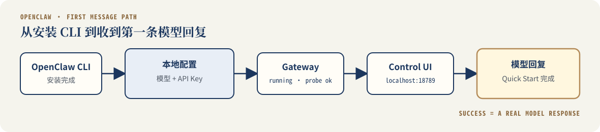

# OpenClaw 快速开始：安装 CLI 并发送第一条消息

## 这篇文档适合谁

这篇文档适合第一次使用 OpenClaw，希望从命令行完成安装，并在浏览器中收到第一条模型回复的用户。

读者需要能够在终端中运行基础命令，并且已经准备好模型服务商账户和 API Key。你不需要提前理解 OpenClaw 的完整架构，完成本文后，可以根据每一步的成功信号判断核心链路是否已经跑通。

## 完成后你将能够

完成本文后，你将能够：

* 安装并验证 OpenClaw CLI 是否可用；
* 配置模型服务商、API Key 和默认模型；
* 确认 Gateway 正常运行；
* 打开 Control UI；
* 发送一条测试消息，并根据是否收到模型回复判断核心链路是否跑通。

**预计用时：** 5–10 分钟。首次下载、模型登录或网络速度可能延长操作时间。

**完成标准：** Control UI 成功返回一条模型回复。

## 开始前准备

开始前，请确认你已经具备：

- 一台 Windows、macOS 或 Linux 电脑；
- 可以使用的 PowerShell 或终端；
- Node.js 24.15 或更高版本；
- 稳定的网络连接；
- 一个受支持模型服务商的账户和 API Key。

本文统一采用 OpenClaw 官方推荐的 Node.js 24 路径。其他受支持版本和安装方式请查看[官方 Node.js 要求](https://docs.openclaw.ai/install/node)。

运行以下命令检查 Node.js 版本：

```bash
node --version
```

终端应输出类似下面的版本号：

```text
v24.15.0
```

版本低于要求时，请先更新 Node.js，再继续安装 OpenClaw。

!!! warning "保护 API Key"

    后续配置过程中，只在 OpenClaw 的本地引导界面中输入 API Key。

    不要把真实 API Key 写入文档、命令示例、截图、GitHub 仓库或公开的问题反馈中。

---

## 步骤 1：安装 OpenClaw CLI

根据你的操作系统选择安装方式。

=== "Windows"

    打开 PowerShell，运行：

    ```powershell
    iwr -useb https://openclaw.ai/install.ps1 | iex
    ```

=== "macOS"

    打开 Terminal，运行：

    ```bash
    curl -fsSL https://openclaw.ai/install.sh | bash
    ```

=== "Linux"

    打开终端，运行：

    ```bash
    curl -fsSL https://openclaw.ai/install.sh | bash
    ```

以上命令来自 [OpenClaw 官方安装文档](https://docs.openclaw.ai/install)。

安装完成后，运行：

```bash
openclaw --version
```

### 成功信号

终端输出 OpenClaw 的版本号。这表示：

- OpenClaw CLI 已经安装；
- 当前终端能够识别 `openclaw` 命令。

这一步还不能证明模型配置和 Gateway 已经完成。由于本文尚未进行本机实测，这里不展示具体版本输出。

<!-- 完成实测后，在此补充脱敏后的真实版本输出。 -->

!!! tip "终端提示找不到命令"

    关闭当前终端并重新打开，然后再次运行：

    ```bash
    openclaw --version
    ```

    安装程序可能已经更新环境变量，但当前终端还没有重新加载。

---

## 步骤 2：完成首次配置

首次配置会引导你选择模型服务商、输入 API Key，并把 Gateway 安装为本地后台服务。

运行：

```bash
openclaw onboard --install-daemon
```

按照引导完成配置。

| 引导内容 | 操作 |
| --- | --- |
| 模型服务商 | 选择你已经拥有账户和 API Key 的服务商 |
| API Key | 输入自己的 Key，不要使用文档中的示例值 |
| 默认模型 | 选择当前账户有权访问的模型 |
| 安装 Gateway 服务 | 确认安装 |
| Channels、Skills 或插件 | Quick Start 阶段可以暂时跳过 |

不同版本中的提示文字可能略有变化。请确认选择结果与上表一致，不需要要求界面逐字相同。

!!! warning "输入凭据时"

    - 不要截图包含 API Key 的页面；
    - 不要把 API Key 粘贴到聊天、文档或 GitHub Issue；
    - 屏幕共享时，先关闭或遮挡凭据输入区域。

### 成功信号

配置引导正常结束，并返回终端。

对读者而言，这表示本地配置已经写入。Gateway 是否真正运行，需要在下一步单独检查。

<!-- 完成实测后，在此插入 onboarding 完成后的终端截图。截图中不能出现 API Key。 -->

---

## 步骤 3：确认 Gateway 正常运行

Gateway 是 OpenClaw 在本地运行的服务，负责连接模型、会话和 Control UI。

运行：

```bash
openclaw gateway status
```

### 成功信号

输出中应显示 Gateway 正在运行。不同版本的字段可能不同，常见的成功信号包括：

```text
Runtime: running
Connectivity probe: ok
```

同时，Gateway 应监听本地端口 `18789`。

这一步可以证明：

- Gateway 进程已经启动；
- 本地健康检查通过；
- Control UI 已经具备连接 Gateway 的条件。

它暂时不能证明模型配置一定有效。最终结果需要通过一条真实回复确认。

<!-- 完成实测后，在此插入 openclaw gateway status 的真实输出截图。 -->

---

## 步骤 4：打开 Control UI 并发送消息

运行：

```bash
openclaw dashboard
```

OpenClaw 会在浏览器中打开 Control UI。

浏览器没有自动打开时，手动访问：

```text
http://127.0.0.1:18789/
```

在聊天输入框中发送一条测试消息，例如：

```text
请用一句话介绍你自己。
```

### 成功信号

Control UI 返回一条模型生成的回复。

这表示下面的核心链路已经跑通：



*收到一条真实模型回复，才表示这条核心链路已经完成基本连通。*

!!! success "你已经完成 Quick Start"

    收到第一条真实回复后，OpenClaw 的安装、模型配置、Gateway 和 Control UI 已经完成基本连通。

<!-- 完成实测后，在此插入 Control UI 收到第一条回复的截图。 -->

---

## 没有成功时，从这里检查

选择与你当前现象一致的标签。

=== "找不到 OpenClaw 命令"

    先关闭并重新打开终端，然后运行：

    ```bash
    openclaw --version
    ```

    仍然无法识别命令时，再检查 Node.js：

    ```bash
    node --version
    ```

    确认 Node.js 版本满足要求后，重新执行对应系统的安装命令。

=== "Gateway 没有运行"

    再次检查状态：

    ```bash
    openclaw gateway status
    ```

    然后运行诊断：

    ```bash
    openclaw doctor
    ```

    根据诊断结果修复配置，再重新检查 Gateway 状态。

    分享诊断结果前，请删除 API Key、访问令牌、本地用户名和其他个人信息。

=== "Control UI 无法打开"

    先确认 Gateway 正常运行：

    ```bash
    openclaw gateway status
    ```

    然后手动打开：

    ```text
    http://127.0.0.1:18789/
    ```

    Gateway 未运行时，Control UI 通常无法建立连接。

=== "页面打开，但没有模型回复"

    页面能够打开，只能说明本地 Control UI 可以访问。

    没有收到模型回复时，重点检查：

    1. 模型服务商是否选择正确；
    2. API Key 是否有效；
    3. 当前账户是否有权使用所选模型；
    4. 默认模型是否已经配置。

    重新进入配置：

    ```bash
    openclaw configure
    ```

    完成修改后，再次发送测试消息。

---

## 下一步

完成第一次对话后，可以继续：

- [连接 Telegram、Slack 或其他消息渠道](https://docs.openclaw.ai/channels)
- [修改默认模型和模型服务商](https://docs.openclaw.ai/concepts/models)
- [查看 OpenClaw CLI 命令参考](https://docs.openclaw.ai/cli)
- [排查 Gateway 和 Control UI 问题](https://docs.openclaw.ai/gateway/troubleshooting)

## 资料来源

本文中的命令与流程已于 2026-07-27 对照官方资料核验，尚未在 Windows、macOS 或 Linux 上完成端到端实测。

- [Getting Started](https://docs.openclaw.ai/start/getting-started)
- [Install OpenClaw](https://docs.openclaw.ai/install)
- [Node.js requirements](https://docs.openclaw.ai/install/node)
- [Gateway CLI](https://docs.openclaw.ai/cli/gateway)
- [Gateway troubleshooting](https://docs.openclaw.ai/gateway/troubleshooting)
