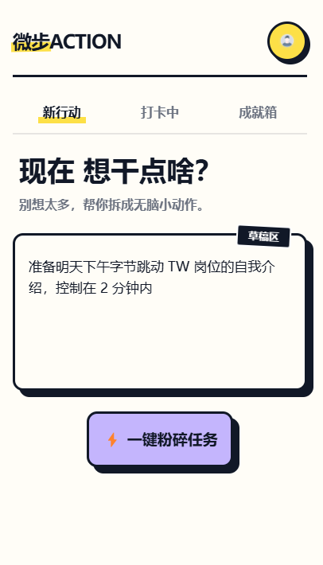
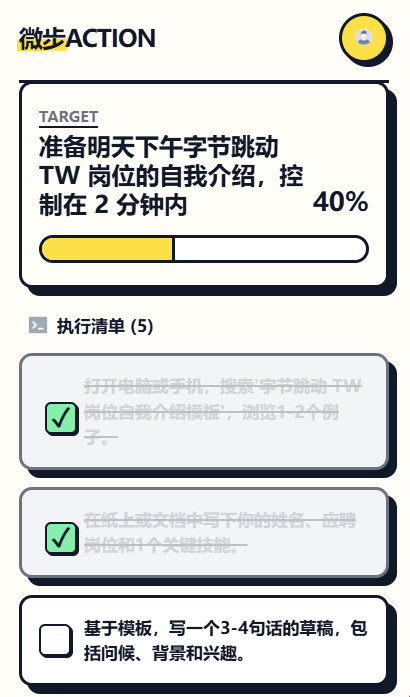

# 任务拆解小程序 · 用户文档集

> 把那个拖了好久的大计划，变成今天就能开始的小行动。


---


## 项目概览

- **项目类型：** C 端小程序用户文档 + 开发者 API 文档
- **文档风格：** 波普手帐风（Voice & Tone 主动设计）
- **受众：** 终端用户（User Guide）+ 前后端开发者（API Reference）
- **工具链：** Markdown · GitHub · MkDocs · GitHub Actions

---

## 1. 关于小程序

### 1.1 核心价值：五步拆解法

你有没有过这种感觉——明明知道要做，就是迟迟不想开始？

不是因为懒，而是因为那件事太大了，大到不知道从哪里下手。脑子里一片模糊，然后就这样又拖了一天。

**任务拆解小程序**就是为这个时刻而生的。你只需要把那个让你头疼的大计划丢进来，AI 会在几秒内把它切成五个足够微小、立刻就能行动的小步骤——小到你看完会说"这个我现在就能做"。

每完成一步打一个勾，进度条往前走一格，最后解锁专属勋章和积分奖励。从"不想开始"到"已经完成"，就这么简单。

**适合人群：** 有拖延困扰的学生、职场人，以及任何面对大目标时容易原地踏步的你。

---

## 2. 快速上手

> 🚀 只需三步，把那个拖了好久的大计划，变成今天就能开始的小行动。

### 2.1 输入并拆解首个任务

**第一步：给目标一个"家"**

打开小程序，点击页面中央的**魔法输入框**，写下那个让你头疼的大计划。

> **✏️ Tip：输入越具体，拆解越精准！**
>
> | 输入示例 | 效果 |
> |---|---|
> | "写论文" | 太模糊，AI 不好下手 |
> | "写论文第二章的文献综述" | 具体清晰，五步拆解直接到位 |
>
> **输入公式：** 具体任务 + 时间范围 + 当前状态或限制条件
>
> 例：明天上午 10 点前，整理好毕业论文答辩 PPT 的前三页逻辑框架，目前只有一个粗略提纲。

输入完成后，点击**开始拆解**按钮，AI 会在几秒内为你生成五个足够微小、立刻可行的行动步骤。

对拆解结果不满意？点击右上角的**重新生成**按钮即可换一套方案。

<p style="text-align: center;">  
  <br>  <small>▲ 在魔法输入框输入你的目标</small>
</p>


### 2.2 见证成就：勾选完成项

五个小步骤会以卡片形式呈现在你面前，每张卡片旁边都有一个 ☐ checkbox。

完成一个步骤后，点击对应的 checkbox，它会变成 ☑，进度条也会随之向前推进一格——每一个勾，都是你战胜拖延的证明。

<p style="text-align: center;">
  
  <br>
  <small>▲ 勾选步骤后进度条同步更新</small>
</p>


### 2.3 Get：得到积分奖励

五个步骤全部打勾后，恭喜界面会弹出，同时你将获得本次任务的积分奖励 🎉

积分会自动累积到你的成就系统中，可在**任务与成就**页面随时查看。

---

## 3. 任务与成就管理

> 每一次拆解都留有痕迹，每一格进度都算数。这里是你的专属战绩板。

### 3.1 重新生成任务

有时候 AI 给出的步骤不太对味——太难了、太模糊了，或者根本不符合当下的状态？没关系，这很正常。

在任务卡片页面，点击右上角的**重新生成**按钮，AI 会根据你原来的输入重新拆解一套方案。

> **✏️ Tip：想要更好的结果，试试升级你的输入！**
>
> 与其反复重新生成，不如回到输入框，把任务描述得更具体一点：
> - "准备面试" → "准备明天下午字节跳动 TW 岗位的自我介绍，控制在 2 分钟内"
>
> 输入越精准，AI 拆解出来的步骤就越贴合你的实际情况。

### 3.2 进度与勋章：你的每一步都作数

点击底部导航栏的**成就**页面，你会看到两个区域：

**进度看板**显示所有正在进行中的任务，以及每项任务当前完成了几步（比如 3/5）。进度条会实时更新，让你对自己的执行状态一目了然。

**勋章墙**则记录你历史上完成的每一个任务。每完成一项，就会解锁对应的勋章图标，积分也会同步累积。你可以在这里看到自己从第一次拆解到现在，一共战胜了多少个"拖延怪"。

> **积分有什么用？**
> 积分目前用于解锁更多个性化的勋章样式，让你的成就墙越来越好看。后续版本将持续更新更多玩法，敬请期待！

---

## 4. 常见问题 FAQ

### 4.1 如何得到更高质量的拆解？

AI 拆解的质量，很大程度上取决于你输入的描述是否具体。模糊的输入会让 AI 给出泛泛的步骤，具体的输入则会让步骤直接可执行。

参考输入公式：**具体任务 + 时间范围 + 当前状态或限制条件**

> 例：明天上午 10 点前，整理好毕业论文答辩 PPT 的前三页逻辑框架，目前只有一个粗略提纲。

### 4.2 如何修改已拆解的任务？

本小程序目前不支持对单个步骤进行编辑。如果拆解结果不理想，有两个选择：

- 点击任务卡片右上角的**重新生成**按钮，AI 会基于原始输入重新给出一套方案。
- 返回首页，在**魔法输入框**中重新输入一个更具体的描述，开始一次新的拆解。

### 4.3 我的任务数据会丢失吗？

不会。所有任务记录（包括进行中和已完成的）都保存在你的微信账号下，退出小程序后数据不会清空，可在**任务与成就**页面随时查看完整历史。

> **注意：** 数据同步依赖网络连接。无网络环境下历史记录可能暂时无法加载，联网后将自动恢复。

---

## 5. 隐私说明

- 你输入的任务描述仅用于 AI 拆解计算，不会被用于模型训练或对外共享。
- 使用语音输入功能时，小程序需要申请麦克风权限，你可以随时在微信设置中关闭。
- 所有数据通过加密传输（HTTPS），存储于与你微信账号绑定的云端空间。

---

## 开发者文档

> 本节面向开发者，介绍如何在本地运行和调试本小程序。

### 环境依赖

在开始之前，请确保你的开发环境满足以下要求：

| 依赖项 | 推荐版本 | 说明 |
|--------|----------|------|
| 微信开发者工具 | v1.06.2409140 及以上 | 小程序官方 IDE |
| Node.js | v18.x LTS | 后端服务运行环境 |
| npm | v9.x 及以上 | 随 Node.js 自动安装 |
| 微信开发者账号 | — | 需完成小程序注册，获取 AppID |

### 快速部署（3 步）

**第一步：克隆仓库**

```bash
git clone https://github.com/alison2fun/tech-docs-portfolio.git
cd tech-docs-portfolio/05-miniprogram-task-decomposer
```

**第二步：安装依赖**

```bash
npm install
```

> **提示：** 如遇网络超时，建议切换国内镜像源：
> ```bash
> npm config set registry https://registry.npmmirror.com
> ```

**第三步：导入项目**

打开**微信开发者工具**，选择**导入项目**，填入项目目录路径与你的 AppID，点击确认即可在模拟器中预览。

### API 参考

> 本节为核心接口文档摘要，完整版请参见 [`api-reference.md`](./api-reference.md)。

#### 任务拆解接口

将用户输入的原始任务描述，通过 AI 引擎拆解为五个微小可执行步骤。

```
POST /api/v1/tasks/decompose
```

**请求示例**

```json
{
  "description": "写论文第二章的文献综述，明天上午 10 点前完成初稿",
  "language": "zh-CN"
}
```

**成功响应示例（200 OK）**

```json
{
  "task_id": "task_abc123",
  "steps": [
    { "step_id": 1, "action": "打开知网，搜索关键词「任务管理」，收集 5 篇核心文献" },
    { "step_id": 2, "action": "阅读摘要，筛选出与研究主题相关的 3 篇，做简要笔记" },
    { "step_id": 3, "action": "按研究方法分类，整理成一张对比表格" },
    { "step_id": 4, "action": "写出文献综述的第一段（100 字以内，概述研究背景）" },
    { "step_id": 5, "action": "通读初稿，检查逻辑衔接，保存文档" }
  ],
  "created_at": "2026-04-17T10:30:00Z"
}
```

**主要错误码**

| 错误码 | HTTP 状态 | 说明 |
|--------|-----------|------|
| `ERR_DESC_TOO_SHORT` | 400 | 任务描述少于 10 字符 |
| `ERR_DESC_TOO_LONG` | 400 | 任务描述超过 200 字符 |
| `ERR_UNAUTHORIZED` | 401 | 认证失败，Token 无效或已过期 |
| `ERR_RATE_LIMIT` | 429 | 超出每日调用配额（20 次/账号） |
| `ERR_AI_UNAVAILABLE` | 503 | AI 服务暂时不可用，请稍后重试 |

---

## 文档版本

| 版本 | 日期 | 说明 |
|------|------|------|
| v1.0.0 | 2026-04-17 | 初始版本，含用户手册、开发者部署指南与 API 参考 |

---

*本文档遵循 [Docs-as-Code](https://www.writethedocs.org/guide/docs-as-code/) 理念，随功能迭代持续更新。*

*© 2026 alison2fun · MIT License*
