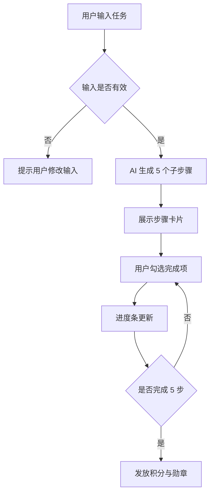

# 微步 ACTION · 产品需求文档（PRD）

> 把模糊的大目标拆成 5 个现在就能开始的小行动。

---

## 1. 产品概述

| 项目   | 说明                      |
| ---- | ----------------------- |
| 产品名称 | 微步 ACTION               |
| 产品类型 | AI 任务拆解小程序              |
| 目标用户 | 面对大任务时容易拖延、难以启动的人       |
| 核心价值 | 将模糊的大目标拆解为足够小、立即可执行的子步骤 |
| 当前版本 | v1.0.0                  |

微步 ACTION 的核心思路很简单：
用户输入一个让自己卡住的大任务，系统通过 AI 将它拆成 5 个更具体、更容易开始的小行动。

这个产品先解决一个很小但很真实的问题：

> 用户现在不知道从哪一步开始。

---

## 2. 用户场景

### 2.1 典型用户

| 用户类型  | 场景                       |
| ----- | ------------------------ |
| 学生    | 写论文、准备答辩、复习考试时不知道怎么开始    |
| 求职者   | 准备面试、自我介绍、作品集修改时任务过大     |
| 职场人   | 面对汇报、材料整理、项目推进时难以拆步骤     |
| 内容创作者 | 想写文章、做选题、整理素材，但不知道第一步做什么 |

---

## 3. 核心用户故事

### 用户故事 1：拆解一个大任务

作为一个容易拖延的用户，
我希望输入一个大目标后，系统能帮我拆成 5 个小步骤，
这样我就可以从第一步开始行动。

### 用户故事 2：勾选完成项

作为一个正在执行任务的用户，
我希望完成一步后可以勾选它，
这样我可以看到自己的进度。

### 用户故事 3：重新生成结果

作为一个觉得拆解结果不合适的用户，
我希望可以重新生成一组步骤，
这样我可以得到更贴近当前状态的行动方案。

---

## 4. 功能范围

## 4.1 任务输入

用户可以在首页输入任务描述。

### 输入规则

| 项目   | 规则                  |
| ---- | ------------------- |
| 字数限制 | 10 ~ 200 字          |
| 输入内容 | 具体任务、时间范围、当前状态或限制条件 |
| 空输入  | 不允许提交               |
| 过短输入 | 提示用户补充描述            |
| 过长输入 | 提示用户精简内容            |

### 推荐输入格式

```text
具体任务 + 时间范围 + 当前状态或限制条件
```

示例：

```text
明天下午准备技术文档岗位面试的 2 分钟自我介绍，目前已有作品集，但还没整理表达。
```

---

## 4.2 AI 任务拆解

系统将用户输入的大目标拆解为 5 个子步骤。

### 拆解规则

| 项目    | 规则           |
| ----- | ------------ |
| 步骤数量  | 固定 5 步       |
| 单步时长  | 建议不超过 15 分钟  |
| 步骤颗粒度 | 具体、可执行、能立刻开始 |
| 输出语言  | 默认中文，后续可支持英文 |
| 结果状态  | 每一步初始状态为未完成  |

---

## 4.3 任务勾选与进度条

用户可以勾选已完成步骤。

系统根据完成数量更新进度条。

| 完成步骤  | 进度   |
| ----- | ---- |
| 0 / 5 | 0%   |
| 1 / 5 | 20%  |
| 2 / 5 | 40%  |
| 3 / 5 | 60%  |
| 4 / 5 | 80%  |
| 5 / 5 | 100% |

---

## 4.4 积分与勋章

当用户完成 5 个步骤后，系统发放积分奖励，并记录完成任务。

### 当前版本

* 完成任务后获得积分；
* 已完成任务进入成就记录；
* 勋章墙展示历史完成情况。

### 后续计划

* 支持更多勋章样式；
* 根据任务类型生成不同勋章；
* 支持连续完成任务提醒。

---

## 5. 功能流程图



---

## 6. 异常边界

| 场景         | 系统行为              |
| ---------- | ----------------- |
| 输入为空       | 提示“请输入任务内容”       |
| 输入少于 10 字  | 提示“描述太简短啦，再说具体一点” |
| 输入超过 200 字 | 提示用户精简描述          |
| 网络中断       | 提示检查网络，并保留用户输入    |
| AI 服务超时    | 提示稍后重试            |
| AI 返回结果不理想 | 提供重新生成入口          |
| 当日调用次数用完   | 提示今日次数已用完，次日再试    |

---

## 7. 非目标范围

当前版本暂不支持：

* 手动编辑单个步骤；
* 多任务协作；
* 复杂项目排期；
* 日历同步；
* 离线任务拆解；
* 多端实时同步。

这些功能可作为后续版本评估方向。

---

## 8. 版本计划

| 版本     | 状态  | 计划内容                     |
| ------ | --- | ------------------------ |
| v1.0.0 | 已完成 | 任务输入、AI 拆解、步骤勾选、进度条、积分奖励 |
| v1.1.0 | 计划中 | 支持单步编辑、拆解结果反馈、更多勋章样式     |
| v1.2.0 | 规划中 | 支持历史任务分类、任务模板和更多输入示例     |

---

## 下一步阅读

1. [用户文档](index.md)：查看用户侧使用流程；
2. [API 参考文档](api-reference.md)：查看任务拆解接口设计；
3. [版本日志](release-notes.md)：查看版本变化和已知限制；
4. [小程序产品总览](../mini-programs.md)：返回查看其他小程序项目。
