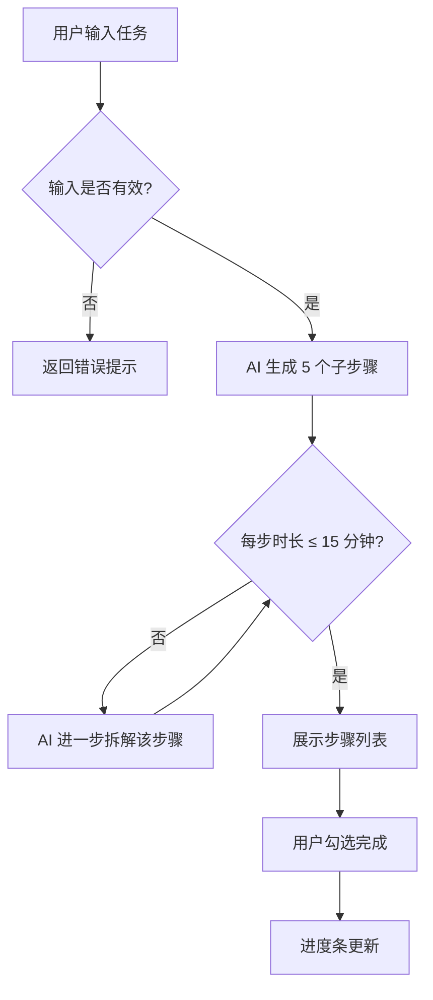

# 产品需求文档（PRD）：AI 任务拆解小程序

## 1. 产品概述

**产品名称**：AI 任务拆解助手  
**目标用户**：存在拖延倾向、难以启动复杂任务的用户  
**核心价值**：将模糊的大目标自动拆解为足够小、立即可行的子步骤

## 2. 功能需求

### 2.1 核心功能：任务拆解

**前提条件**：用户已登录微信，设备联网  
**输入**：用户输入的任务描述（字符串，1\~200 字）  
**处理逻辑**：AI 将任务拆解为 5 个子步骤，每步时长不超过 15 分钟  
**输出**：结构化的步骤列表，含序号、描述、预计时长

**约束条件**：
- 输入不得为空
- 单步时长超过 15 分钟时，AI 自动进一步拆解
- 网络中断时返回错误提示，不提供本地降级方案（系统强依赖微信环境）

### 2.2 功能流程图

## 3. 异常边界定义

| 场景 | 系统行为 |
|---|---|
| 输入为空 | 提示"请输入任务内容" |
| 输入超过 200 字 | 截断并提示字数限制 |
| 网络中断 | 返回错误码，提示检查网络 |
| AI 服务超时 | 3 秒后返回超时错误，建议重试 |

## 4. 版本记录

| 版本 | 日期 | 变更内容 |
|---|---|---|
| v1.0 | 2026-04-20 | 初版发布，包含核心拆解功能 |
