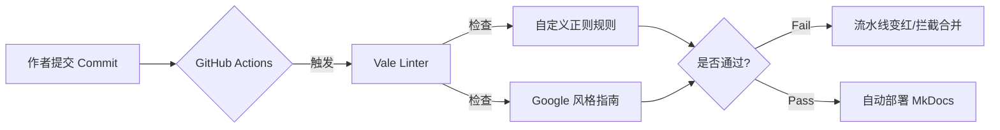

# [01] 文档自动化流水线 (Quality Gate)

> **核心成果**: 将人工校对时间从 30分钟/篇 降低至 <10秒，实现了 100% 的格式错误拦截率。

## 1. 背景与挑战 (Challenge)
在多人协作的技术文档项目中，我们面临以下痛点：
* **格式混乱**: 中英文混排缺乏空格（盘古之白），全角半角标点混用。
* **标准缺失**: 缺乏统一的术语表，"Login" 被写成 "登陆"、"登入" 等多种形式。
* **效率低下**: 资深工程师需要花费大量时间审核低级格式问题，而非关注技术准确性。

## 2. 解决方案 (Solution: Docs as Code)

我搭建了一套基于 **GitHub Actions + Vale** 的自动化质量门禁系统。

### 2.1 架构图



### 2.2 核心技术点
#### A. 自定义正则规则 (Regex Strategy)
针对中文技术文档特有的“中西文空格”问题，编写了强制校验规则：
```yaml
# styles/MyStyle/Spacing.yml
tokens:
  - ".*[\u4e00-\u9fa5][a-zA-Z0-9].*"  # 抓取：(任意字)中文+英文(任意字)
  - ".*[a-zA-Z0-9][\u4e00-\u9fa5].*"  # 抓取：(任意字)英文+中文(任意字)
```    
#### B. 行业标准集成 (Compliance)
引入 **Google Developer Documentation Style Guide**，对语气（Voice & Tone）进行标准化约束，例如禁止在文档中使用 "Please" 等客套词汇，保持指令的清晰度。

#### C. CI/CD 集成 (Automation)
配置 GitHub Actions 脚本，实现 Fail-Fast 机制。
> *[点击查看 CI 配置文件](https://github.com/alison2fun/tech-docs-portfolio/blob/main/.github/workflows/ci.yml)*

## 3. 实施效果 (Result)

* **Before**: 文档发布后常被读者指出排版错误，显得不专业。
* **After**: 所有低级格式问题在 `git push` 阶段即被拦截，Reviewer 专注于技术逻辑审核。
* **证据 (Evidence)**: 
    > [点击查看 GitHub Actions 拦截记录](https://github.com/alison2fun/tech-docs-portfolio/actions) 
    > *(请查看历史记录中红色的 "Fail" 与绿色的 "Pass" 对比)*