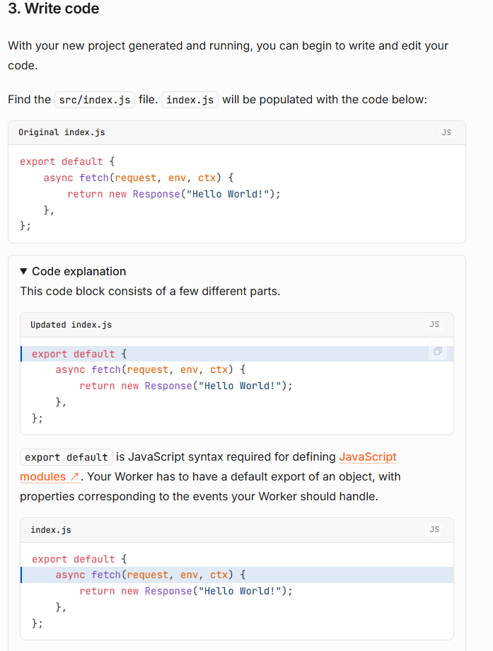
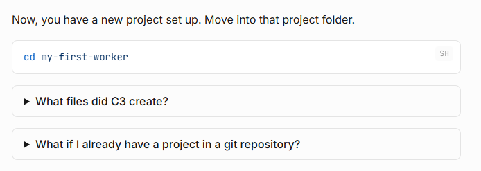

# Cloudflare Workers Quick Start：把说明和短排错放在步骤旁

[查看 Cloudflare Workers Get Started](https://developers.cloudflare.com/workers/get-started/guide/)

## 值得学习的结构

文档的每个主要步骤都是这个结构：

```text
步骤标题
→ 执行动作
→ 必要解释
→ 命令或代码
→ 当前结果
→ 与当前步骤有关的短排错
```

作为一篇快速开始文档，**动作 + 结果**或者**动作 + 目的**是基本的写作方法。

## 增加对代码的注释



*图 1：代码示例旁的折叠面板解释关键语法，读者可以按需展开。*

## 在相关步骤旁加入短排错

文档没有在页面末尾放一个笼统的 Troubleshooting 章节，而是将小问题放在对应步骤旁边，并且运用了折叠面板的结构。在保留主任务通畅的前提下，作为及时补充，用户可选择是否展开。



*图 2：与当前操作有关的两类问题紧邻命令出现，并默认折叠。*

<div class="bottom-pager">
    <a href="../stripe-checkout-quickstart/" class="pager-link">上一篇：Stripe Checkout Quickstart</a>
    <a href="../docker-daemon-troubleshooting-breakdown/" class="pager-link pager-link-primary">下一篇：Docker daemon 故障排查</a>
</div>
