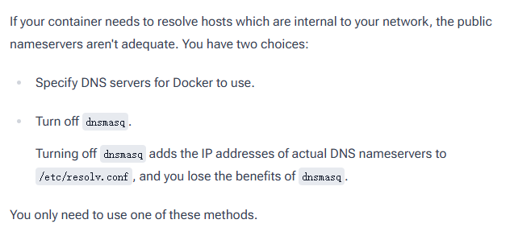

# Docker daemon 故障排查：从症状走到验证

[查看 Troubleshooting the Docker daemon](https://docs.docker.com/engine/daemon/troubleshoot/#specify-dns-servers-for-docker)

## 故障排查顺序

Docker 的故障排查顺序比 [GitHub REST API troubleshooting](github-rest-api-troubleshooting-breakdown.md) 多了一个解释步骤，帮助读者理解清楚：

```text
你看到了什么
→ 这通常意味着什么
→ 怎样确认
→ 怎样修复
→ 怎样验证
```

## 方案二选一的排错原则

在文档中，DNS resolver issues 这个条目先给出读者可能看到的警告，然后解释警告出现原因。理解原因后，读者先检查是否正在使用 `dnsmasq`，随后页面给出两种解决方法，并明确提醒只需选择一种。



*图 1：页面给出两种 DNS 处理方法，并明确说明只需选择其中一种。*

这体现了一个很好的排错原则：

```text
先确认原因
→ 提供互斥方案
→ 说明方案影响
→ 让读者选择一种
```

## 英文表达

### 症状标题

- Unable to connect to...
- Unable to remove...
- [Component] not running
- [Resource] disappearing
- [Feature] issues

### 判断条件

- If this command returns a value, ...
- If the variable is unset, ...
- If you see this warning, first check ...

### 修复操作

- To work around this problem, ...
- Edit the configuration file.
- Restart the Docker daemon.
- Try the command again.

### 验证结果

- Verify that Docker can...
- Confirm that the interface has...
- The changes take effect when...

<div class="bottom-pager">
    <a href="../cloudflare-workers-quick-start-breakdown/" class="pager-link">上一篇：Cloudflare Workers Quick Start</a>
    <a href="../document-breakdowns/" class="pager-link pager-link-primary">查看全部拆解</a>
</div>
