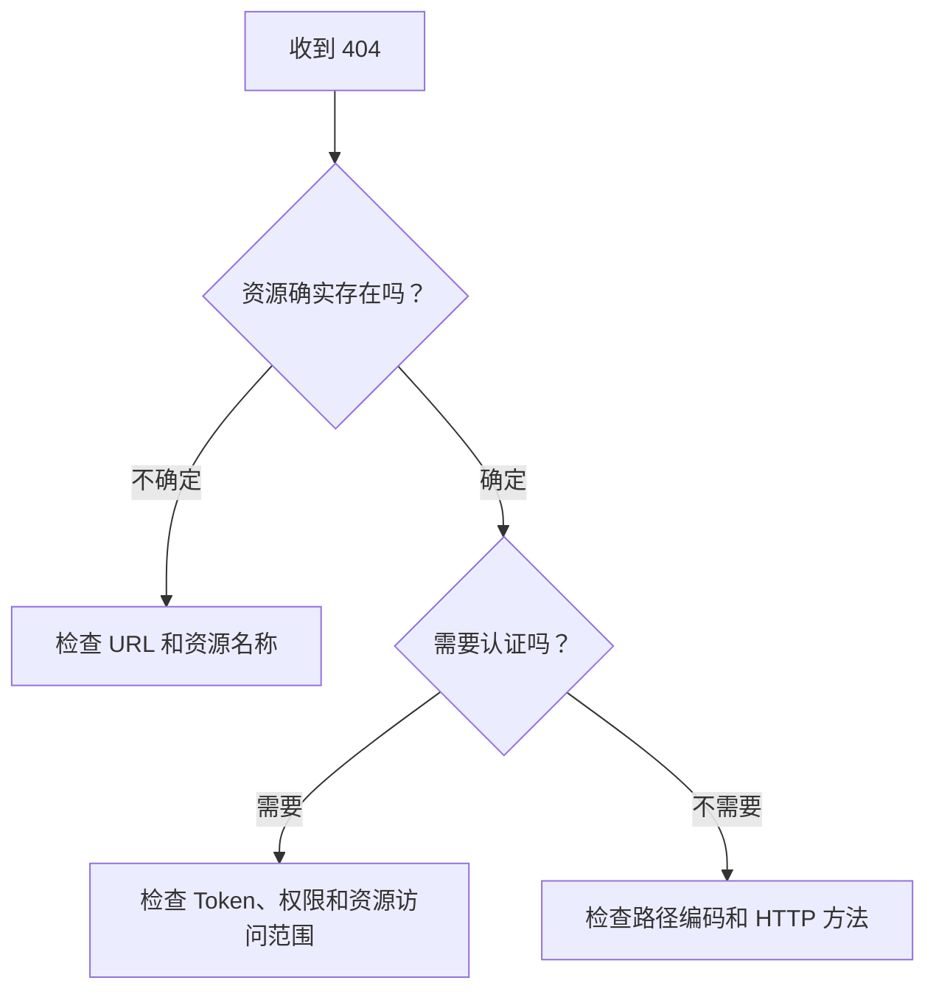
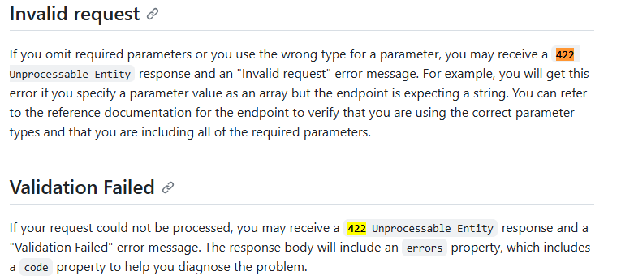

# GitHub REST API 故障排查：用错误文字组织检索入口

[查看 GitHub REST API troubleshooting](https://docs.github.com/en/rest/using-the-rest-api/troubleshooting-the-rest-api?apiVersion=2026-03-10)

## 标题特点

Troubleshooting 类型的文档，读者不会从头读到尾，而是带着具体问题进入页面，因此，标题就是检索入口。

*图 1：GitHub REST API troubleshooting 直接使用状态码、错误消息和问题现象作为目录入口。*

这里的标题大多直接沿用状态码或错误消息，方便读者用终端里的文字搜索页面。

| 直接看到的文字 | 总结性文字 |
| --- | --- |
| Rate limit errors | Authentication considerations |
| Missing results | Request configuration problems |
| Validation Failed | Response-related issues |

## 单个排错条目的结构

以 `404 Not Found` 为例，页面采用了下面的顺序。

### 先解释一个容易误判的情况

访问私有资源时，如果认证不正确，GitHub 可能返回 `404`，而不是 `403`。这是为了避免向未授权用户确认私有仓库的存在。

### 按认证方式给出检查项

页面给出多种认证的检查步骤：

> If you are using a personal access token (classic), you should ensure that...

> If you are using a fine-grained personal access token, you should ensure that...

每种认证方式需要检查的权限各不相同，这里使用分组列表来分情况说明。

### 检查请求本身

认证没有问题后，让读者继续检查：

- URL 是否有拼写错误；
- 路径参数是否经过 URL 编码；
- HTTP 方法是否受端点支持。

于是，一个 `404` 的判断路径为：

这也是技术支持人员的排错步骤。

## 状态码重复问题

一个状态码可能对应多种原因。需要注意的是，我在之前的练习文稿里采用了状态码与对应原因的表格。这是因为模拟 API 文档中状态码与原因一一对应，这是一种简化情况，在短排错或状态码简单时可以使用。

在这个文档中，GitHub 将状态码作为排查入口，再用错误消息和响应头帮助读者缩小原因范围。

*图 2：同一个 `422` 响应可能对应参数类型错误或验证失败，需要结合错误消息继续判断。*

例如图中的 `422` 可能是参数类型错误，也可能是验证失败，此时要结合 error message 去排查。

    <a href="../" class="pager-link">返回复盘与方法</a>
    <a href="../stripe-checkout-quickstart/" class="pager-link pager-link-primary">下一篇：Stripe Checkout Quickstart</a>

