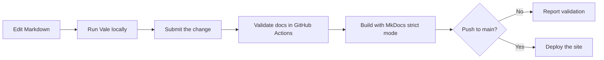

# Documentation Quality Pipeline

`English technical writing` · `Task-based documentation` · `Vale` · `GitHub Actions`

This English documentation set describes the workflow implemented and
maintained in Project 03. Project 03 presents the design, implementation, and
validation of the pipeline. This project shows how to explain that workflow to
contributors and maintainers through task-based English documentation.

!!! info "Validation status"

    All five pages are published and pass the current local Vale check and
    MkDocs strict build. A successful workflow run includes the published
    documentation set. A controlled CI failure-and-recovery test remains
    pending.

## Problem and audience

Documentation contributors need feedback before wording, terminology, or
formatting issues reach review. Repository maintainers also need a reliable way
to repeat the same checks after a change is submitted.

This workflow uses Vale in two places:

- contributors run `vale docs` locally while editing;
- GitHub Actions runs Vale against `docs` for pull requests and pushes to
  `main`.

The readers are technical writers, documentation contributors, and repository
maintainers who work with Markdown and have basic command-line experience.
They don't need to understand Vale rule syntax before starting the Quick
Start.

The documentation separates four tasks that happen at different points:

1. run the first local check;
2. understand or change the repository configuration;
3. run the same check in GitHub Actions;
4. recover from a local or automated failure.

Keeping these tasks separate prevents the Quick Start from becoming a complete
Vale reference and gives troubleshooting information a clear home.

## Documentation set

| Page | Reader task | Completion condition |
| --- | --- | --- |
| [Quick Start](quick-start.md) | Install Vale and run the first local check | Vale scans `docs` without a runtime error |
| [Configure Vale](configure-vale.md) | Read and change repository rules | Vale loads the intended configuration and the change is tested |
| [Run Vale in GitHub Actions](github-actions.md) | Understand the automated check and deployment gate | The reader can identify triggers, blocking results, and job permissions |
| [Troubleshooting](troubleshooting.md) | Diagnose an observable failure | The failed command or job produces the expected result after one focused fix |

Start with the page that matches the current task. The pages link to each other
when a configuration or failure detail belongs elsewhere.

## Workflow

| Repository component | Responsibility |
| --- | --- |
| `.vale.ini` and `styles/` | Define the active writing rules and project vocabulary |
| `docs/` | Stores the Markdown source checked by Vale |
| `.github/workflows/ci.yml` | Runs Vale and MkDocs, then deploys successful pushes to `main` |

Local checks provide fast feedback before submission. The automated workflow
repeats the committed rules in a clean environment and prevents deployment
until the validation job succeeds.

## Key decisions

### Put the first success before configuration

The first reader goal is to run a check and recognize the result. The Quick
Start therefore stops after `vale docs` scans the documentation and the reader
can distinguish content alerts from runtime failures. Rule implementation and
vocabulary maintenance belong in the configuration guide.

### Separate local and automated checks

The two checks share committed rules but answer different questions. A local
check asks whether an issue can be found before submission. The automated check
asks whether the submitted repository state meets the documentation gate.

### Start troubleshooting from symptoms

Readers usually arrive with an observable failure, such as a missing command,
an unavailable style, or a local result that differs from CI. The
troubleshooting page starts from those symptoms and keeps each recovery path
short.

## Validation

| Evidence | Current result |
| --- | --- |
| Local Vale check | `vale docs` completes with 0 error-level findings |
| Local site build | `mkdocs build --strict` completes successfully |
| Published workflow | [Documentation CI run for commit `68043a5`](https://github.com/alison2fun/tech-docs-portfolio/actions/runs/30818428366) completed successfully |
| Controlled CI failure and recovery | Pending |

The successful run proves that the committed workflow can validate and deploy
the published documentation set. It doesn't prove that every error-level
finding will block deployment until the controlled failure-and-recovery test is
recorded.

Vale can enforce repeatable wording and formatting rules. Technical accuracy,
information completeness, and task usability still require human review.

## Start reading

- Run the first check: [Set up local documentation checks with Vale](quick-start.md).
- Change repository rules: [Configure Vale for a documentation repository](configure-vale.md).
- Review the automated gate: [Run Vale in GitHub Actions](github-actions.md).
- Resolve a failure: [Troubleshoot Vale and CI checks](troubleshooting.md).

