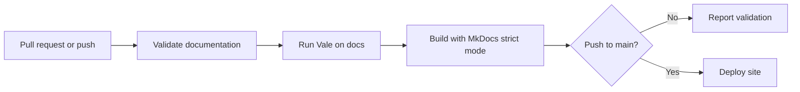

<div class="english-doc" markdown>

# Run Vale in GitHub Actions

The repository runs Vale and a strict MkDocs build in one validation job. A
separate deployment job starts only after validation succeeds on a push to
`main`.

!!! info "Validation evidence"

    All five English pages are published. The
    [Documentation CI run for commit `68043a5`](https://github.com/alison2fun/tech-docs-portfolio/actions/runs/30818428366)
    completed successfully. A controlled error-level failure and recovery has
    not yet been recorded.

## Workflow summary



The workflow is stored in `.github/workflows/ci.yml`. It has no path filters,
so repository changes can trigger documentation validation even when Markdown
isn't the only changed content. This keeps the policy simple but can run more
often than a filtered workflow.

## Triggers and permissions

| Question | Current answer |
| --- | --- |
| Which events trigger the workflow? | Pull requests, pushes to `main`, and manual dispatch |
| Which event can deploy? | A successful push to `main` |
| What can the workflow read by default? | Repository contents |
| Which job can write? | Only the deployment job receives `contents: write` |
| How are duplicate runs handled? | Concurrency cancels an older run for the same workflow, event, and ref |

The validation job also receives `checks: write` because the Vale reporter
publishes check annotations. Every job doesn't receive write access.

## Validation job

The job checks out the repository, installs the pinned documentation
dependency from `requirements-docs.txt`, runs Vale against `docs`, and then
runs `mkdocs build --strict`.

The writing-style step is:

```yaml
- name: Check writing style with Vale
  uses: vale-cli/vale-action@85f9f7f2c5f449ac0ae5b66662961bae3f77ca6a
  with:
    version: 3.15.1
    files: docs
    fail_on_error: true
    filter_mode: nofilter
    reporter: github-check
```

The action is pinned to a commit SHA. `files: docs` applies the repository
policy to the documentation directory instead of one fixture file.
`fail_on_error: true` and `filter_mode: nofilter` are intended to make
error-level findings fail the step while still reporting the full selected
scope.

The next step runs:

```bash
mkdocs build --strict
```

Vale and MkDocs answer different questions. Vale checks enabled writing rules;
the strict build checks navigation, Markdown processing, and site generation.

## Deployment gate

The deployment job has two conditions:

1. the event must be a push to `main`;
2. the validation job must succeed.

Pull requests and manual runs can validate documentation without publishing
the site. The deployment job receives write permission only when it's needed
to update the Pages branch.

## Validation evidence

| Evidence | What it proves | Boundary |
| --- | --- | --- |
| Successful run for `68043a5` | The published repository completed validation and deployment | It doesn't prove the failure path |
| Local `vale docs` | The working tree can load the committed configuration and styles | Local Vale is 3.13.0; CI requests 3.15.1 |
| Local strict build | The current site builds before submission | CI still runs in a separate Ubuntu environment |
| Controlled error-level test | Not yet recorded | The gate's failure-and-recovery behavior remains pending evidence |

## Change the workflow safely

1. identify the trigger, file scope, blocking result, or permission that needs
   to change;
2. edit one responsibility at a time;
3. run `vale docs` and `mkdocs build --strict` locally;
4. review the workflow diff for broadened permissions or changed deployment
   conditions;
5. use a pull request or manual run to inspect the validation result before
   relying on it for publication.

Don't change the rule severity or turn off strict mode only to obtain a green
run. Use [Troubleshooting](troubleshooting.md) to identify whether a failure
comes from Vale, MkDocs, environment differences, or the deployment gate.

Sources: [GitHub Actions workflow syntax](https://docs.github.com/en/actions/writing-workflows/workflow-syntax-for-github-actions),
[Vale GitHub Action](https://github.com/vale-cli/vale-action), and
[MkDocs command reference](https://www.mkdocs.org/user-guide/cli/).

</div>
