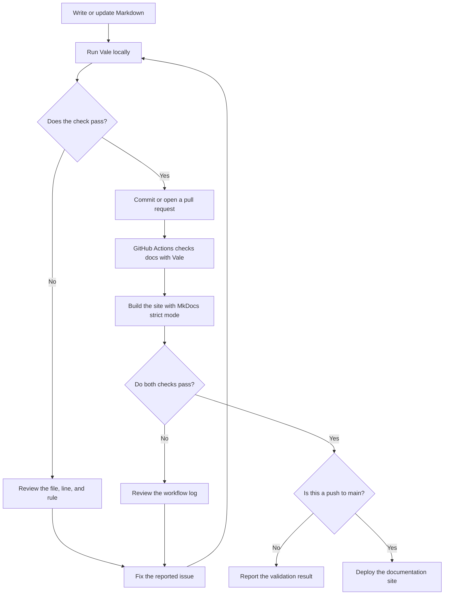

<style>
@media screen and (max-width: 44.984375em) {
  .md-main__inner,
  .md-content {
    box-sizing: border-box;
    min-width: 0;
    width: 100%;
    max-width: 100vw;
  }

  .md-content__inner {
    box-sizing: border-box;
    width: calc(100vw - 2rem) !important;
    max-width: calc(100vw - 2rem) !important;
    margin-right: 1rem !important;
    margin-left: 1rem !important;
    padding: 1rem 0;
  }

  .md-typeset .admonition,
  .md-typeset .md-typeset__scrollwrap {
    box-sizing: border-box;
    max-width: 100%;
  }

  .md-typeset p code {
    white-space: normal;
    overflow-wrap: anywhere;
  }
}
</style>

# Documentation Quality Pipeline

`English technical writing` · `Docs-as-Code` · `Vale` · `GitHub Actions`

This project provides an English documentation set for adding automated style
checks to a Markdown documentation repository.

It guides documentation contributors from their first local Vale check to a
repeatable GitHub Actions workflow. The content is organized by reader task:
run a check, configure the repository, automate the check, or resolve a failure.

!!! info "Project status"

    This project is based on the documentation workflow used by this portfolio.

    The repository structure, MkDocs site, Vale configuration, and existing
    documentation rules have been implemented. The English task pages are being
    written and revalidated against the repository before the project is marked
    complete.

    All five English pages have passed the current local Vale check and MkDocs
    strict build. The published workflow has successful run evidence, but these
    uncommitted pages need a new workflow run after publication.

## Project summary

Documentation contributors need feedback before a wording, terminology, or
formatting issue reaches review.

In this project, Vale checks Markdown files against repository-level writing
rules. Contributors can run the check locally while editing. GitHub Actions
checks the `docs` directory again for pull requests and pushes to `main`.

The documentation explains both parts of the workflow:

```text
Local feedback
→ Fix issues before committing
→ Submit the change
→ Run the repository check in GitHub Actions
→ Review the result
```

The project focuses on the documentation needed to use and maintain this
workflow. It doesn't attempt to reproduce the complete Vale or GitHub Actions
reference documentation.

## Audience

This documentation is intended for technical writers, documentation
contributors, and repository maintainers who:

- work with documentation stored as Markdown;
- have basic command-line and Git experience;
- are new to Vale or repository-level style checks;
- need to run documentation checks before committing changes;
- want the same repository rules to run automatically in GitHub Actions.

Readers don't need to understand Vale rule syntax before starting the Quick
Start.

Repository maintainers who need to add or change rules can continue to the
configuration guide after completing the first local check.

## Problem

The workflow involves several related tasks:

- installing the Vale command-line tool;
- locating the repository configuration;
- understanding which files and rules are active;
- running a local check;
- adding the same repository rules to GitHub Actions;
- interpreting failures in local and CI environments.

These tasks are often encountered at different times.

A contributor who only needs to run the first check doesn't need a complete
explanation of styles, vocabularies, and workflow syntax. A maintainer
investigating a failed CI job, however, needs information that doesn't belong
in a Quick Start.

Placing every concept on one page would make the first task harder to complete
and the later troubleshooting information harder to find.

## Project goals

The documentation is designed to help readers:

1. run their first local Vale check;
2. understand which repository files control the check;
3. configure rules without mixing configuration with installation steps;
4. run the check automatically in GitHub Actions;
5. distinguish content failures from environment and configuration failures;
6. verify that a change has produced the expected result.

Each task page includes an observable completion condition. Readers shouldn't
have to assume that a command, configuration change, or workflow run succeeded.

## Documentation strategy

The documentation is organized by task rather than by Vale feature.

```text
First local success
→ Repository configuration
→ CI integration
→ Troubleshooting
```

This structure separates four different reader needs.

| Document | Reader task | Completion condition |
| --- | --- | --- |
| Project Overview | Understand the project scope and documentation design | The reader can choose the correct starting page |
| [Quick Start](quick-start.md) | Install Vale and run the first local check | Vale scans the documentation directory and returns a result |
| [Configure Vale](configure-vale.md) | Understand and change repository-level checks | Vale loads the intended configuration and rules |
| [Run Vale in GitHub Actions](github-actions.md) | Apply the same rules to repository changes | The workflow runs and reports a clear pass or failure |
| [Troubleshooting](troubleshooting.md) | Recover from an observable failure | The reader can verify that the reported problem is resolved |

The Quick Start contains only the shortest path to the first successful local
check. Detailed configuration, CI behavior, and failure analysis remain in
their own pages.

## Workflow

The repository connects local authoring, automated checks, site builds, and
publication in one documentation workflow.



Local checks provide fast feedback while the contributor is editing. GitHub
Actions applies the committed configuration after a pull request is opened or
after a change is pushed to `main`. The workflow also supports a manual run.

The validation job runs Vale against `docs` and then runs
`mkdocs build --strict`. The deployment job runs only for a successful push to
`main`; pull requests and manual runs don't publish the site.

Running both local and CI checks also helps expose environment differences,
such as missing files, path capitalization, or inconsistent Vale versions.

## Repository components

The workflow depends on a small set of repository components.

| Component | Responsibility |
| --- | --- |
| `docs/` | Stores the Markdown documentation and site assets |
| `.vale.ini` | Defines the Vale configuration entry point, active styles, vocabulary, and minimum alert level |
| `styles/` | Stores committed Microsoft and Google style snapshots, the portfolio vocabulary, and the custom `MyStyle` rules |
| `.github/workflows/ci.yml` | Validates documentation changes and deploys successful pushes to `main` |
| `mkdocs.yml` | Defines the documentation site navigation, Markdown extensions, and build settings |
| `requirements-docs.txt` | Pins the MkDocs Material dependency used by the workflow |
| Git | Records documentation and configuration changes |

The task pages explain these components only where they affect the reader's
current goal.

For example, the Quick Start identifies `.vale.ini`, `styles/`, and `docs/` so
that the reader can confirm that the correct repository is open. The
configuration guide explains how those components affect Vale behavior in more
detail.

## Key decisions

### First success before configuration

The first reader goal isn't to understand every Vale option. It's to run a
check and recognize the result.

The Quick Start therefore focuses on this path:

```text
Install Vale
→ Open the configured repository
→ Run vale docs
→ Read the result
```

Style packages, rule implementation, ignored paths, and severity settings are
handled later.

### Local and CI checks as separate tasks

Local and CI checks use the same committed configuration and styles, but they
answer different questions and run through different entry points.

A local check answers:

> Can I detect and fix this issue before submitting my change?

A CI check answers:

> Does the submitted change meet the repository's documentation requirements?

Separating the two tasks keeps the local setup instructions short and gives the
GitHub Actions page enough space to explain triggers, workflow steps, logs, and
environment differences.

### Troubleshooting starts with symptoms

The troubleshooting page is organized around failures that readers can
observe, such as:

- `vale` isn't recognized as a command;
- Vale can't find the configured styles;
- Markdown files aren't being checked;
- the local check passes but the GitHub Actions job fails.

Each issue follows the same structure:

```text
Symptom
→ Likely cause
→ Check
→ Fix
→ Verification
```

This structure helps readers identify a relevant section before they understand
the underlying configuration model.

### Automated checks don't replace review

Vale is useful for rules that can be defined and applied repeatedly, including
terminology, discouraged wording, and selected formatting patterns.

It can't determine whether a document has the correct audience, a complete
task path, an appropriate information structure, or enough context for a new
reader.

The workflow therefore separates two responsibilities:

| Automated check | Human review |
| --- | --- |
| Repeatable wording and formatting rules | Technical accuracy |
| Terminology consistency | Information completeness |
| Detectable style patterns | Task flow and usability |
| File-level feedback | Context and reader needs |

## Project documents

The planned English documentation set contains five pages.

| Page | Purpose | Current status |
| --- | --- | --- |
| Project Overview | Explain the problem, structure, and validation model | Complete |
| [Quick Start](quick-start.md) | Run the first local Vale check | Complete |
| [Configure Vale](configure-vale.md) | Configure repository-level documentation checks | Complete |
| [Run Vale in GitHub Actions](github-actions.md) | Automate checks for pushes and pull requests | Complete |
| [Troubleshooting](troubleshooting.md) | Resolve local and CI failures | Complete |

The status table should be updated as each page is implemented and validated.

<!--
Replace the plain page names with relative links only after the target pages
exist. Do not publish broken links.
-->

## Validation

The project distinguishes implementation status from validation evidence.

| Item | Status | Evidence required |
| --- | --- | --- |
| MkDocs documentation site | Validated locally | `mkdocs build --strict` completed in the current repository |
| Repository documentation structure | Implemented | Repository files and navigation |
| Vale configuration and committed styles | Implemented | `.vale.ini` and `styles/` |
| Local Vale check for the English pages | Validated locally | `vale docs` returned 0 errors in the current repository |
| GitHub Actions documentation check | Revalidation required | A current successful workflow run containing this page |
| Deliberate local rule failure | Planned | A controlled example and corrected result |
| Deliberate CI failure and recovery | Planned | Workflow logs before and after the fix |

A page is marked as validated only after its commands and expected results have
been reproduced in the current repository.

Example output, placeholder version numbers, and sample workflow logs must be
identified as examples. They must not be presented as results produced by the
author's environment.

<!--
After validation, insert one current GitHub Actions screenshot here.

Suggested asset:
assets/english-docs/github-actions-vale-success.png

The screenshot should show:
- the workflow name;
- the repository or branch context;
- the Vale step;
- the successful job status.

Do not use a fabricated screenshot or a screenshot from another repository.
-->

## Technology

| Tool | Role in the project |
| --- | --- |
| Markdown | Stores the documentation source |
| Vale | Checks selected writing and terminology rules |
| GitHub Actions | Runs repository-level automated checks |
| MkDocs Material | Builds the documentation website |
| Git | Tracks documentation and configuration changes |
| Mermaid | Displays lightweight workflow diagrams |

## Project boundaries

The first version covers:

- Markdown documentation stored in one repository;
- local Vale installation and execution;
- repository-level Vale configuration;
- a GitHub Actions documentation check;
- common local and CI failures;
- the workflow used by this portfolio project.

The first version doesn't cover:

- organization-wide Vale configuration;
- protected-branch or required-check administration;
- publishing custom Vale packages;
- complete Vale rule development;
- checks for source-code repositories;
- localization and multilingual terminology management;
- replacing technical or editorial review with automated rules.

## Reading path

Start with [Quick Start](quick-start.md) when you need to install Vale and run the first local
documentation check.

Continue to [Configure Vale](configure-vale.md) when you need to understand or
change the repository rules.

Read [Run Vale in GitHub Actions](github-actions.md) when you need to apply the
same checks to pull requests and pushes to `main`.

Use [Troubleshooting](troubleshooting.md) when a local command, configuration,
or CI workflow doesn't produce the expected result.
