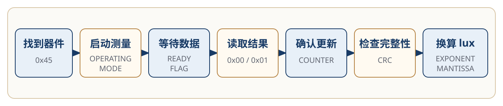
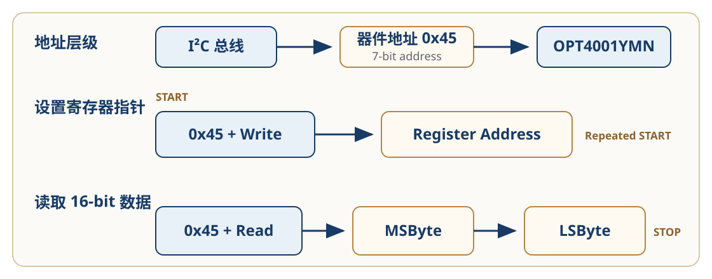
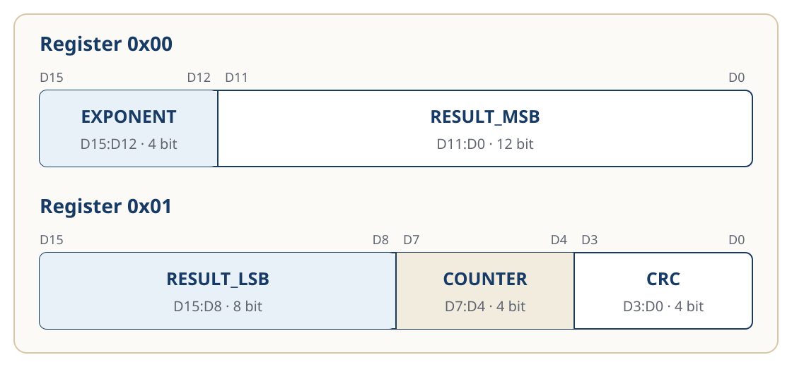

# 配置与数据读取

<div class="hardware-doc hardware-read-path-page" markdown>

OPT4001YMN 上电后不会立即持续产生新的环境光测量结果。

主控需要先找到器件、启动测量、等待转换完成，再读取结果寄存器，并将原始数据换算为 lux。

本页按照“找到器件 → 启动测量 → 等待数据 → 读取结果 → 验证结果 → 换算 lux”的任务顺序组织这些信息。

!!! info "验证状态"

    本页根据 TI [《OPT4001 Datasheet》](https://www.ti.com/lit/ds/symlink/opt4001.pdf)和
    [《OPT4001YMNEVM User's Guide》](https://www.ti.com/lit/ug/sbou278/sbou278.pdf)整理。

    工作模式、I²C 地址、寄存器字段和 lux 换算公式已经过官方资料核对。
    示例流程和代码尚未在 OPT4001YMNEVM 实物或目标 MCU 上运行。

<span id="read-path-overview"></span>

{ .doc-figure .figure--large .figure--diagram }

*图 1：OPT4001YMN 数据读取路径。根据 TI [《OPT4001 Datasheet》](https://www.ti.com/lit/ds/symlink/opt4001.pdf)的工作模式、I²C 编程和寄存器定义整理。该图表示读取任务，不是芯片内部框图。*
{: .figure-caption }

## 找到器件

OPT4001YMN 使用固定的 7-bit I²C 地址：

```text
0x45
```

这个地址用于定位 I²C 总线上的 OPT4001YMN。

器件内部还包含多组寄存器。当前读取任务主要使用以下地址：

| 地址 | 作用 |
| --- | --- |
| `0x0A` | 配置量程、转换时间和工作模式 |
| `0x0B` | 配置 Burst Read |
| `0x0C` | 查看转换完成状态 |
| `0x00` | 读取 Exponent 和 Mantissa 高 12 位 |
| `0x01` | 读取 Mantissa 低 8 位、Counter 和 CRC |

两类地址承担不同作用：

```text
0x45
→ 定位 I²C 总线上的器件

0x00、0x01、0x0A……
→ 定位器件内部的寄存器
```

多数 MCU 的 I²C 接口接收 7-bit 地址，此时应传入 `0x45`。

`0x8A` 和 `0x8B` 是将 `0x45` 左移并加入读写位后形成的地址字节。只有底层接口明确要求完整地址字节时，才应使用这种形式。

### 设置寄存器指针

读取某个寄存器前，主控需要先写入目标寄存器地址：

```text
器件地址 0x45 + Write
→ Register Address
```

随后发起读取：

```text
器件地址 0x45 + Read
→ MSByte
→ LSByte
```

OPT4001 的寄存器宽度为 16 bit，发送顺序为高字节在前、低字节在后。

### I²C 寄存器读取过程

{ .doc-figure .figure--large .figure--diagram }

*图 2：OPT4001YMN 的 I²C 寄存器读取过程。根据 TI [《OPT4001 Datasheet》](https://www.ti.com/lit/ds/symlink/opt4001.pdf)第 21—24 页重绘。该图用于说明地址层级和数据顺序，不表示完整电气时序。*
{: .figure-caption }

器件会保留当前寄存器指针。重复读取同一个寄存器时，不需要每次重新设置；
切换到其他寄存器时，再写入新的寄存器地址。

## 启动测量

OPT4001YMN 上电后默认处于 Power-down。

Power-down 状态下：

- 器件不进行主动光感测和转换；
- 结果寄存器不会持续更新；
- 器件仍然响应 I²C 访问。

因此，能够读取配置寄存器，并不代表器件已经开始测量。

测量相关配置位于寄存器 `0x0A`：

| 字段 | 默认值 | 本页使用 |
| --- | ---: | --- |
| `RANGE` | `0xC`，`Auto-range` | 保持默认 |
| `CONVERSION_TIME` | `0x8`，100 ms | 保持默认 |
| `OPERATING_MODE` | `0`，Power-down | 修改为 `3` |

将 `OPERATING_MODE` 从 `0` 修改为 `3` 后，器件进入 Continuous 模式：

```text
Power-down
OPERATING_MODE = 0

        ↓

Continuous
OPERATING_MODE = 3
```

Continuous 模式下，OPT4001 按照配置的 Conversion Time 持续测量，并更新输出寄存器。

修改 `OPERATING_MODE` 时，建议采用读—改—写：

```text
读取寄存器 0x0A
→ 只修改 OPERATING_MODE
→ 写回寄存器 0x0A
```

这样可以保留同一寄存器中的量程、转换时间和其他配置字段。

### Conversion Time

Conversion Time 表示一次测量从开始到结果寄存器完成更新所需的时间。

默认值为：

```text
CONVERSION_TIME = 0x8
转换时间约为 100 ms
```

器件支持从 600 μs 到 800 ms 的 12 档转换时间。较短的转换时间可以更快更新结果；有效测量分辨率还会受到转换时间和当前量程影响。

本页沿用默认的 100 ms，不对不同转换时间的实际性能作验证结论。

??? note "其他转换时间"

    | 字段值 | 转换时间 |
    | ---: | ---: |
    | `0` | 600 μs |
    | `1` | 1 ms |
    | `2` | 1.8 ms |
    | `3` | 3.4 ms |
    | `4` | 6.5 ms |
    | `5` | 12.7 ms |
    | `6` | 25 ms |
    | `7` | 50 ms |
    | `8` | 100 ms |
    | `9` | 200 ms |
    | `10` | 400 ms |
    | `11` | 800 ms |

OPT4001 还提供两种 One-shot 模式。本页只讨论与首次连续读取直接相关的 Continuous。

## 等待数据

切换到 Continuous 后，需要等待新的转换完成，再读取结果寄存器。

可以使用两种方式判断读取时机。

### 按时间等待

使用默认的 100 ms Conversion Time 时，主控应为第一次转换预留足够时间。

不应在写入工作模式后立即将当前结果寄存器内容当成新样本。

具体等待时间还需要考虑：

- 当前 Conversion Time；
- MCU 和总线调度；
- 应用允许的采样周期。

### 检查状态

寄存器 `0x0C` 中的 `CONVERSION_READY_FLAG` 表示转换状态：

| 值 | 状态 |
| ---: | --- |
| `0` | 转换仍在进行 |
| `1` | 转换已经完成 |

基本读取顺序可以写成：

```text
读取 0x0C
→ CONVERSION_READY_FLAG = 1
→ 读取结果寄存器
```

读取寄存器 `0x0C` 会清除 `CONVERSION_READY_FLAG`，因此程序应在读取后保存并处理该状态。

## 读取结果

最新测量结果分布在两个连续的 16-bit 寄存器中。

### 寄存器 0x00

| 位 | 字段 | 作用 |
| --- | --- | --- |
| `D15:D12` | `EXPONENT` | 表示当前满量程范围 |
| `D11:D0` | `RESULT_MSB` | Mantissa 的高 12 位 |

### 寄存器 0x01

| 位 | 字段 | 作用 |
| --- | --- | --- |
| `D15:D8` | `RESULT_LSB` | Mantissa 的低 8 位 |
| `D7:D4` | `COUNTER` | 记录样本更新 |
| `D3:D0` | `CRC` | 检查读取数据中的 bit 错误 |

### 结果寄存器位字段

{ .doc-figure .figure--large .figure--diagram }

*图 3：OPT4001 结果寄存器 `0x00` 和 `0x01`。根据 TI [《OPT4001 Datasheet》](https://www.ti.com/lit/ds/symlink/opt4001.pdf)第 27 页重绘。*
{: .figure-caption }

一组完整结果需要读取 4 个字节：

```text
0x00 MSByte
0x00 LSByte
0x01 MSByte
0x01 LSByte
```

### Burst Read

寄存器 `0x0B` 中的 `I2C_BURST` 默认值为 `1`，即上电后默认启用 Burst Read。

启用后，每完成一次 16-bit 寄存器读取，寄存器指针自动增加 `1`：

```text
设置寄存器指针为 0x00
→ 读取 0x00 的 2 个字节
→ 指针自动移动到 0x01
→ 读取 0x01 的 2 个字节
```

因此，主控可以从 `0x00` 开始连续读取 4 个字节，取得一组完整测量结果。

Burst Read 的作用是减少重复设置寄存器指针产生的 I²C 开销。

Datasheet 没有明确将 Burst Read 描述为两个结果寄存器的原子锁存机制，因此本页不作这一保证。

## 验证结果

`COUNTER` 是寄存器 `0x01` 中的 4-bit 滚动计数器。

它具有以下行为：

- 上电后从 `0` 开始；
- 每完成一次成功测量后递增；
- 到达 `15` 后回到 `0`；
- 随后继续循环。

Counter 可以帮助主控判断结果寄存器是否持续更新。

例如：

| 现象 | 判断 |
| --- | --- |
| lux 不变，Counter 改变 | 传感器仍在测量，当前环境光可能较稳定 |
| lux 和 Counter 都改变 | 传感器正在更新新的测量结果 |
| Counter 长时间不变 | 继续检查工作模式、转换状态和读取逻辑 |

Counter 只能帮助判断样本更新情况，不能单独证明 lux 计算或通信内容一定正确。

`CRC` 位于寄存器 `0x01` 的低 4 bit。

OPT4001 在每次测量后更新 CRC，主控可以使用它检查输出数据读取过程中是否出现 bit 错误。

```text
Counter
→ 判断样本是否更新

CRC
→ 检查读取数据是否完整
```

CRC 的计算涉及 Exponent、Mantissa 和 Counter 中的多组 bit。完整算法见 [《OPT4001 Datasheet》](https://www.ti.com/lit/ds/symlink/opt4001.pdf)第 27 页。

本页不重新简化 CRC 算法，避免给出未经验证的实现。

## 换算 lux

OPT4001 使用 Exponent 和 Mantissa 表示测量结果：

- `EXPONENT` 为 4 bit；
- `MANTISSA` 为 20 bit；
- Mantissa 分布在 `RESULT_MSB` 和 `RESULT_LSB` 中。

当前器件为 OPT4001YMN / PicoStar，使用以下系数：

```text
MANTISSA = (RESULT_MSB << 8) + RESULT_LSB
ADC_CODES = MANTISSA × 2^EXPONENT
lux = ADC_CODES × 312.5 × 10⁻⁶
```

SOT-5X3 使用不同的换算系数，不能直接套用当前公式。

### 计算示例

以下数值只用于说明计算过程，不是实测结果。

假设读取到：

```text
EXPONENT   = 1
RESULT_MSB = 0x003
RESULT_LSB = 0xE8
```

组合 Mantissa：

```text
MANTISSA
= (0x003 << 8) + 0xE8
= 1000
```

恢复 ADC code：

```text
ADC_CODES
= 1000 << 1
= 2000
```

换算为 lux：

```text
lux
= 2000 × 0.0003125
= 0.625 lux
```

Mantissa 需要 20 bit，经过 Exponent 左移后，ADC code 最多需要 28 bit。

实现计算时，应在左移前使用至少 32-bit 的无符号类型，避免中间结果溢出。

## 参考代码

下面的代码只负责解析已经读取到的寄存器 `0x00` 和 `0x01`。

它不包含：

- I²C 初始化；
- 寄存器读写；
- 工作模式配置；
- Ready Flag 轮询；
- 特定 MCU 的 HAL 接口。

```c
#include <stdint.h>

/**
 * Convert OPT4001YMN output registers to lux.
 *
 * This function only parses Register 0x00 and Register 0x01.
 * It does not perform I2C communication.
 */
double opt4001_ymn_result_to_lux(
    uint16_t result_reg_0,
    uint16_t result_reg_1)
{
    const uint8_t exponent =
        (uint8_t)((result_reg_0 >> 12) & 0x0Fu);

    const uint32_t result_msb =
        (uint32_t)(result_reg_0 & 0x0FFFu);

    const uint32_t result_lsb =
        (uint32_t)((result_reg_1 >> 8) & 0x00FFu);

    const uint32_t mantissa =
        (result_msb << 8) + result_lsb;

    /*
     * Mantissa is 20 bit and Exponent can be up to 8.
     * Use a 32-bit type before shifting.
     */
    const uint32_t adc_codes =
        mantissa << exponent;

    return (double)adc_codes * 0.0003125;
}
```

该代码根据 [《OPT4001 Datasheet》](https://www.ti.com/lit/ds/symlink/opt4001.pdf)中的寄存器字段和 lux 公式整理，尚未经过编译、目标 MCU 运行或实物验证。

!!! note "本页边界"

    本页只讨论 OPT4001YMN / PicoStar 在 Continuous 模式下的基本读取路径，使用固定的 7-bit 地址 `0x45` 和 PicoStar lux 系数。它不覆盖 SOT-5X3 的 ADDR 与 INT、完整 FIFO、阈值检测、完整 CRC 实现或特定 MCU 驱动。示例代码尚未经过编译和实物验证。

??? note "资料来源"

    <span id="source-opt4001-data"></span>

    **[OPT4001 Datasheet](https://www.ti.com/lit/ds/symlink/opt4001.pdf)**，SBOS993A，revised December 2022

    - 工作模式：第 13—15 页；
    - Conversion Time 和 lux 换算：第 18—19 页；
    - I²C 地址和寄存器读取：第 21—24 页；
    - 结果寄存器、Counter 和 CRC：第 26—27 页；
    - 配置与状态寄存器：第 31—33 页。

    <span id="source-opt4001-evm"></span>

    **[OPT4001YMNEVM User's Guide](https://www.ti.com/lit/ug/sbou278/sbou278.pdf)**，SBOU278，December 2021

    - GUI 中的结果寄存器和配置寄存器：第 17 页。

## 继续阅读

- [Quick Start：首次采集](../../02-hardware.md)
- [评估系统与光学硬件结构](information-architecture.md)
- [故障排查](troubleshooting.md)

</div>
