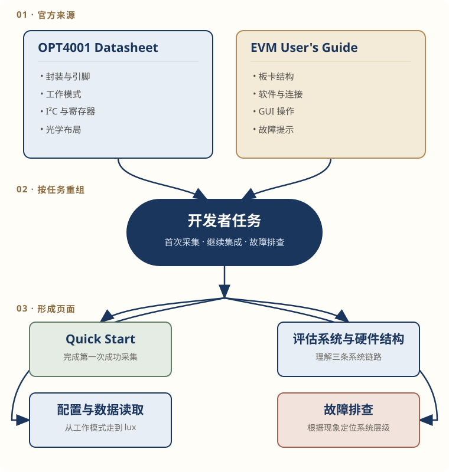

# OPT4001YMNEVM 开发者文档重构

## 项目说明

这个项目基于 TI 的 [《OPT4001 Datasheet》](https://www.ti.com/lit/ds/symlink/opt4001.pdf)和 [《OPT4001YMNEVM User's Guide》](https://www.ti.com/lit/ug/sbou278/sbou278.pdf)，把分散在两份官方资料中的板卡结构、首次采集、I²C 读写、结果寄存器和故障信息，重组为一套面向开发者的 Web 文档。

两份官方资料共 89 页：OPT4001 Datasheet 54 页，OPT4001YMNEVM User's Guide 35 页。当前交付从中筛选首次评估所需的信息，重组为 4 篇任务型 Web 文档，而不是复述一份缩短版 Datasheet。

{ .doc-figure .figure--medium .figure--diagram }

*图 1：将 Datasheet 和 EVM User's Guide 中的分散信息，按开发者任务重组。*
{: .figure-caption }

## 目标读者与问题

这套文档面向第一次使用 OPT4001YMNEVM，并希望继续理解底层逻辑的开发者。它集中处理两个问题：

- 怎样尽快连接评估板，并在 EVM GUI 中看到第一组 lux 数据；
- 需要集成或调试时，到哪里查找系统链路、工作模式、结果寄存器和故障判断。

官方 Datasheet 的 54 页内容按器件知识组织，EVM User's Guide 的 35 页内容按评估板安装和操作组织。完成一次首次采集或底层读取，往往需要跨越不同章节，甚至同时查阅两份资料，因此这套文档按照用户任务重新连接相关信息。

## 文档交付

| 页面 | 读者任务 |
| --- | --- |
| [Quick Start：首次采集](../../02-hardware.md) | 检查硬件、连接评估板、启动 EVM GUI，并确认 lux 曲线开始更新 |
| [评估系统与光学硬件结构](information-architecture.md) | 理解 PC、母板、coupon board 和传感器之间的控制、电气与光学链路 |
| [配置与数据读取](configure-and-read-lux.md) | 配置 Continuous 模式，读取结果寄存器并换算 lux |
| [故障排查](troubleshooting.md) | 根据 COM 端口、GUI 错误、结果更新和光学响应定位问题层级 |

## 三项关键判断

### 先建立第一次成功路径

Quick Start 的终点不是“完成配置”，而是读者能够在 EVM GUI 中看到 lux 数值和持续更新的曲线。寄存器、I²C 时序和 lux 公式不会提前进入这条路径。

### 把三条系统链路分开

- **控制链路**负责传递配置命令和测量数据；
- **电气链路**负责器件供电和 I²C 通信；
- **光学链路**负责让环境光到达感光区域。

通信正常但读数异常时，读者仍需检查安装方向、FPCB 开孔和感光区域，不能只停留在 I²C 配置。

### 区分地址与封装能力

`0x45` 是 OPT4001YMN 的 7-bit I²C 器件地址，`0x00`、`0x01` 和 `0x0A` 等是器件内部寄存器地址。OPT4001YMN / PicoStar 只有 VDD、GND、SCL 和 SDA，不能把 SOT-5X3 的 ADDR 与 INT 能力写入当前流程。

更完整的资料重组、交叉核对与写作判断，见[《从官方资料到开发者文档集》](../../posts/hardware-datasheet-restructure.md)。

## 验证状态

| 内容 | 当前状态 |
| --- | --- |
| 器件型号、封装、引脚和地址 | TI 官方资料确认 |
| 板卡结构、工作模式、I²C 与结果寄存器 | 已完成跨资料核对 |
| 文档结构、任务路径和重绘示意图 | 本项目完成 |
| 软件安装、USB 枚举和首次采集 | 待真实硬件验证 |
| 参考代码编译、运行和故障复现 | 待目标平台或真实硬件验证 |

作者目前没有 OPT4001YMNEVM 实物。页面中的官方界面截图和操作现象来自 TI 资料，不代表作者已经独立复现。资料确认、工程判断和实物验证在正文中保持区分。

## 进入文档

第一次查看时，从 [Quick Start：首次采集](../../02-hardware.md)开始。完成首次采集后，再依次阅读：

1. [评估系统与光学硬件结构](information-architecture.md)
2. [配置与数据读取](configure-and-read-lux.md)
3. [故障排查](troubleshooting.md)

