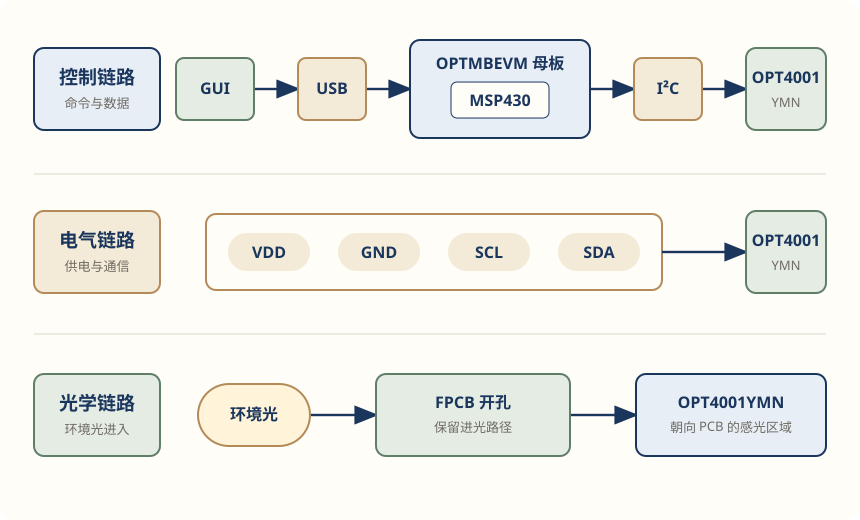

# OPT4001YMNEVM 开发者文档重构

<div class="hardware-doc" markdown>

这个项目基于 TI 的 [《OPT4001 Datasheet》](https://www.ti.com/lit/ds/symlink/opt4001.pdf)和
[《OPT4001YMNEVM User's Guide》](https://www.ti.com/lit/ug/sbou278/sbou278.pdf)，重新组织开发者第一次使用评估板时真正需要的信息。

文档从连接评估板开始，逐步进入系统结构、测量配置、数据读取和故障排查：

```text
连接评估板
→ 启动 EVM GUI
→ 采集第一组 lux 数据
→ 理解数据怎样产生
→ 出现异常时定位问题
```

我希望这套文档能够同时回答两个问题：

- 第一次接触 OPT4001YMNEVM，怎样尽快完成一次有效采集；
- 需要继续集成或调试时，到哪里查看系统链路、寄存器和故障判断。

!!! info "当前状态"

    文档中的器件型号、封装引脚、板卡关系、工作模式、I²C 读取方式和
    lux 换算公式，已经根据 TI 官方资料完成核对。

    我目前没有 OPT4001YMNEVM 实物，因此尚未独立复现软件安装、
    硬件连接、数据采集和故障现象。页面中的官方界面截图和操作结果
    不代表作者本人的实测结果。

## 项目目标

官方资料已经完整覆盖器件规格、评估板结构、软件安装、GUI 操作、
寄存器和 PCB 设计。

但开发者要完成一次首次采集，仍然需要在两份资料和多个章节之间来回查找：

```text
确认硬件
→ 安装和启动软件
→ 连接评估板
→ 判断母板是否被识别
→ 切换测量模式
→ 查看 lux 数据
→ 出现问题时寻找对应章节
```

这个项目没有重新编写一份缩短版 Datasheet。

我先确定开发者需要完成的任务，再从不同资料中提取和核对相关事实，
将它们重新组织为一条可以执行、判断和排错的使用路径。

## 原始资料

本项目主要使用两份 TI 官方资料。

| 资料 | 主要内容 | 在项目中的作用 |
| --- | --- | --- |
| [《OPT4001 Datasheet》](https://www.ti.com/lit/ds/symlink/opt4001.pdf) | 封装与引脚、电气条件、工作模式、I²C、寄存器、lux 换算和光学布局 | 核对器件行为和底层数据 |
| [《OPT4001YMNEVM User's Guide》](https://www.ti.com/lit/ug/sbou278/sbou278.pdf) | 板卡组成、软件安装、硬件连接、GUI 操作、原理图、PCB 和故障处理 | 核对评估流程和硬件结构 |

[《OPT4001 Datasheet》](https://www.ti.com/lit/ds/symlink/opt4001.pdf)按器件知识和工程设计组织，[《OPT4001YMNEVM User's Guide》](https://www.ti.com/lit/ug/sbou278/sbou278.pdf)按评估板的安装、操作和硬件组成展开。

两份资料承担不同职责。一个开发任务所需的信息，也经常分布在不同文档中。

例如，要解释“为什么连接成功后仍然没有新的 lux 数据”，需要同时查看：

- EVM GUI 中的 `Continuous` 和 `Start Capture` 操作；
- OPT4001 上电后的默认工作模式；
- `OPERATING_MODE` 配置字段；
- 结果寄存器的更新条件。

技术文档的工作，就是把这些来源重新连接为一段完整答案。

## 目标读者

这套文档面向第一次使用 OPT4001YMNEVM，并希望继续理解底层逻辑的开发者。

读者需要完成的核心任务是：

```text
理解系统
→ 检查硬件
→ 连接电脑
→ 启动测量
→ 等待数据
→ 读取结果
→ 判断是否成功
→ 出错时定位问题
```

这条任务路径决定了：

- 哪些内容进入 Quick Start；
- 哪些内容进入开发与调试指南；
- 哪些参数只需要链接回官方 Reference；
- 哪些结论必须明确标注适用封装和验证状态。

## 信息重组

官方资料按照产品体系组织：

```text
OPT4001 Datasheet
├─ 封装和引脚
├─ 电气规格
├─ 工作模式
├─ I²C
├─ 寄存器
└─ 应用设计

OPT4001YMNEVM User's Guide
├─ 硬件组成
├─ 软件安装
├─ 硬件连接
├─ GUI 操作
├─ 原理图与 PCB
└─ 故障处理
```

重构时，我先确定用户当前要解决的问题，再回到不同章节提取所需事实：

```text
官方来源
→ 用户问题
→ 完成任务所需的信息
→ 最合适的文档页面
```

{ .opt4001-overview-diagram }

*图 1：本项目将 [《OPT4001 Datasheet》](https://www.ti.com/lit/ds/symlink/opt4001.pdf)和 [《OPT4001YMNEVM User's Guide》](https://www.ti.com/lit/ug/sbou278/sbou278.pdf)中分散的信息，按照开发者任务重新组织。*

## 文档结构

整个项目分为三个层次。

### Quick Start

服务第一次使用 EVM 的开发者，只负责建立第一次成功路径：

```text
检查 coupon board
→ 连接 USB
→ 启动 GUI
→ 选择 Continuous
→ 点击 Start Capture
→ 看到 lux 数值和曲线
```

每个关键操作都补充了：

```text
用户动作
→ 可观察结果
→ 常见失败
→ 最短恢复动作
```

寄存器、I²C 时序和 lux 公式不会提前进入这条路径。

### 开发与调试指南

服务需要继续理解、集成或排查问题的开发者，包括：

- **评估系统与光学硬件结构**：解释整套系统怎样连接；
- **配置与数据读取**：解释测量怎样开始，结果怎样读取和换算；
- **故障排查**：根据可观察现象判断问题所在的系统层级。

### Reference

当前版本没有复制一份完整的寄存器手册。

必要的引脚、地址、字段和参数以小型表格放在对应任务附近，
完整定义继续链接 TI [《OPT4001 Datasheet》](https://www.ti.com/lit/ds/symlink/opt4001.pdf)。

这样可以保留官方资料的权威性，也避免开发者页面变成缩短版 Datasheet。

## 关键设计

### 第一次成功路径

官方 [《OPT4001YMNEVM User's Guide》](https://www.ti.com/lit/ug/sbou278/sbou278.pdf)已经给出了硬件连接、GUI 操作、成功结果和局部错误提示，
但这些内容分布在软件安装、设备连接和操作章节中。

我将首次采集重新连接为一条连续路径，并把完成标准定为：

```text
Operation Select 设为 Continuous
→ 点击 Start Capture
→ GUI 显示 lux 数值
→ 曲线持续增加新的数据点
```

这让 Quick Start 的终点可以被读者直接观察，而不只是一句“完成配置”。

关于这部分的完整写作复盘，见
[《如何写一篇让读者真正跑通的 Quick Start》](../../posts/quick-start-reader-success.md)。

### 三条系统链路

阅读 [《OPT4001 Datasheet》](https://www.ti.com/lit/ds/symlink/opt4001.pdf)、[《OPT4001YMNEVM User's Guide》](https://www.ti.com/lit/ug/sbou278/sbou278.pdf)和板卡结构后，我将首次评估拆成了三条链路：

```text
控制链路
GUI → USB → MSP430 → I²C → OPT4001YMN

电气链路
VDD / GND / SCL / SDA

光学链路
环境光 → FPCB 开孔 → 朝下的感光区域
```

控制链路说明命令和测量结果怎样传递，电气链路说明器件怎样供电和通信，
光学链路说明环境光怎样真正到达传感器。

这样，通信正常但 lux 响应异常时，读者还会继续检查安装方向、
进光开孔和感光区域，而不会只停留在 I²C 配置。

[{ .opt4001-overview-diagram }](information-architecture.md)

*图 2：OPT4001YMNEVM 的控制、电气和光学链路。点击图片查看完整说明。*

### 底层读取任务

原始资料将器件地址、工作模式、读取时序、Burst 配置、结果寄存器和
lux 换算放在多个章节。

我将它们重新组织为一次完整的数据读取任务：

```text
找到器件
→ 启动测量
→ 等待数据
→ 读取结果
→ 确认更新
→ 检查完整性
→ 换算 lux
```

每项信息在任务中承担不同作用：

| 信息 | 作用 |
| --- | --- |
| `0x45` | 定位 I²C 总线上的 OPT4001YMN |
| `OPERATING_MODE` | 决定器件是否开始测量 |
| `CONVERSION_TIME` | 决定一次结果何时完成 |
| Ready Flag | 判断新转换是否完成 |
| Burst Read | 连续读取完整结果 |
| Counter | 判断样本是否持续更新 |
| CRC | 检查读取数据中的 bit 错误 |
| Exponent 和 Mantissa | 恢复测量结果并换算为 lux |

这些内容按照任务发生的顺序展开，读者可以看到每个字段为什么需要读取，
以及它在整个流程中处于哪一步。

### 故障定位

故障排查没有按照错误码或 Datasheet 章节机械罗列。

页面先根据读者能够看到的现象，将问题定位到不同层级：

```text
电脑与 USB
→ Windows 设备枚举
→ EVM GUI 与母板
→ coupon board 与 I²C
→ 测量状态与结果更新
→ 数据解析
→ 光学路径
```

Quick Start 只保留当前步骤最短的恢复动作，完整检查过程再进入故障排查页。

### 来源与边界

没有真实硬件时，资料阅读能够确认技术事实，却不能代替实物验证。

页面中的内容被区分为：

- TI 官方资料明确说明的事实；
- 根据多处资料交叉形成的系统关系；
- 由本项目完成的文档结构和图示；
- 仍需真实硬件确认的操作、代码和测试结果。

“官方资料确认”不会被写成“作者已经跑通”。

## 跨资料核对

有些信息不能只看单个界面、丝印或章节。

### 封装与接口

OPTMBEVM 的通用接口中可以看到 `ADDR` 和 `INT`，但
OPT4001YMN / PicoStar 本身只有：

```text
VDD / GND / SCL / SDA
```

器件能力需要以当前封装的引脚定义为准。

### 板卡层级

官方 Overview 从功能上将系统分为 OPTMBEVM 和 coupon board。

继续展开物理结构后，coupon board 还包括：

```text
rigid coupon board
→ flex coupon board
→ OPT4001YMN
```

“两部分”和“三层板卡”描述的是不同层级。

### 通信与测量

OPT4001YMN 上电后默认处于 Power-down。

它仍然可以响应 I²C，但不会持续产生新的环境光测量结果。
因此，“能够读取寄存器”和“已经开始测量”需要分别判断。

### 地址层级

`0x45` 用于定位 I²C 总线上的 OPT4001YMN。

`0x00`、`0x01`、`0x0A` 等地址用于定位器件内部的结果或配置寄存器。

文档将这两层地址分开说明，避免把器件地址和寄存器地址混在同一组步骤中。

## 文档交付

### [Quick Start：首次采集](../../02-hardware.md)

帮助读者从检查 coupon board 开始，完成 USB 连接、GUI 启动和
第一组 lux 数据采集。

### [评估系统与光学硬件结构](information-architecture.md)

解释 PC GUI、OPTMBEVM、MSP430、coupon board 和 OPT4001YMN
之间的关系，以及控制、电气和光学三条链路。

### [配置与数据读取](configure-and-read-lux.md)

按照“找到器件—启动测量—等待数据—读取结果—验证结果”的顺序，
解释工作模式、I²C、结果寄存器和 lux 换算。

### [故障排查](troubleshooting.md)

从 LED、COM 端口、GUI 错误、寄存器读取、样本更新和光学响应等
可观察现象出发，逐层定位问题。

## 验证状态

| 内容 | 当前状态 |
| --- | --- |
| 器件型号、封装和引脚 | 官方资料确认 |
| 板卡结构和系统链路 | 已完成跨资料核对 |
| 工作模式、I²C 和寄存器 | 官方资料确认 |
| 文档结构和任务路径 | 本项目完成 |
| 系统图、光学图和寄存器图 | 根据官方资料重绘 |
| 软件安装和 USB 枚举 | 待实物验证 |
| Continuous 首次采集 | 待实物验证 |
| 示例代码编译和运行 | 待目标平台验证 |
| 故障现象复现 | 待实物验证 |

## 项目边界

当前版本覆盖：

- OPT4001YMNEVM；
- OPTMBEVM 母板；
- OPT4001YMN / PicoStar；
- 官方 coupon board；
- 首次采集、系统说明、基础数据读取和故障排查。

当前版本不包含：

- SOT-5X3 的 `ADDR` 和 `INT` 使用方法；
- 完整寄存器 Reference；
- FIFO、阈值检测和完整 CRC 实现；
- 特定 MCU 平台的完整驱动；
- 量产 PCB 的机械和光学参数；
- 已经过作者实物测试的性能结论。

## 官方资料

### [OPT4001YMNEVM User's Guide](https://www.ti.com/lit/ug/sbou278/sbou278.pdf)

文档编号：SBOU278，December 2021

用于核对评估系统组成、软件操作、硬件连接、原理图、PCB 和故障处理。

### [OPT4001 Datasheet](https://www.ti.com/lit/ds/symlink/opt4001.pdf)

文档编号：SBOS993A，revised December 2022

用于核对封装与引脚、工作条件、工作模式、I²C、寄存器、
lux 换算和光学布局。

## 进入开发者文档

第一次查看这项作品时，建议从
[Quick Start：首次采集](../../02-hardware.md)开始。

已经完成首次采集，希望继续理解系统和底层数据时，可以依次阅读：

1. [评估系统与光学硬件结构](information-architecture.md)
2. [配置与数据读取](configure-and-read-lux.md)
3. [故障排查](troubleshooting.md)

</div>
