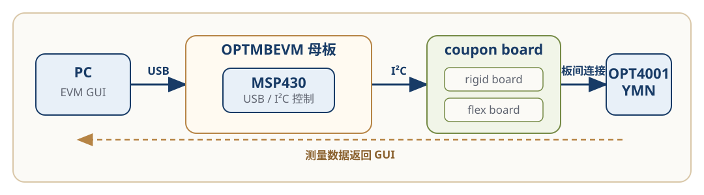
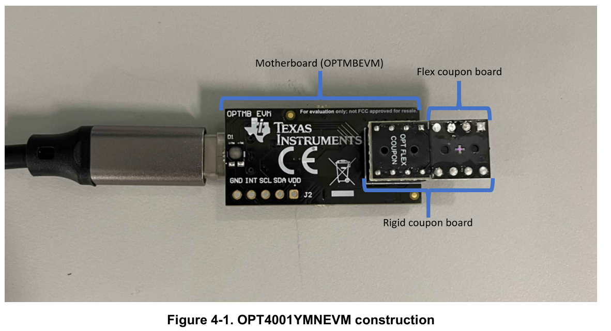
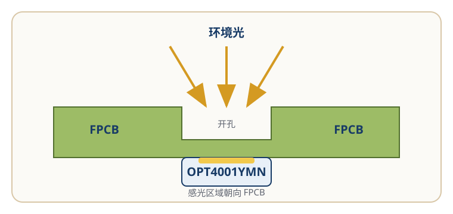

# 评估系统与光学硬件结构

<div class="hardware-doc" markdown>

OPT4001YMNEVM 通过 PC 端 EVM GUI、OPTMBEVM 母板和
OPT4001YMN coupon board 完成环境光测量。

理解这套评估系统，需要同时查看三条路径：

- <strong class="path-name">控制链路</strong>负责传递配置命令和测量数据；
- <strong class="path-name">电气链路</strong>负责器件供电和 I²C 通信；
- <strong class="path-name">光学链路</strong>负责让环境光到达感光区域。

本页说明这些部分如何连接，以及它们各自承担什么作用。

!!! info "验证状态"

    本页根据 TI [《OPT4001YMNEVM User's Guide》](https://www.ti.com/lit/ug/sbou278/sbou278.pdf)和
    [《OPT4001 Datasheet》](https://www.ti.com/lit/ds/symlink/opt4001.pdf)整理。

    板卡关系、器件引脚和光学结构已经过官方资料核对。
    作者目前没有 OPT4001YMNEVM 实物，尚未独立验证硬件连接、
    通信和光照响应。

## 系统总览

一次测量需要经过以下部分：

```text
PC EVM GUI
→ USB
→ OPTMBEVM 母板
→ MSP430
→ I²C
→ OPT4001YMN
```

配置命令沿这条路径到达传感器。测量完成后，结果再经过 MSP430 和 USB
返回 EVM GUI，并显示为 lux 数值和曲线。



*图 1：OPT4001YMNEVM 系统组成和数据路径。根据 TI [《OPT4001YMNEVM User's Guide》](https://www.ti.com/lit/ug/sbou278/sbou278.pdf)第 3 页和第 5 页重绘。该图不表示实际 PCB 走线和机械比例。*

## 板卡结构 { #board-structure }

官方指南从功能上将评估系统分为两个部分：

- OPTMBEVM 母板；
- OPT4001YMN coupon board。

展开 coupon board 后，可以看到三层物理结构：

```text
OPTMBEVM motherboard
→ rigid coupon board
→ flex coupon board
→ OPT4001YMN
```



*图 2：OPT4001YMNEVM 的板卡结构。来源：TI [《OPT4001YMNEVM User's Guide》](https://www.ti.com/lit/ug/sbou278/sbou278.pdf)，Figure 4-1，第 19 页。*

各部分承担不同的作用：

| 部分 | 作用 |
| --- | --- |
| PC 与 EVM GUI | 配置器件并显示 lux 数值和曲线 |
| OPTMBEVM 母板 | 提供 USB 接口、电源和 MSP430 控制器 |
| Rigid coupon board | 提供机械支撑和母板插拔接口 |
| Flex coupon board | 承载 OPT4001YMN，并为感光区域提供开孔 |
| OPT4001YMN | 测量环境光并输出数字结果 |

Flex coupon board 焊接在 rigid coupon board 上，rigid coupon board
再插入 OPTMBEVM 母板。较薄的柔性板用于承载朝向 PCB 的传感器并保留进光开孔，刚性板则为它提供
机械支撑，使 coupon board 可以稳定插拔。

需要插拔 coupon board 时，应握住 rigid coupon board，不要按压或弯折
flex coupon board。

## 控制链路

PC 端 EVM GUI 不直接访问 OPT4001YMN。

GUI 发出的配置和读取命令通过 USB 到达 OPTMBEVM。母板上的 MSP430
将这些命令转换为 I²C 操作，再访问 coupon board 上的 OPT4001YMN。

测量完成后，MSP430 读取器件的结果寄存器，并通过 USB 将数据返回 GUI。
GUI 再将测量结果显示为 lux 数值和曲线。

各部分的职责如下：

| 部分 | 职责 |
| --- | --- |
| EVM GUI | 提供操作界面并显示结果 |
| USB | 连接电脑与 OPTMBEVM |
| MSP430 | 在 USB 命令和 I²C 操作之间建立控制链路 |
| I²C | 传输器件配置和寄存器数据 |
| OPT4001YMN | 完成环境光测量 |

工作模式、寄存器读取和 lux 换算见
[配置与数据读取](configure-and-read-lux.md)。

## 电气链路

OPT4001YMN 是四引脚 PicoStar 器件。

| 信号 | 类型 | 作用 |
| --- | --- | --- |
| VDD | 电源 | 为 OPT4001YMN 供电 |
| GND | 电源 | 系统地 |
| SCL | 数字输入 | I²C 时钟 |
| SDA | 数字输入/输出 | I²C 数据 |

这四条信号从 OPTMBEVM 经过板间接口和 coupon board，最终连接到
OPT4001YMN。

OPTMBEVM 和 rigid coupon board 的通用接口中还可以看到 `ADDR` 和
`INT` 标识，但当前使用的 OPT4001YMN / PicoStar 没有对应的器件引脚。

`ADDR` 和 `INT` 适用于另一种 SOT-5X3 封装。判断器件能力时，应以当前
封装的 Datasheet 引脚定义为准，不能只根据母板丝印或通用接口名称判断。

## 光学链路

OPT4001YMN 的感光区域与器件焊盘位于同一侧。

器件焊接到 flex PCB 后，感光区域朝向电路板，因此环境光需要通过
flex PCB 上的开孔到达传感器。



*图 3：OPT4001YMN 的光学路径。根据 TI [《OPT4001 Datasheet》](https://www.ti.com/lit/ds/symlink/opt4001.pdf) Figure 9-6 和 Figure 9-9 重绘。该图为结构示意，不表示实际尺寸和视场角。*

因此，评估结果不仅依赖供电和 I²C 通信，还依赖以下条件：

- coupon board 安装方向正确；
- FPCB 开孔没有被遮挡；
- 感光区域没有被灰尘、指纹或其他异物覆盖；
- 周围结构没有明显限制进光。

通信正常，只能说明控制链路和电气链路已经建立，不能证明光学条件一定正常。

在自研 PCB 中，去耦电容需要靠近器件电源引脚，同时还应考虑邻近元件、
焊点和结构可能产生的遮挡或反射。具体距离、开孔尺寸和视场设计应结合
Datasheet、机械结构和实际测试确定，本页不提供量产布局参数。

## 故障定位

控制、电气和光学三条链路会产生不同的故障表现。

| 链路 | 正常状态 | 异常时优先检查 |
| --- | --- | --- |
| 控制链路 | GUI 可以识别母板，命令和数据可以往返 | USB、COM 端口、母板供电和 MSP430 |
| 电气链路 | OPT4001YMN 获得供电并响应 I²C | VDD、GND、SCL、SDA 和板卡连接 |
| 光学链路 | 环境光可以到达感光区域 | 安装方向、FPCB 开孔和感光表面 |

例如：

- GUI 无法检测到母板时，优先检查电脑、USB 和 OPTMBEVM；
- 母板已连接但寄存器读取失败时，优先检查 coupon board 和 I²C 链路；
- 通信正常但 lux 读数异常时，还需要检查安装方向、开孔和感光区域。

完整的现象和检查顺序见
[故障排查](troubleshooting.md)。

## 适用范围

本页适用于：

- OPT4001YMNEVM；
- OPTMBEVM 母板；
- OPT4001YMN coupon board；
- OPT4001YMN / PicoStar 封装。

本页不包含：

- SOT-5X3 封装的 `ADDR` 和 `INT` 使用方法；
- 完整 EVM 原理图说明；
- 具体寄存器配置和 lux 换算；
- 量产 PCB 的开孔尺寸和机械参数；
- 已经过作者实物验证的性能结论。

## 资料来源

### [OPT4001YMNEVM User's Guide](https://www.ti.com/lit/ug/sbou278/sbou278.pdf)

文档编号：SBOU278，December 2021

- PicoStar 感光方向和系统组成：第 3 页；
- PC、USB、母板和 I²C 关系：第 5 页；
- coupon board 连接和操作注意事项：第 6 页；
- 板卡结构：第 19 页；
- 原理图和 PCB：第 19—27 页。

### [OPT4001 Datasheet](https://www.ti.com/lit/ds/symlink/opt4001.pdf)

文档编号：SBOS993A，revised December 2022

- YMN 与 SOT-5X3 引脚：第 4 页；
- PicoStar 开孔、光学布局和邻近元件影响：第 39 页。

## 继续阅读

- [Quick Start：首次采集](../../02-hardware.md)
- [配置与数据读取](configure-and-read-lux.md)
- [故障排查](troubleshooting.md)

</div>
