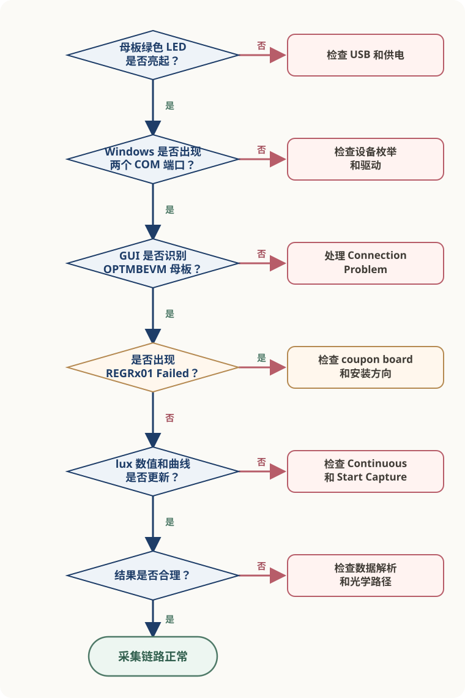
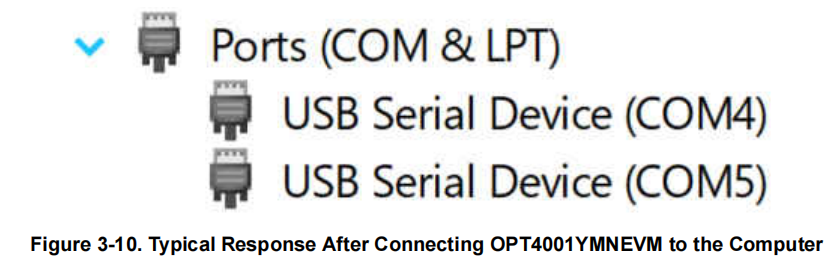
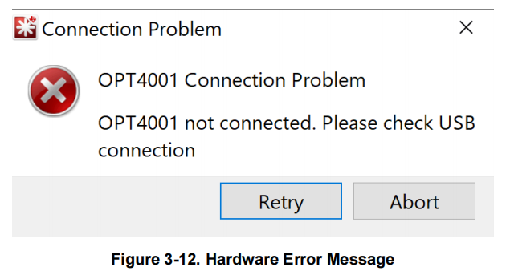
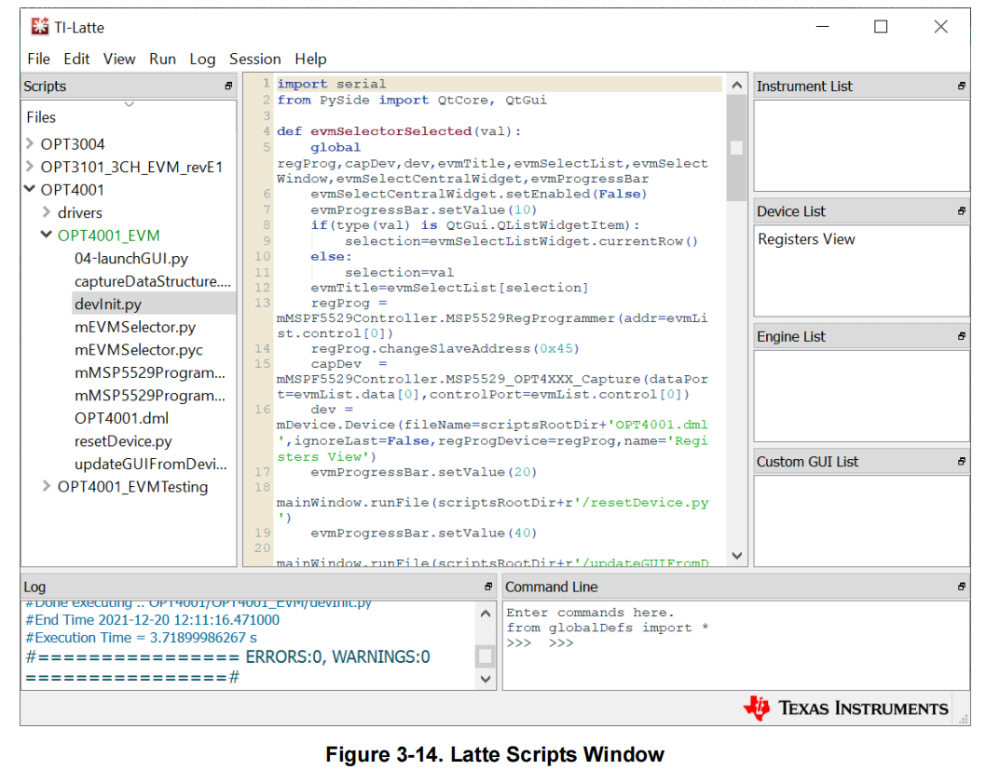

# 故障排查

<div class="hardware-doc" markdown>

OPT4001YMNEVM 的首次采集依赖电脑、USB、OPTMBEVM 母板、
coupon board、OPT4001YMN 和 EVM GUI 共同工作。

出现异常时，先根据可观察到的现象判断问题停在哪一层，再检查对应的连接、
配置或数据处理过程。

!!! info "验证状态"

    本页根据 TI [《OPT4001YMNEVM User's Guide》](https://www.ti.com/lit/ug/sbou278/sbou278.pdf)和
    [《OPT4001 Datasheet》](https://www.ti.com/lit/ds/symlink/opt4001.pdf)整理。

    官方文档明确给出的错误现象和检查步骤在正文中单独说明。
    自定义主控、数据解析和光学路径中的补充检查根据系统结构整理，
    尚未在 OPT4001YMNEVM 实物上复现。

## 排查路径

按照以下顺序定位问题：

```text
母板绿色 LED 是否亮起
→ Windows 是否出现两个 COM 端口
→ GUI 是否识别母板
→ coupon board 是否能够被读取
→ lux 数值和曲线是否更新
→ 数据解析是否正确
→ 光学路径是否正常
```

### OPT4001YMNEVM 故障排查路径

{ .doc-figure .figure--medium .figure--diagram }

*图 1：OPT4001YMNEVM 故障排查路径。该图根据系统结构和官方错误说明整理，不表示实际硬件走线。*
{: .figure-caption }

下面的检查分为两部分：

- 使用官方 OPT4001 EVM GUI 时，进入“官方 EVM GUI”；
- 使用 MCU 或其他控制器直接访问器件时，进入“自定义主控”。

## 官方 EVM GUI

### 母板未上电

**现象**

将评估板连接到电脑后，OPTMBEVM 母板上的绿色 LED 没有亮起。

**检查**

1. USB-C 接头是否完全插入 OPTMBEVM；
2. USB-A 接头是否完全插入电脑；
3. 当前 USB 端口是否能够正常供电；
4. 更换 USB 端口或线缆后，现象是否改变。

绿色 LED 用于确认母板已经通过 USB 获得供电。LED 未亮起时，
暂时不要继续检查 GUI、寄存器或传感器配置。

**恢复标准**

重新连接后：

- 母板绿色 LED 亮起；
- Windows 开始识别新的 USB 设备。

### 未识别 COM 端口

**现象**

母板绿色 LED 已亮起，但 Windows 设备管理器中没有出现两个 COM 端口。

正常连接后，设备管理器应在 `Ports (COM & LPT)` 下显示两个端口。

{ .doc-figure .figure--small .figure--screenshot }

*图 2：评估板正常枚举后，Windows 设备管理器中出现两个 COM 端口。来源：TI [《OPT4001YMNEVM User's Guide》](https://www.ti.com/lit/ug/sbou278/sbou278.pdf)，Figure 3-10，第 12 页。实际端口编号可能不同。*
{: .figure-caption }

**检查**

1. 断开并重新连接 USB，观察设备管理器是否刷新；
2. 检查 `Ports (COM & LPT)`；
3. 检查 `Other devices` 或带警告标志的设备；
4. 确认设备是否以 `USB Serial Device` 出现；
5. 查看设备状态中是否包含驱动错误信息。

**恢复标准**

设备管理器中出现两个 COM 端口，且没有驱动警告标志。

??? note "Windows 7 驱动"

    TI 官方指南第 28—34 页提供了 Windows 7 的手动驱动安装步骤。

    该流程针对 Windows 7，不应直接作为所有 Windows 版本的通用处理方法。
    使用其他系统版本时，应先检查设备管理器中的具体状态和驱动来源。

### GUI 未检测到母板

**现象**

启动 EVM GUI 后出现：

```text
OPT4001 Connection Problem
OPT4001 not connected. Please check USB connection.
```

{ .doc-figure .figure--small .figure--screenshot }

*图 3：EVM GUI 未检测到 OPTMBEVM 时显示的错误。来源：TI [《OPT4001YMNEVM User's Guide》](https://www.ti.com/lit/ug/sbou278/sbou278.pdf)，Figure 3-12，第 13 页。*
{: .figure-caption }

该错误表示 GUI 没有检测到 OPTMBEVM 母板。此时问题位于电脑、USB、
设备枚举或母板这一段链路，还不能据此判断 OPT4001YMN 是否正常。

**检查**

1. USB 是否仍然连接；
2. 母板绿色 LED 是否亮起；
3. Windows 是否出现两个 COM 端口；
4. 关闭 GUI 后重新连接评估板；
5. Windows 完成设备识别后，再次启动 GUI。

**恢复标准**

GUI 正常进入 OPT4001 主操作界面，不再显示连接错误。

### 寄存器读取失败

**现象**

GUI 可以启动，但 Latte Scripts 窗口中出现：

```text
Operation I2C Register Read for command [REGRx01] Failed
```

该错误表示母板未能正常检测或读取 OPT4001 IC 或 coupon board。

Latte Scripts 窗口在软件启动后可能处于最小化状态。

{ .doc-figure .figure--large .figure--screenshot }

*图 4：Latte Scripts 窗口的位置。来源：TI [《OPT4001YMNEVM User's Guide》](https://www.ti.com/lit/ug/sbou278/sbou278.pdf)，Figure 3-14，第 16 页。*
{: .figure-caption }

**检查**

TI 官方优先检查以下两项：

1. coupon board 是否已经插入 OPTMBEVM；
2. coupon board 的安装方向是否正确。

插拔 coupon board 时：

- 只握住 rigid coupon board；
- 不要按压或弯折 flex coupon board。

**仍未恢复时**

继续检查可见的机械状态：

- rigid coupon board 是否完全插入插座；
- 插针是否存在明显弯曲或异物；
- flex PCB 是否存在明显破损；
- 板卡是否受到异常压力。

这些属于根据板卡结构整理的补充检查，不能将其中某一项直接认定为
`REGRx01 Failed` 的唯一原因。

**恢复标准**

重新安装 coupon board 后：

- Scripts 窗口不再出现该寄存器读取错误；
- GUI 可以继续访问器件；
- 可以进入连续采集操作。

### 没有 lux 数据

**现象**

GUI 已经识别母板和 coupon board，但主界面没有显示 lux 数值，
或者曲线没有持续增加新的数据点。

**检查**

1. `Operation Select` 是否选择 `Continuous`；
2. 是否已经点击 `Start Capture`；
3. GUI 中是否开始显示 lux 数值；
4. 曲线区域是否持续增加新的数据点。

OPT4001YMN 上电后默认处于 Power-down。该模式下，器件仍然响应 I²C，
但不会主动持续测量。

因此，能够打开寄存器视图或读取配置寄存器，不代表器件已经开始更新结果。

**恢复标准**

- `Operation Select` 已设为 `Continuous`；
- 已点击 `Start Capture`；
- GUI 显示 lux 数值；
- 曲线持续更新。

工作模式和结果寄存器的详细说明见
[配置与数据读取](configure-and-read-lux.md)。

## 自定义主控

本节适用于使用 MCU 或其他控制器直接访问 OPT4001YMN 的场景。

这些检查不属于 EVM GUI 的官方错误处理流程，需要结合目标硬件、
I²C 驱动和实际测量结果验证。

### I²C 无响应

**现象**

主控向 OPT4001YMN 发起 I²C 通信，但器件没有返回 ACK，
或者无法读取任何寄存器。

**检查**

1. VDD 和 GND 是否连接正确，电源是否位于推荐工作范围；
2. SCL 和 SDA 是否接反或断开；
3. 总线是否具有合适的上拉；
4. 主控 API 要求的是 7-bit 地址还是完整地址字节；
5. 总线上是否存在持续拉低 SCL 或 SDA 的器件。

OPT4001YMN 使用固定的 7-bit I²C 地址：

```text
0x45
```

多数 MCU I²C API 接收 7-bit 地址，此时应传入 `0x45`。

只有底层接口明确要求完整地址字节时，才需要处理左移和读写位。
不要在未确认 API 参数格式时直接使用 `0x8A` 或 `0x8B`。

**恢复标准**

主控向 `0x45` 发起访问时，OPT4001YMN 返回 ACK，并能够读取已知寄存器。

地址层级和寄存器读取过程见
[配置与数据读取](configure-and-read-lux.md)。

### 结果未更新

**现象**

I²C 通信正常，但连续读取到的 lux 或结果寄存器长期不变。

使用两个字段判断问题：

```text
CONVERSION_READY_FLAG
→ 新转换是否完成

COUNTER
→ 是否持续产生新样本
```

**检查**

| 现象 | 优先检查 |
| --- | --- |
| Ready Flag 一直为 `0` | 工作模式、Conversion Time 和轮询时机 |
| Ready Flag 变化，Counter 不变 | 结果寄存器地址、缓存和读取逻辑 |
| Counter 改变，lux 不变 | 当前光照可能稳定，继续检查字段解析 |
| Counter 和 lux 都不变 | 工作模式、寄存器指针和读取流程 |

继续确认：

1. `OPERATING_MODE` 是否已经进入 Continuous；
2. 写入模式后是否等待了足够的转换时间；
3. 是否读取了正确的结果寄存器；
4. 程序是否一直返回旧缓存；
5. Burst Read 的起始地址是否设为 `0x00`。

读取状态寄存器会清除 `CONVERSION_READY_FLAG`。程序轮询时应保存并处理
本次读取结果，避免将读后清除误判为器件没有完成转换。

**恢复标准**

- Counter 随新的测量循环更新；
- 结果寄存器能够持续提供新样本；
- 在改变有效光照条件时，解析后的结果能够相应变化。

最后一项需要在真实硬件和受控测试条件下确认。

### lux 结果异常

**现象**

主控能够读取数据，Counter 也在更新，但计算得到的 lux 数量级明显异常，
或者结果出现跳变、溢出或负值。

按照以下顺序检查：

```text
字节顺序
→ 字段提取
→ 数据类型
→ 封装系数
```

**检查**

1. 两个字节是否按照高字节在前、低字节在后的顺序组合；
2. `EXPONENT`、`RESULT_MSB` 和 `RESULT_LSB` 是否从正确字段提取；
3. Counter 和 CRC 是否被错误并入 Mantissa；
4. Mantissa 左移前是否转换为至少 32-bit 无符号类型；
5. 是否使用 OPT4001YMN / PicoStar 的换算系数。

当前对象是 OPT4001YMN / PicoStar。SOT-5X3 使用不同的 lux 换算系数，
不能混用。

**恢复标准**

- 字段提取与 Datasheet 位定义一致；
- 计算过程没有中间溢出；
- 使用的是 PicoStar 换算系数；
- 示例寄存器值能够得到可复核的计算结果。

完整字段、公式和参考代码见
[配置与数据读取](configure-and-read-lux.md)。

## 光学响应

进入本节前，先确认：

- I²C 通信正常；
- Counter 持续更新；
- 结果字段和 lux 计算没有明显错误。

控制链路和电气链路正常，不代表环境光一定能够正确到达感光区域。

**现象**

通信和结果更新正常，但 lux 读数明显偏低、变化不符合预期，
或者改变光源后响应很小。

**检查**

1. coupon board 的安装方向是否正确；
2. flex PCB 开孔是否被胶带、外壳或异物遮挡；
3. 感光区域是否存在明显污染或物理损伤；
4. 周围结构是否遮挡进光；
5. 光源方向是否使光线难以通过开孔到达感光区域。

发现感光表面污染时，应按照 Datasheet 的器件处理与清洁要求操作，
避免使用磨蚀性工具或施加过大的机械力。

**恢复标准**

在控制、电气和光学条件均正常的情况下，改变传感器附近的有效光照后，
lux 结果应出现相应变化。

该结果尚未由作者通过实物验证，不能作为当前版本已经完成的测试结论。

PicoStar 感光方向、FPCB 开孔和板卡结构见
[评估系统与光学硬件结构](information-architecture.md)。

## 仍未解决

如果完成前面的检查后问题仍然存在，保留以下证据：

1. Windows 版本，或自定义主控与 I²C 驱动名称；
2. 供电、LED、COM 端口或 ACK 状态；
3. GUI 完整错误文本，或 `0x0A`、`0x0C`、`0x00` 和 `0x01` 的原始值；
4. 使用的地址参数、总线频率和连续读取时的 Counter 变化；
5. coupon board 安装照片，以及问题发生前的操作步骤。

保留原始数据，不要只记录最终的 lux 数值。原始寄存器值能够帮助区分：

```text
通信问题
配置问题
样本更新问题
字段解析问题
光学问题
```

!!! note "本页边界"

    本页只覆盖 OPT4001YMNEVM 与 OPT4001YMN / PicoStar，区分官方 EVM GUI 检查和补充工程判断。它不覆盖 SOT-5X3 的 ADDR 与 INT、特定 MCU HAL、完整 CRC 算法或已经通过作者实物复现的故障结论。

??? note "资料来源"

    **[OPT4001YMNEVM User's Guide](https://www.ti.com/lit/ug/sbou278/sbou278.pdf)**，SBOU278，December 2021

    - USB、LED 与 COM 端口：第 11—12 页；
    - GUI 连接错误和首次采集：第 13—14 页；
    - Latte Scripts 与寄存器视图：第 16—17 页；
    - Windows 7 手动驱动：第 28—34 页。

    **[OPT4001 Datasheet](https://www.ti.com/lit/ds/symlink/opt4001.pdf)**，SBOS993A，revised December 2022

    - 推荐工作条件和工作模式：第 5—7、13—15 页；
    - I²C 与结果寄存器：第 21—27 页；
    - 配置和转换状态：第 31—33 页；
    - 器件处理和光学布局：第 38—44 页。

## 继续阅读

- [Quick Start：首次采集](../../02-hardware.md)
- [评估系统与光学硬件结构](information-architecture.md)
- [配置与数据读取](configure-and-read-lux.md)

</div>
