# PopDots · 用户文档

> 最近 INS 上很火的波点拼贴图，想不想也来一张？

---

## 项目概览

- **项目类型：** C 端图片创作小程序用户文档
- **文档风格：** 波普拼贴风 / 轻量创作工具
- **受众：** 想快速做出个性化图片的普通用户
- **核心玩法：** 上传主图 → 选模板或自定义 → 调整排版与底图 → 添加笔刷效果 → 导出图片

---

## 1. 关于 PopDots

### 1.1 核心玩法：把普通照片变成拼贴感图片

你可能刷到过这种图：

- 半边是人物，半边是高饱和底色；
- 图上有波点、条纹、网格、星星、圆环；
- 看起来有点复古，有点 Y2K，又有点手帐和杂志拼贴感。

PopDots 就是拿来做这种图的。

你只需要传一张主图，选一个喜欢的模板，或者自己调整排版、底图和笔刷，就能生成一张适合发朋友圈、小红书、INS、做头像、做封面的拼贴图。

不用打开复杂修图软件，也不用慢慢抠图、排版。  
打开小程序，传图，调一调，出图，就是这么直接。

**适合人群：**

- 喜欢 INS 风、Y2K、拼贴风的人；
- 想给照片加一点设计感的人；
- 想快速做社交平台配图、头像、封面的人；
- 想轻松玩图、不想上手复杂设计软件的人。

---

## 2. 快速上手

> 🎨 只需三步，就能做出一张波点拼贴图。

### 2.1 上传主图

**第一步：先传一张你想改造的照片**

打开 PopDots 后，点击左上角的 **传主图** 按钮，从相册中选择一张图片。

适合的图片包括：

- 人像照片；
- 证件照；
- 宠物照片；
- 插画图；
- 任意你想加工成拼贴风的图片。

  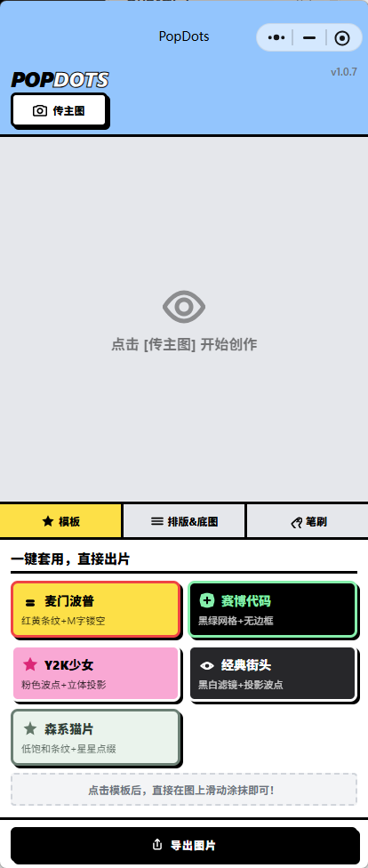
   
  <small>▲ 点击「传主图」，上传你想处理的照片</small>

> **Tip：什么样的图更容易出效果？**  
> 主体清楚、边缘明显、颜色对比比较好的图片，更容易做出有层次的拼贴效果。

---

### 2.2 选择模板或自己搭配

上传图片后，可以先从底部的 **模板** 开始。

目前可以直接选用的模板包括：

- **Y2K 少女**：粉色波点 + 立体投影，甜一点、轻复古；
- **经典街头**：黑白滤镜 + 投影波点，更酷一点；
- **森系猫片**：低饱和条纹 + 星星点缀，更清新一点。

模板适合快速出图。  
如果你想自己控制画面，可以继续进入 **排版 & 底图** 和 **笔刷** 做细调。

  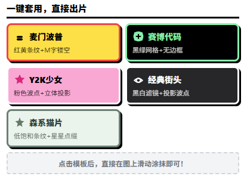
   
  <small>▲ 先选模板，快速定下整张图的风格</small>

---

### 2.3 导出图片

当你调整满意后，点击底部的 **导出图片**，就可以保存成图。

无论你是想发社交平台，还是拿来做头像、封面，都可以直接导出使用。

---

## 3. 排版与底图

> 这一部分适合“我想自己调，我想让图更像我”的时候。

### 3.1 调整主图排版

进入 **排版 & 底图** 后，可以先调整主图的位置和占比。

目前支持的排版方式包括：

- **主图在右**
- **主图在左**
- **主图在下**
- **主图在上**
- **居中悬浮**

你还可以调整：

- **主图占用比例**
- 让主体更大或更小
- 决定画面是偏“人物主导”还是偏“背景主导”

  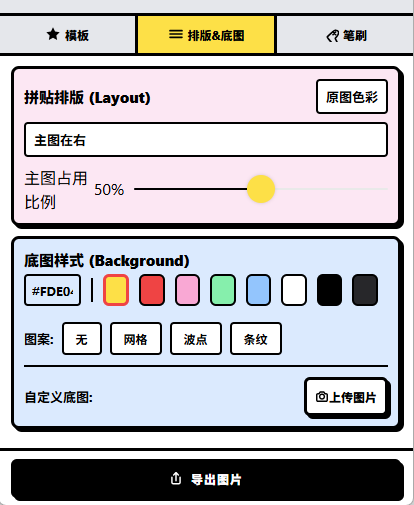
   
  <small>▲ 可以调整主图位置和主图占比</small>

### 3.2 调整底图样式

底图不只是换个颜色这么简单。

你可以选择：

- **纯色**
- **网格**
- **波点**
- **条纹**

同时还可以继续调：

- 图案颜色
- 图案间隔大小
- 图案线条粗细
- 图案倾斜角度

  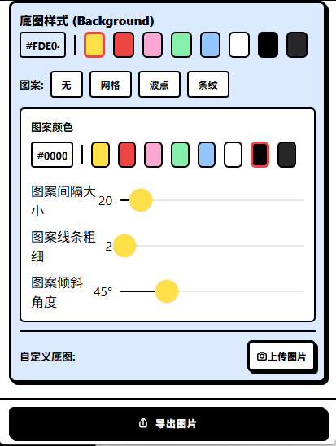
   
  <small>▲ 底图支持网格、波点、条纹，并可继续调颜色和参数</small>

### 3.3 自定义底图与双面镂空

如果你想做得更特别，可以上传 **自定义底图**。

这时可以实现一些更有意思的玩法，比如：

- 一张主图 + 一张底图，做出双图拼贴效果；
- 用另一张图作为背景纹理；
- 做出类似 **双面镂空** 的视觉效果；
- 让人物和背景之间产生更强的反差感。

这个功能很适合拿来做更有“成品感”的图。

---

## 4. 笔刷与装饰

> 这里就是 PopDots 最好玩的地方。想让画面更满、更有设计感，就来这里加东西。

### 4.1 可选笔刷类型

进入 **笔刷** 后，你可以选择不同的装饰类型。

目前支持的笔刷包括：

- **文字 / emoji**
- **经典圆点**
- **Y2K 星星**

  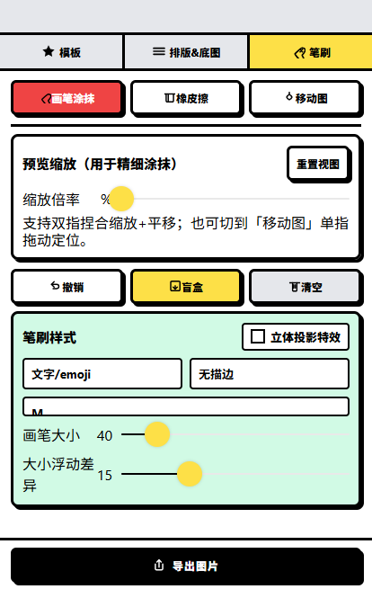
   
  <small>▲ 笔刷支持文字、经典圆点和 Y2K 星星</small>

如果你想做那种“满屏有元素飘着”的感觉，圆点和星星会很好用。  
如果你想做更个人化一点的图，可以直接输入字母、emoji 或符号。

### 4.2 调整笔刷样式

你还可以继续调整笔刷效果，例如：

- 画笔大小
- 大小浮动差异
- 是否有边框
- 是否使用立体投影特效

  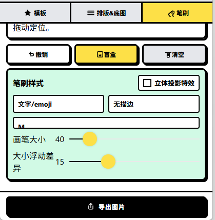
   
  <small>▲ 笔刷大小、浮动差异和投影效果都可以调整</small>

> **Tip：怎么更容易出片？**  
> 先少量添加，再慢慢加。  
> 主体脸部、宠物头部、关键文字附近尽量少遮挡，边缘区域可以多玩一点。

---

## 5. 精修工具

### 5.1 橡皮擦

如果你加多了，或者某个波点刚好挡住脸了，可以切到 **橡皮擦**，把多余部分擦掉。

这个功能很适合拿来修局部，尤其是：

- 人脸附近；
- 主体边缘；
- 想保留干净留白的位置。

### 5.2 移动画面

如果想调整笔刷落点和画面位置，可以切换到 **移动图** 模式。

这样你就可以更方便地拖动画面，调整主体位置，做更细的构图。

### 5.3 预览缩放

为了方便精细涂抹，PopDots 提供了 **预览缩放** 功能。

你可以：

- 双指捏合放大 / 缩小；
- 拖动画面定位；
- 在放大状态下处理细节；
- 点击 **重置视图** 回到默认预览状态。

  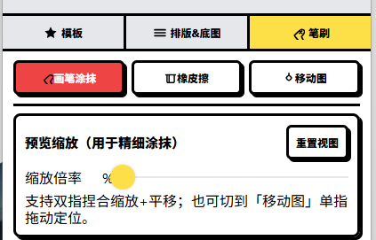
   
  <small>▲ 放大后更适合精细涂抹，也方便用橡皮擦修边</small>

### 5.4 撤销、盲盒、清空

在精修阶段，你还可以使用：

- **撤销**：回退上一步操作；
- **盲盒**：随机生成新的装饰效果，适合没有灵感的时候试手气；
- **清空**：清除当前装饰内容，重新开始这一轮创作。

  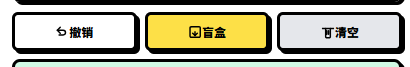
   
  <small>▲ 撤销、盲盒、清空可以帮助你更轻松地试不同效果</small>

如果你懒得一点点想，盲盒会特别有意思。  
点一下，有时候会给你意外灵感。

---

## 6. 成图示例

下面是 PopDots 可以生成的效果示例。

### 6.1 星星拼贴效果

这种效果适合人像、头像和偏清新的照片。
背景留出大色块，再用星星做装饰，看起来会更像 INS 上那种轻复古拼贴图。

  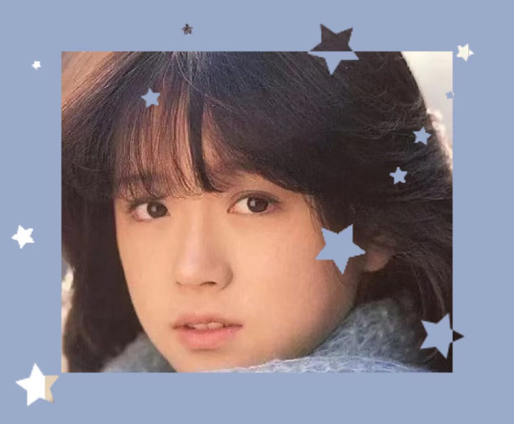
   
  <small>▲ 星星、低饱和底色和人像照片组合效果</small>

### 6.2 圆环波点效果

这种效果更适合旅行照、海边照、户外照片。
圆环分布在画面四周，可以保留照片主体，同时让图片多一点设计感。

  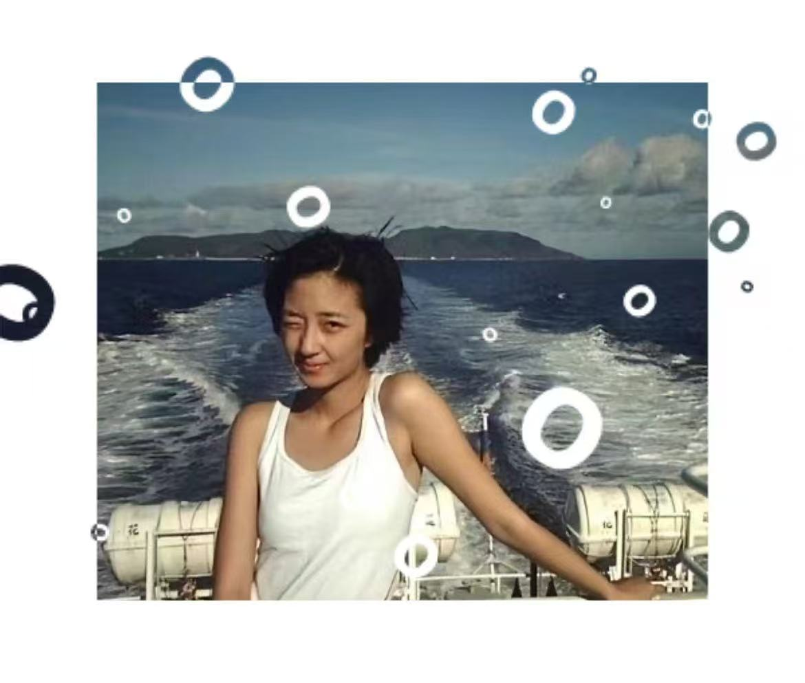
   
  <small>▲ 圆环、留白和照片主体组合效果</small>

### 6.3 条纹拼贴效果

这种效果适合做头像、封面或更强烈的视觉图。
可以用上下分区、条纹底图和圆环装饰，做出更明显的拼贴感。

  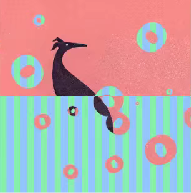
   
  <small>▲ 条纹、色块和圆环组合的拼贴效果</small>

如果你想做出类似 INS 上那种很火的拼贴图，可以先从这几个方向试：

* 高饱和底色 + 主图半边拼贴；
* 星星、圆环、波点先选一种做主元素；
* 网格、条纹、波点底图不要一次全堆满；
* 主体脸部或关键区域尽量留干净；
* 画面留一点空白，反而更像设计过。

---

## 7. 常见问题 FAQ

### 7.1 为什么我的图看起来不够好看？

通常有几个原因：

- 主图主体不够清楚；
- 底色和主图颜色太接近；
- 装饰太少，画面有点空；
- 装饰太多，把主体盖住了。

你可以试试：

- 换一张主体更清楚的图；
- 使用对比更强的底色；
- 先选模板，再慢慢调；
- 用橡皮擦清掉遮挡主体的部分。

### 7.2 波点或星星挡住脸了怎么办？

切到 **橡皮擦**，把挡住主体的部分擦掉就可以。

建议优先保留这些区域：

- 脸部
- 眼睛
- 宠物头部
- 产品主体
- 想突出的文字

### 7.3 盲盒是什么？

盲盒是一个随机生成灵感的小功能。

如果你不知道接下来该怎么加装饰，可以点一下盲盒，系统会给你随机效果。有时候会歪打正着，出来很好玩的图。

### 7.4 我可以只改底图，不加笔刷吗？

可以。

如果你只想做干净一点的拼贴风，可以只调：

- 主图排版
- 背景颜色
- 网格 / 波点 / 条纹

这样成图会更简洁。

### 7.5 导出的图片保存在哪里？

点击 **导出图片** 后，图片会保存到你的相册。  
如果系统弹出权限请求，请允许小程序访问相册。

---

## 8. 隐私说明

- 你上传的图片仅用于当前图片创作；
- 小程序不会主动公开你的图片；
- 导出图片时需要你授权访问相册；
- 如果使用云端能力处理图片，数据会通过加密方式传输；
- 你可以随时在微信设置中关闭相册相关权限。

---

## 文档集入口

如需查看其他小程序文档，可以点击：

1. [小程序产品总览](mini-programs.md)
2. [微步 ACTION 用户文档](05-miniprogram-task-decomposer/index.md)
3. [照片换底色小程序](photo-background.md)

---

## 文档版本

| 版本 | 日期 | 说明 |
|---|---|---|
| v1.0.7 | 2026-06-12 | 初始版本，包含上传、模板、排版、底图、笔刷、精修工具、导出和 FAQ |

---

*© 2026 alison2fun · MIT License*