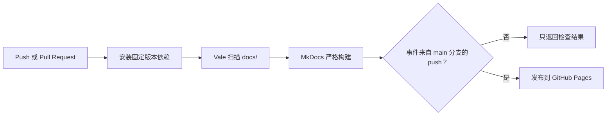

# GitHub Actions：让检查通过后再发布文档

## 这次改动解决什么问题

这个仓库原来有两条互不依赖的工作流：一条只用 Vale 检查 `test.md`，另一条在 `main` 分支更新后直接发布 MkDocs 站点。

这会留下两个空档：

* `docs/` 中的真实页面没有进入完整检查；
* 即使文档检查失败，独立的发布任务仍可能继续运行。

本次改动把检查和发布放进同一条流水线。发布任务必须等待全量文档检查和严格构建通过。

## 工作流概览



Pull Request 只验证，不发布。只有 `main` 分支上的 `push` 事件能够进入发布任务，而且该任务声明了 `needs: validate`。

## 关键设计

| 决策 | 实现 | 原因 |
| --- | --- | --- |
| 扫描真实文档 | `files: docs` | 避免只检查演示文件 |
| 使用官方 Vale Action | 固定到 v2.1.2 的完整 commit SHA | 减少手写安装逻辑，并避免标签指向变化 |
| 固定 Vale 版本 | `version: 3.15.1` | 降低本地与 CI 结果漂移 |
| 提交规则快照 | `styles/` 作为规则真源 | 避免 CI 自动拉取上游新规则后结果漂移 |
| 错误阻断检查 | `fail_on_error: true` | 发现 error 时返回失败状态 |
| 检查全部历史内容 | `filter_mode: nofilter` | 防止旧页面中的 error 被增量过滤隐藏 |
| 同时支持 push 和 PR | `reporter: github-check` | 避免使用仅适用于 PR 的默认 reporter |
| 严格构建 | `mkdocs build --strict` | 把缺失链接、配置和构建警告纳入质量门禁 |
| 固定文档依赖 | `requirements-docs.txt` | 让本地和 CI 安装相同版本 |
| 发布依赖检查 | `needs: validate` | 检查失败时不部署站点 |
| 最小权限 | 默认只读，发布任务单独授予 `contents: write` | 减少不必要的写权限 |
| 明确提交身份 | 配置 `github-actions[bot]` | 确保 `gh-deploy` 能创建发布提交 |

## 触发条件

工作流响应三类事件：

```yaml
on:
  push:
    branches:
      - main
  pull_request:
  workflow_dispatch:
```

* `pull_request`：在合并前验证改动；
* `push` 到 `main`：重新验证，通过后发布；
* `workflow_dispatch`：需要时手动执行验证。

手动执行不会发布，因为发布任务还会检查事件类型和分支。

## 验证任务

验证任务依次执行：

1. 拉取仓库；
2. 安装 Python 3.12；
3. 根据 `requirements-docs.txt` 安装 MkDocs Material；
4. 使用 Vale 3.15.1 扫描整个 `docs/` 目录；
5. 使用严格模式构建站点。

核心配置如下：

```yaml
- name: Check writing style with Vale
  uses: vale-cli/vale-action@85f9f7f2c5f449ac0ae5b66662961bae3f77ca6a # v2.1.2
  with:
    version: 3.15.1
    files: docs
    fail_on_error: true
    filter_mode: nofilter
    reporter: github-check

- name: Build documentation
  run: mkdocs build --strict
```

Vale 会报告 suggestion、warning 和 error；当前门禁只因 error 失败。这样既保留改进提示，又避免一次改动被大量非阻断建议淹没。

## 发布任务

发布任务包含两道条件：

```yaml
if: github.event_name == 'push' && github.ref == 'refs/heads/main'
needs: validate
```

第一行限制事件和分支，第二行建立任务依赖。任何一项不满足，GitHub Pages 都不会更新。

发布任务需要向 `gh-pages` 分支写入内容，因此只在该任务中授予：

```yaml
permissions:
  contents: write
```

## 本地复现

在仓库根目录安装与 CI 相同的文档依赖：

```powershell
python -m pip install --requirement requirements-docs.txt
```

再运行两项检查：

```powershell
vale docs
mkdocs build --strict
```

如果本地没有 Vale，请先按照[快速开始](install.md)安装。排查本地与 CI 差异时，先确认 Vale 版本、依赖版本、执行路径和规则文件是否一致。

## 本次基线处理

第一次把扫描范围从 `test.md` 扩大到 `docs/` 时，Vale 在 44 个 Markdown 文件中发现了 20 个 error。这些问题没有通过降低检查等级来隐藏，而是分成三类处理：

* 项目专有名词加入词汇表，例如 `OAuth`、`OpenClaw`、`Vue` 和人名；
* 写作规范中的“错误示例”改为代码文本，避免示例本身触发规则；
* 修正标题格式和一个英文标题中的缩写提示。

warning 和 suggestion 仍会显示，后续可以分批处理，不阻断当前基线。

## 验证记录

| 检查 | 环境 | 结果 |
| --- | --- | --- |
| `vale docs` | Windows，Vale 3.15.1 | 通过：44 个文件，0 error、69 warning、181 suggestion |
| `mkdocs build --strict` | Windows，Python 3.13.5，MkDocs Material 9.7.6 | 通过 |

## 失败时先看哪里

| 失败步骤 | 优先检查 |
| --- | --- |
| 安装依赖 | `requirements-docs.txt` 是否存在，版本是否可用 |
| Vale | 文件、行号、规则名和 alert level |
| MkDocs 严格构建 | 导航路径、内部链接、YAML 配置和构建 warning |
| 发布 | 事件是否为 `main` 分支 push，验证任务是否通过，写权限是否存在 |

完整配置见 [`.github/workflows/ci.yml`](https://github.com/alison2fun/tech-docs-portfolio/blob/main/.github/workflows/ci.yml)。
