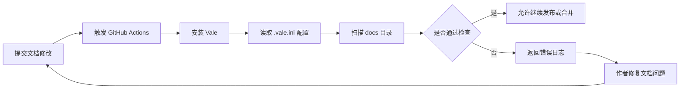

# GitHub Actions Workflow：自动运行文档质量检查

## 页面目标

本文档说明本项目如何使用 GitHub Actions 自动运行文档质量检查。

通过该工作流，文档在提交到仓库后会自动触发检查流程，帮助作者提前发现格式、术语和写作风格问题，减少人工审查中的重复性工作。

## 适用场景

这个工作流适用于以下场景：

* 提交 Markdown 文档后自动检查写作规范；
* 在 Pull Request 合并前发现文档质量问题；
* 避免格式、术语和风格问题进入主分支；
* 将文档质量检查纳入 Docs-as-Code 工作流。

## 工作流概览

本项目的自动化检查流程如下：



## 触发条件

GitHub Actions 可以在以下情况触发：

* 向主分支提交代码；
* 创建或更新 Pull Request；
* 手动运行工作流。

在本项目中，推荐至少在以下场景运行检查：

```yaml
on:
  push:
    branches:
      - main
  pull_request:
```

## 示例配置

以下是一个简化版 GitHub Actions 配置示例：

```yaml
name: Documentation Quality Check

on:
  push:
    branches:
      - main
  pull_request:

jobs:
  vale:
    runs-on: ubuntu-latest

    steps:
      - name: Checkout repository
        uses: actions/checkout@v4

      - name: Install Vale
        run: |
          wget https://github.com/errata-ai/vale/releases/download/v3.0.7/vale_3.0.7_Linux_64-bit.tar.gz
          tar -xvzf vale_3.0.7_Linux_64-bit.tar.gz
          sudo mv vale /usr/local/bin/

      - name: Run Vale
        run: vale docs/
```

## 配置说明

| 配置项                | 作用            |
| ------------------ | ------------- |
| `name`             | 定义工作流名称       |
| `on`               | 定义触发条件        |
| `jobs`             | 定义要运行的任务      |
| `runs-on`          | 指定运行环境        |
| `actions/checkout` | 拉取仓库代码        |
| `Install Vale`     | 安装 Vale 检查工具  |
| `Run Vale`         | 扫描文档目录并输出检查结果 |

## 检查结果如何解读

如果检查通过，GitHub Actions 会显示绿色通过状态。

如果检查失败，日志中通常会包含：

* 出错文件；
* 行号；
* 规则名称；
* 错误级别；
* 修改建议。

示例：

```text
docs/index.md
  12:5  error  中文与英文之间应保留一个空格  MyStyle.Spacing
```

这表示 `docs/index.md` 第 12 行附近触发了 `MyStyle.Spacing` 规则，需要检查中英文或数字之间的空格。

## 与本地检查的关系

本地 Vale 检查适合作者边写边改，GitHub Actions 则负责在提交后给出统一结果。两条检查路径处理的是不同阶段。

| 检查方式              | 使用时机        | 作用           |
| ----------------- | ----------- | ------------ |
| 本地检查              | 提交前         | 作者提前发现问题     |
| GitHub Actions 检查 | 提交后 / PR 阶段 | 自动验证文档是否符合规则 |

推荐流程是：

1. 作者在本地运行 `vale docs/`；
2. 修复明显问题；
3. 提交代码；
4. GitHub Actions 自动再次检查；
5. 检查通过后再合并或发布。

## 常见失败原因

GitHub Actions 检查失败可能由以下原因导致：

* Vale 安装失败；
* 检查命令路径错误；
* `.vale.ini` 没有提交到仓库；
* `styles/` 规则目录没有提交；
* 文档中存在未修复的 error；
* 本地和 CI 环境使用的 Vale 版本不同。

如果遇到这些问题，可以查看 [故障排查](troubleshooting.md)。

## 这份工作流文档的写作取舍

示例配置保留最小可运行结构，表格解释触发条件和关键字段，流程图把提交、检查、反馈和修复连起来。读者既可以复制配置，也能知道检查为什么会在这个阶段发生。

页面同时连接本地检查与故障排查。自动化流程出错时，读者可以继续沿着日志和常见原因定位问题。

## 下一步

阅读完本文后，可以继续查看：

1. [快速开始](install.md)：了解如何在本地运行文档质量检查；
2. [写作风格指南](style-guide.md)：了解本项目采用的写作规范；
3. [故障排查](troubleshooting.md)：查看自动化检查常见问题；
4. [更新记录](changelog.md)：了解本文档项目的迭代记录。
