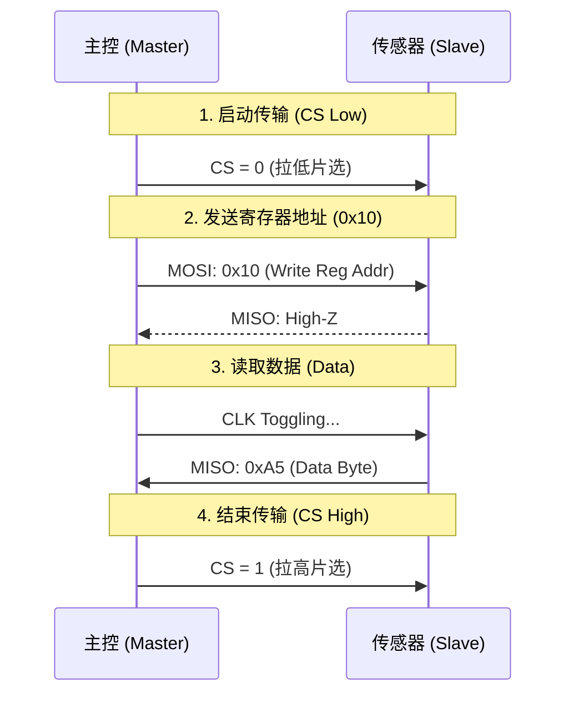

# [02] 芯片数据手册重构 (Datasheet Refactoring)

> **核心价值**: 将数百页的静态 PDF 芯片手册，重构为开发者友好的、可交互的 Web 文档。

## 1. 痛点分析 (Pain Points)
传统硬件开发中，软件工程师阅读 PDF 数据手册面临三大难题：
1.  **信息检索难**: 几千个寄存器散落在数百页文档中，Ctrl+F 效率极低。
2.  **图表死板**: 时序图通常是截图，无法缩放，看不清纳秒级 (ns) 的时序要求。
3.  **复制困难**: 寄存器地址和配置位宽通常是图片格式，手敲代码容易出错。

## 2. 重构案例：光感传感器 XYZ-2024

### 2.1 协议时序可视化 (Interactive Timing)
使用 **Mermaid** 代码替代传统截图，清晰展示 SPI 读取时序。



### 2.2 寄存器定义 (Register Map)
使用结构化表格定义寄存器，支持直接复制 Bit 定义。

**寄存器名称**: `CTRL_REG1` (控制寄存器 1)
**地址**: `0x20`
**默认值**: `0x00`

| Bit | 7 | 6 | 5 | 4 | 3 | 2 | 1 | 0 |
| :--- | :---: | :---: | :---: | :---: | :---: | :---: | :---: | :---: |
| **Name** | RESET | SLEEP | - | - | ODR [1] | ODR [0] | X_EN | Y_EN |
| **Access** | RW | RW | R | R | RW | RW | RW | RW |

* **RESET**: 软件复位，写 1 复位。
* **ODR [1:0]**: 输出数据速率选择。
    * `00`: Power Down
    * `01`: 10 Hz
    * `10`: 100 Hz

### 2.3 驱动代码示例 (Driver Snippet)
提供开箱即用的 C 语言配置代码，减少开发者的试错成本。

### 2.3 驱动代码示例 (Driver Snippet)
提供开箱即用的 C 语言配置代码，减少开发者的试错成本。

```c
// 示例：初始化传感器，设置 100Hz 采样率
void Sensor_Init(void) {
    uint8_t ctrl_val = 0;
    
    // 设置 ODR = 100Hz (Bit 3:2 = 10)
    ctrl_val |= (0x02 << 2);
    
    // 启用 X/Y 轴 (Bit 1:0 = 11)
    ctrl_val |= 0x03;
    
    // 写入寄存器 0x20
    SPI_Write(0x20, ctrl_val);
}