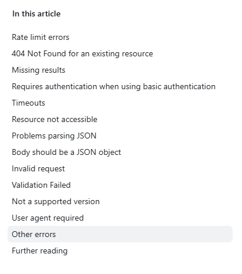
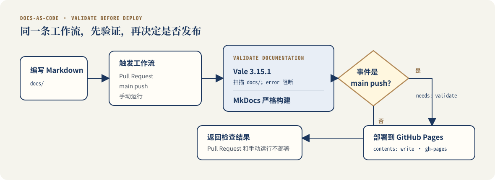

# 梁卓雯｜Technical Documentation Portfolio

> PDF 内容源。页面顺序与 `technical-documentation-portfolio.html` 保持一致。

[下载 6 页 PDF 作品集](../assets/zhuowen-liang-technical-documentation-portfolio.pdf)

## Page 1｜个人介绍

**梁卓雯 Zhuowen Liang**  
Technical Documentation Portfolio  
技术文档工程师｜深圳

电子信息硕士，围绕技术资料分析、信息架构和文档交付，持续完成硬件开发者文档、API 文档、产品文档与 Docs-as-Code 项目。

能够从 Datasheet、接口定义、产品流程和代码仓库中提取开发者真正需要的信息，再把它们组织成可以执行、查询和维护的文档。

能力标签：Hardware Documentation · API Documentation · Product Documentation · Docs-as-Code · English Technical Writing

工作路径：**技术资料分析 → 信息架构 → 文档交付**

## Page 2｜Documentation Capability Overview

### Hardware Documentation

- 输入：Datasheet、EVM User's Guide、原理图、GUI 资料
- 处理：交叉核对器件事实，按首次采集和底层读取任务重组
- 交付：Quick Start、系统说明、配置与读取、故障排查

### API Documentation

- 输入：公开 REST API、Endpoint、命令行输出和错误信息
- 处理：拆分主路径与诊断路径，明确命令、可观察结果和通过标准
- 交付：英文 Quick Start、Troubleshooting、接口说明

### Product Documentation

- 输入：小程序原型、产品流程、云函数和数据库边界
- 处理：按用户、产品和维护者三类任务组织信息
- 交付：User Guide、PRD、System Flow、隐私边界和迭代记录

### Docs-as-Code Workflow

- 输入：Markdown 文档仓库与写作规则
- 处理：统一版本管理、本地检查、严格构建和发布条件
- 交付：Vale + MkDocs + GitHub Actions + GitHub Pages 工作流

## Page 3｜OPT4001 EVM Developer Documentation

项目基于 TI 共 89 页的 *OPT4001 Datasheet* 和 *OPT4001YMNEVM User's Guide*。板卡结构、首次采集、I²C 读写、结果寄存器和故障信息分散在两份资料中。

我没有把资料压缩成一份更短的 Datasheet，而是按开发者任务重组为四篇 Web 文档：

1. Quick Start：完成第一次 lux 数据采集；
2. System：理解控制、电气和光学链路；
3. I²C + lux：配置工作模式、读取结果寄存器并换算 lux；
4. Troubleshooting：根据现象定位连接、配置、解析或光学路径问题。

验证边界：器件事实与系统关系已按 TI 官方资料交叉核对；作者尚未使用真实 OPT4001YMNEVM 完成独立实物验证。

## Page 4｜GitHub REST API Documentation

这组英文文档使用公开仓库 `alison2fun/tech-docs-portfolio` 作为请求对象，围绕 GitHub REST API 的仓库元数据查询组织两条路径。

### Quick Start

- 提供 GitHub CLI 与 `curl` 两种方法；
- 把命令、状态码和响应字段写成完成标准；
- 要求核对 `full_name`、`visibility` 和 `default_branch`。

### Troubleshooting

- 按终端中看到的错误进入诊断；
- 区分 PowerShell 参数解析、认证、连接、404 和限流；
- 修复后返回 Quick Start，继续原来的请求任务。

### Verification evidence

- `curl 8.14.1` 请求已在 Windows PowerShell 中跑通；
- GitHub CLI `2.96.0` 的安装和浏览器认证已检查；
- 单行 GitHub CLI API 请求仍保留为未重新运行的范围。

## Page 5｜Docs-as-Code Workflow

当前作品集本身就是这条文档工程工作流的运行对象。

**Markdown → Vale + MkDocs → GitHub Actions → GitHub Pages**

### Version control

Markdown、配置和图片与代码一起进入 Git 版本历史，页面修改能够追踪和回退。

### Automated validation

Vale 检查写作规则，MkDocs 使用严格模式构建站点；Pull Request 与主分支提交使用同一套仓库配置。

### Continuous deployment

GitHub Actions 先运行文档检查和严格构建。主分支验证通过后，部署任务才发布到 GitHub Pages。

## Page 6｜Product Documentation Practice

产品文档以个人微信小程序为对象，主案例是把大任务拆成五个可执行步骤的“微步 ACTION”。文档不只描述页面，也把用户任务、产品判断和技术维护分开组织。

### User Guide

原型快速体验、创建与拆解任务、进度管理、常见问题和输入安全提醒。

### PRD

产品问题、用户故事、功能状态、完成标准、异常边界和非目标范围。

### User Flow & Maintenance

系统流程、云函数调用、数据库保存、数据与隐私边界、迭代记录和路线图。

---

**Portfolio**  
https://alison2fun.github.io/tech-docs-portfolio/

**Email**  
lzwof@foxmail.com

**Resume**  
https://alison2fun.github.io/tech-docs-portfolio/%E7%AE%80%E5%8E%86/
