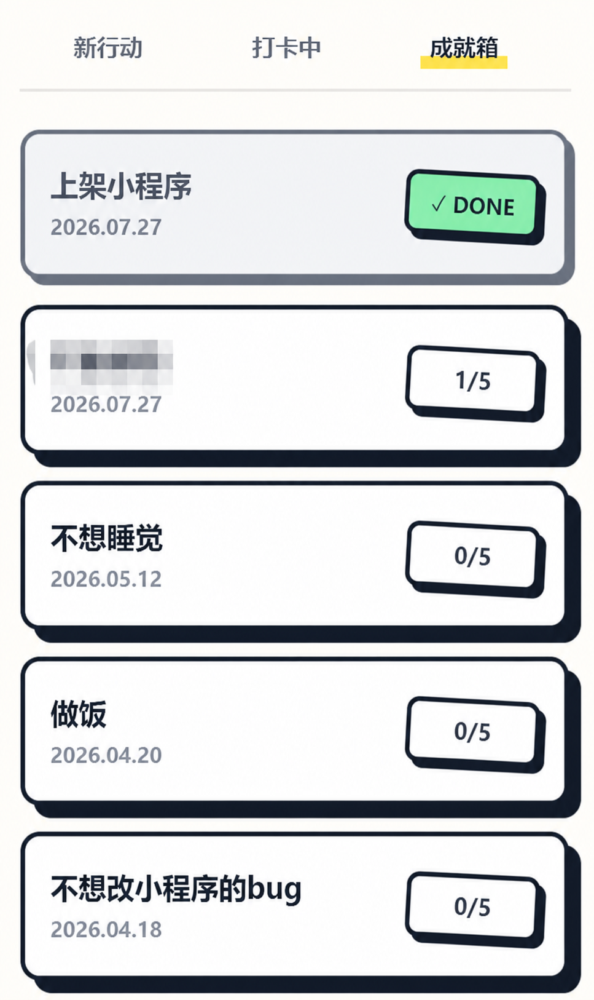
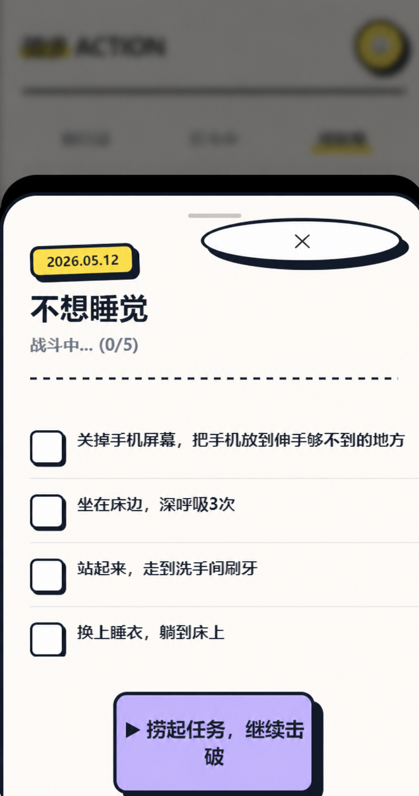

# 管理任务与进度

已经创建过的任务，可以在“成就箱”里重新找到。这里既有已经完成的任务，也有只推进了一部分、还没做完的任务。

## 在成就箱查看任务

点击页面顶部的“成就箱”。

每张任务卡片都会显示任务名称、创建日期和当前完成情况：

- `DONE` 表示这个任务已经全部完成；
- `1/5` 表示已经完成了 1 个步骤；
- `0/5` 表示任务已经创建，但还没有开始推进。

{ .doc-figure .figure--small .figure--screenshot }

*图 1：成就箱会把“已完成”和“仍在推进中的任务”放在同一个列表里。先看卡片右侧的状态，就能很快判断这张任务卡现在停在哪一步。*
{: .figure-caption }

如果你只是想找回之前的任务，先扫一眼右侧状态，通常就够了。

## 打开任务详情

点击一张还没有完成的任务卡片，页面下方会展开任务详情。

这里会显示：

- 创建日期；
- 任务名称；
- 当前完成数；
- 这项任务已经生成的步骤清单。

{ .doc-figure .figure--small .figure--screenshot }

*图 2：打开任务详情后，页面会把这项任务目前做到哪里直接摊开来。上方能看到当前是 `0/5`，下方能看到已经生成的行动步骤。*
{: .figure-caption }

如果只是暂时想看看，不继续做，点右上角的关闭按钮就可以回到成就箱列表。

## 继续未完成的任务

如果你想把这件事接着做下去，就在任务详情页点击“捞起任务，继续击破”。

回到任务页后，完成一项就勾选一项，任务卡片上的数字会跟着推进：

- 完成两项时，显示 `2/5`；
- 五项全部完成后，状态会变成 `DONE`。

这个过程的重点不是查看有哪些任务没做完，而是把之前已经拆好的路径继续走完，把之前的任务继续推进。

## 怎样判断进度已经记录

回到成就箱后，可以用两件事来判断进度有没有记上：

1. 卡片右侧的数字是不是从 `0/5` 往前增加了；
2. 全部做完后，状态是不是变成了 `DONE`。

现在的成就箱页面还没有展示搜索、排序、重命名或删除操作，所以这页只先说明当前已经能看见、也能理解的管理流程。

任务本身需要调整时，建议回到[创建与拆解任务](create-task.md)，重新写清任务范围。
