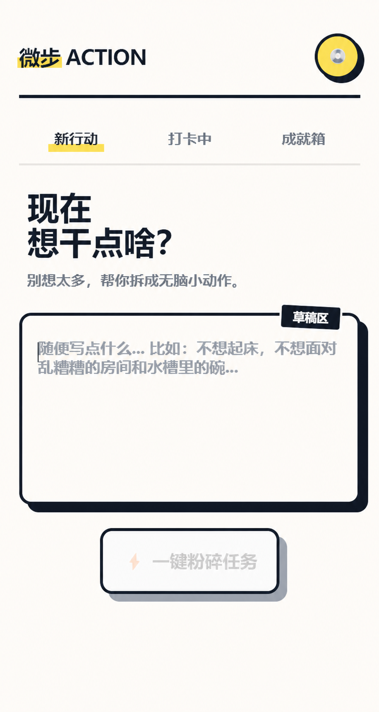
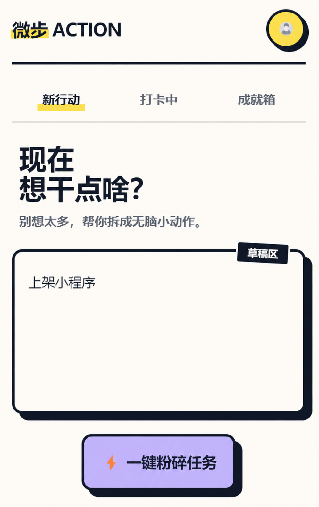
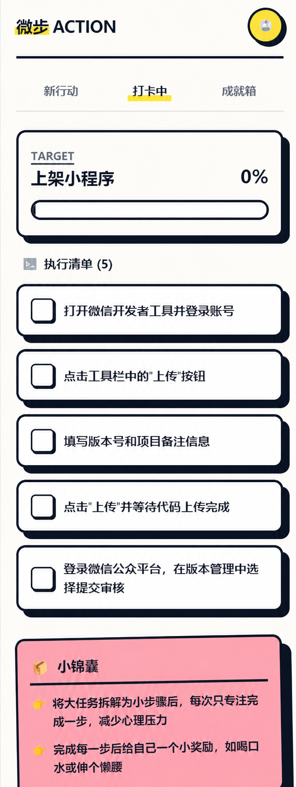
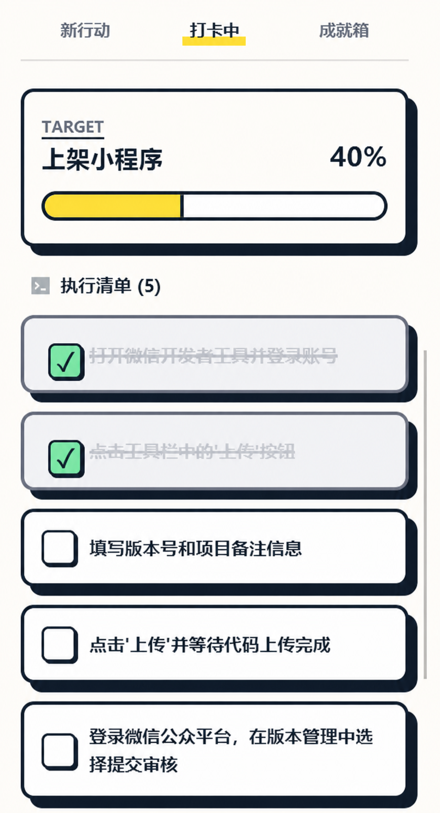
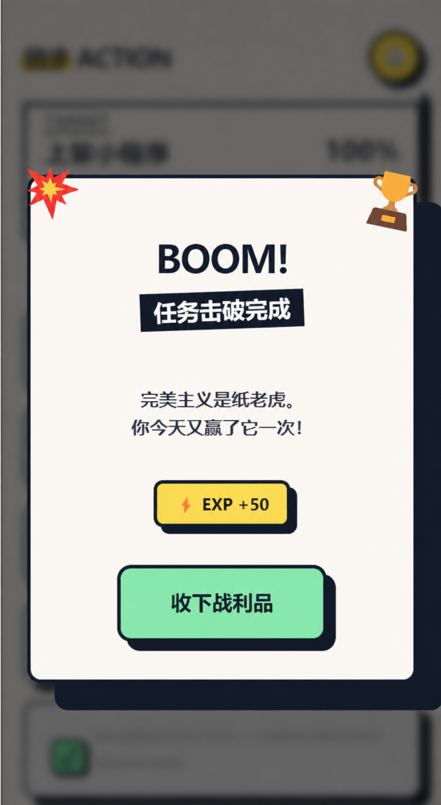

# 微步 ACTION 原型快速体验：拆解并推进一个任务

这篇文档带你从一件还没开始的任务，走到可以逐项推进的五步清单：

```text
输入任务 → 生成步骤 → 勾选一项 → 查看进度变化
```

这次使用“上架小程序”作为例子。你会生成五个行动步骤，观察进度从 0% 变为 40%，最后完成整项任务。

## 打开“新行动”

进入“新行动”页面后，你会先看到一个空白任务页。这里先不急着想完整计划，先把眼前想完成的一件事写下来。

{ .action-screenshot }

*图 1：进入“新行动”后，页面会先停在一个空白任务页，等你写下当前最想推进的一件事。*

## 步骤 1：写下任务

在输入框里先写一句任务描述。

示例任务：

> 上架小程序

写入内容后，点击下方按钮，让系统开始处理这句任务。

{ .action-screenshot }

*图 2：写入“上架小程序”后，页面已经有了一个明确目标。下一步就是把它拆成可以执行的小步骤。*

这里不用一次把所有细节都写全。只要先把任务写出来，后面再继续补充或调整，也比一直停在空白页里更容易开始。

## 步骤 2：生成任务步骤

点击“一键碎碎任务”后，页面会把原任务拆成 5 个足够微小的步骤，并在任务卡顶部显示当前进度。

这一步生成的内容包括：

- 当前任务标题；
- 5 个可勾选步骤；
- 初始进度条；
- 页面下方的提醒和反馈区域。

{ .action-screenshot }

*图 3：原任务已经被拆成 5 个步骤。此时进度还是 0%，因为任务虽然被拆开了，但还没有真正开始执行。*

如果步骤太大、太空，或者已经偏离原任务，这时候就该回去修改任务描述，而不是硬着头皮往下做。

## 步骤 3：勾选已经完成的步骤

完成一个步骤后，点击它左侧的勾选框。页面会把这一步标记为已完成，并同步更新顶部进度。

{ .action-screenshot }

*图 4：完成两个步骤后，任务进度更新为 40%。这时用户不仅看到“做完了什么”，也能直观看到任务往前走了多少。*

这也是这个原型里最重要、很有成就感的体验点。任务不只被“拆开”，我们还能看到它被一项一项地推进。

## 查看进度变化

勾选步骤后，页面会同时出现两种变化：

1. 已完成的步骤切换为完成状态；
2. 顶部进度条和百分比同步变化。

当页面从“列出步骤”变成“显示推进”，这个任务才真正开始有了完成中的感觉。

## 步骤 4：完成全部步骤

继续把剩下的步骤完成后，页面会给出任务完成反馈，并弹出这次任务的结果页。

{ .action-screenshot }

*图 5：当 5 个步骤全部完成后，页面会弹出任务完成反馈。到这里，一句原本模糊的任务，已经完整走完了一次从输入到完成的闭环。*

点击**收下战利品**，结束这次任务。

到这里，你已经体验了从写下任务、生成步骤、记录进度到完成任务的完整流程。

## 下一步

- [学习怎样写出更容易拆解的任务](create-task.md)
- [了解任务与进度操作](manage-progress.md)
- [查看输入内容安全提醒](privacy.md)
