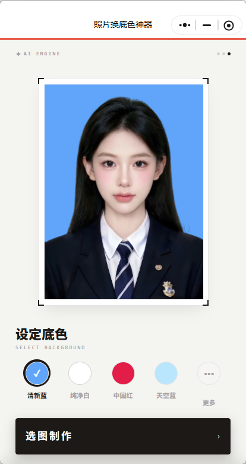
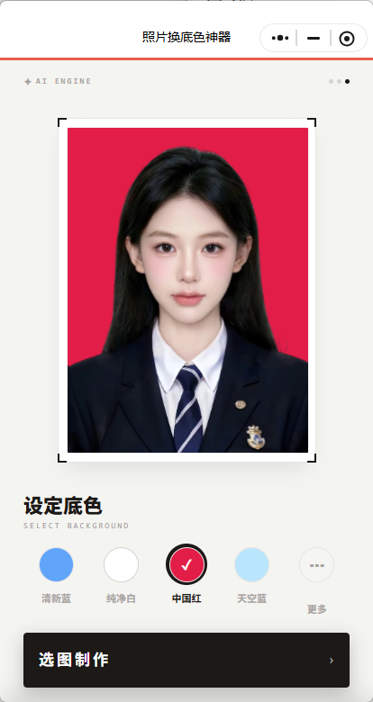
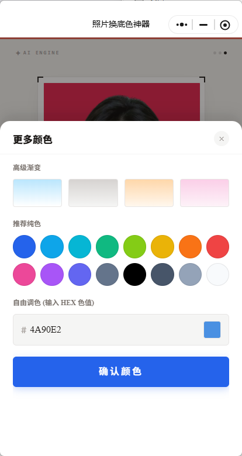
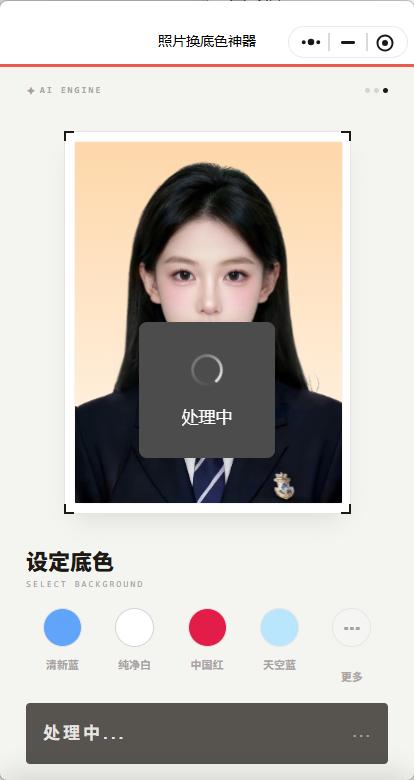
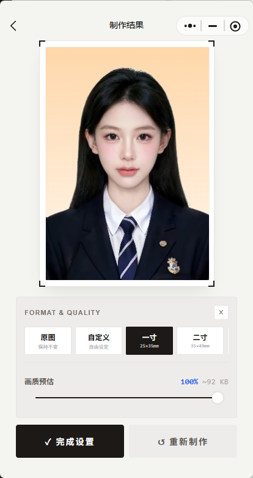

# 照片换底色神器 · 用户文档

> 急着要白底、蓝底、红底照片？上传一张图，选个底色，马上制作。


---

## 项目概览

* **项目类型：** C 端照片换底色小程序用户文档
* **核心功能：** 上传照片 → 选择底色 → AI 处理 → 调整尺寸与质量 → 保存到相册
* **适用场景：** 证件照、报名照、头像、简历照、临时照片处理
* **受众：** 需要快速换照片背景的普通用户

---

## 1. 关于照片换底色神器

### 1.1 核心价值：不用打开修图软件，也能快速换底色

有时候只是想换个照片背景，却要打开复杂修图软件，抠图、换底、调尺寸，来回折腾很久。

照片换底色神器就是为这种小需求准备的。

你只需要上传一张照片，选择想要的背景颜色，小程序会自动处理图片，并生成新的换底色照片。

常见的清新蓝、纯净白、中国红、天空蓝都可以直接选择。
还可以点 **更多**，选择渐变色、推荐纯色，或者输入 HEX 色值自定义颜色。

做好之后，可以继续调整图片尺寸和压缩质量，最后保存到相册。

---

## 2. 快速上手

> 三步完成换底色：上传照片、选择背景、保存结果。

### 2.1 上传照片

打开小程序后，先上传一张需要处理的照片。

适合上传的图片包括：

* 证件照；
* 简历照；
* 报名照；
* 头像照片；
* 需要更换背景的人像照片。

<p style="text-align: center;">
  
  <br>
  <small>▲ 上传照片后，可以先预览当前背景效果</small>
</p>

> **Tip：什么照片更适合？**
> 人物边缘清楚、背景不太复杂、光线均匀的照片，处理效果通常更稳定。

---

### 2.2 选择背景颜色

上传照片后，在 **设定底色** 区选择你需要的背景颜色。

常用颜色包括：

| 背景色 | 适合场景                |
| --- | ------------------- |
| 清新蓝 | 常见证件照、报名照、头像        |
| 纯净白 | 简历照、证件材料、正式用途       |
| 中国红 | 部分证件照、考试报名、特定材料     |
| 天空蓝 | 更柔和的蓝底照片            |
| 更多  | 渐变色、推荐纯色、自定义 HEX 色值 |

<p style="text-align: center;">
  
  <br>
  <small>▲ 点击颜色圆点，即可切换照片背景</small>
</p>

如果预设颜色不够用，点击 **更多**，可以打开更多颜色面板。

<p style="text-align: center;">
  
  <br>
  <small>▲ 更多颜色里可以选择渐变、推荐纯色，也可以输入 HEX 色值</small>
</p>

---

### 2.3 开始制作

选好背景色后，点击 **选图制作** 或 **开始制作**。

小程序会进入处理状态，等待几秒即可生成新的照片。

<p style="text-align: center;">
  
  <br>
  <small>▲ 处理中，请等待照片生成完成</small>
</p>

处理完成后，会进入制作结果页面。

---

## 3. 制作结果

### 3.1 查看换底效果

在制作结果页，你可以看到换底后的照片。

页面会显示当前图片的基础信息，比如：

* 图片尺寸；
* 文件大小；
* 画质比例。

<p style="text-align: center;">
  
  <br>
  <small>▲ 可以选择原图、自定义、一寸、二寸，并调整画质</small>
</p>

你可以双指缩放，也可以单指拖动，调整图片在预览框中的位置。

---

### 3.2 保存到相册

确认效果后，点击 **保存到相册**。

保存时，系统可能会弹出相册权限请求。允许后，图片会保存到手机相册。

如果你还想继续调整，可以点击：

* **尺寸与压缩**：调整照片规格和画质；
* **重新制作**：返回前面步骤重新选择图片或底色。

---

## 4. 调整尺寸与压缩

有些报名系统、证件材料或平台上传入口，会要求固定尺寸和文件大小。

这时可以进入 **尺寸与压缩**。

### 4.1 选择常见尺寸

目前支持：

| 尺寸  | 说明      |
| --- | ------- |
| 原图  | 保持原始尺寸  |
| 自定义 | 手动设置宽高  |
| 一寸  | 常见证件照尺寸 |
| 二寸  | 常见证件照尺寸 |


选择尺寸后，可以继续调整画质比例。

画质越高，图片越清晰，文件也会更大。
画质越低，图片更小，适合有上传大小限制的场景。

### 4.2 完成设置

调整完成后，点击 **完成设置**。

系统会重新生成符合尺寸和画质要求的图片。
确认无误后，再保存到相册。

---

## 5. 重新换图

如果上传错照片，或者想处理另一张图，可以点击 **换图**。

重新换图后，可以继续选择底色、制作结果、调整尺寸和保存。

这个功能适合连续处理多张照片，比如：

* 同一张照片试不同底色；
* 给多张照片统一做蓝底；
* 先处理证件照，再处理头像图。

---

## 6. 常见问题 FAQ

### 6.1 为什么人物边缘看起来不够干净？

可能和原图质量有关。

常见原因包括：

* 原图背景太复杂；
* 头发边缘和背景颜色太接近；
* 图片分辨率太低；
* 光线太暗或阴影太重。

可以试试换一张光线更清楚、背景更简单的照片。

### 6.2 可以自定义背景颜色吗？

可以。

点击 **更多**，在自由调色区域输入 HEX 色值，确认后即可应用到背景。

例如：

```text
#4A90E2
```

### 6.3 可以做一寸、二寸照片吗？

可以。

在制作结果页点击 **尺寸与压缩**，选择一寸或二寸规格，再点击 **完成设置**。

### 6.4 图片保存失败怎么办？

可以先检查：

* 是否允许小程序访问相册；
* 手机存储空间是否充足；
* 当前网络是否稳定；
* 是否已经完成图片处理。

如果权限被拒绝，可以在微信的小程序权限设置里重新开启相册权限。

### 6.5 换底后的图片可以重新制作吗？

可以。

点击 **重新制作**，返回前面步骤重新选择底色或图片。

---

## 7. 隐私说明

* 你上传的照片仅用于当前换底色处理；
* 小程序不会主动公开你的图片；
* 保存图片时，需要你授权访问相册；
* 如果使用云端能力处理图片，数据会通过加密方式传输；
* 你可以随时在微信小程序权限设置中关闭相册相关权限。

---

## 文档集入口

如需查看其他小程序文档，可以点击：

1. [小程序产品总览](mini-programs.md)
2. [微步 ACTION 用户文档](05-miniprogram-task-decomposer/index.md)
3. [PopDots 波点拼贴图片生成器](dot-collage.md)

---

## 文档版本

| 版本     | 日期         | 说明                                         |
| ------ | ---------- | ------------------------------------------ |
| v1.0.0 | 2026-06-12 | 初始版本，包含上传照片、选择底色、更多颜色、制作结果、尺寸压缩、保存到相册和 FAQ |

---

*© 2026 alison2fun · MIT License*
