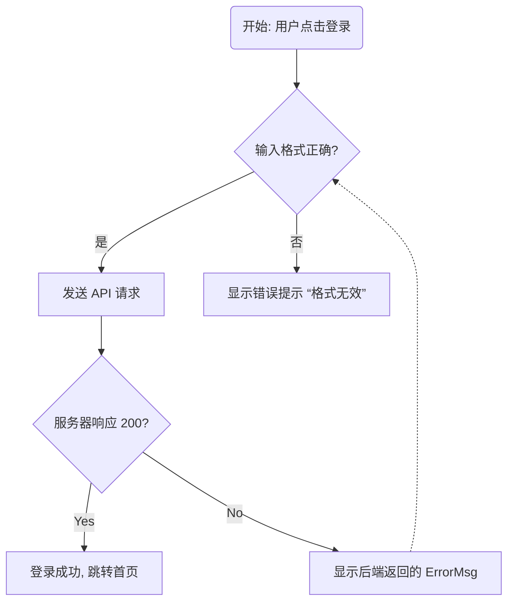
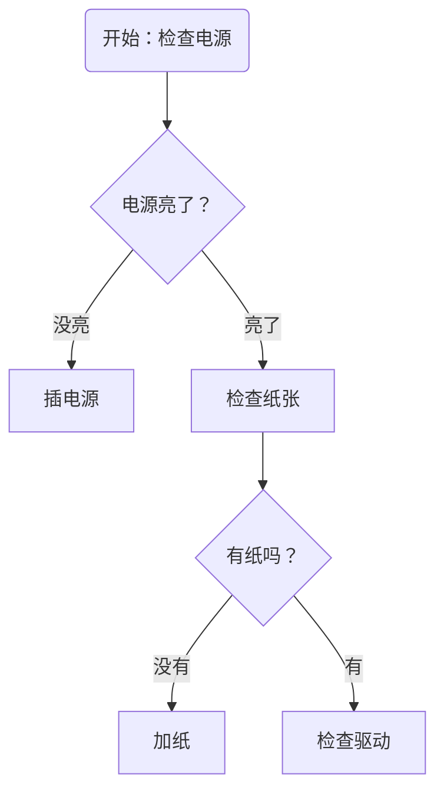
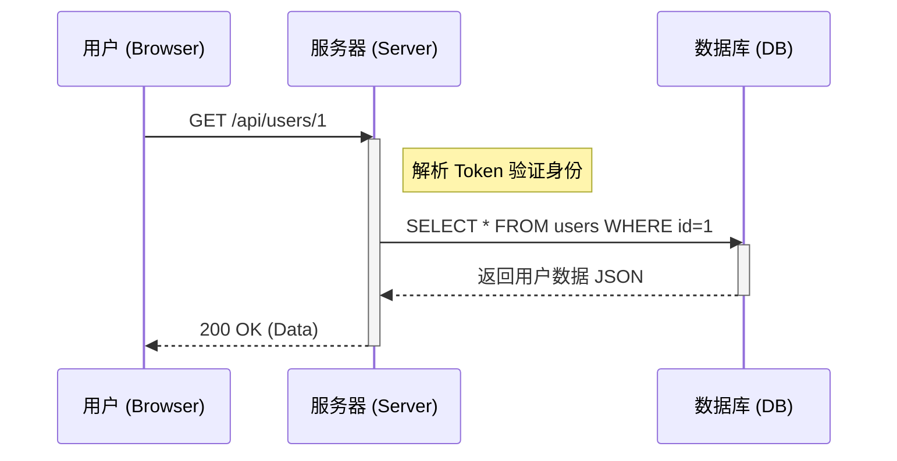
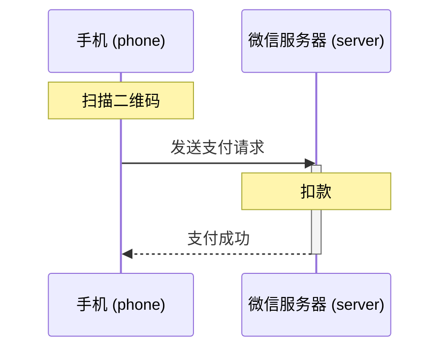
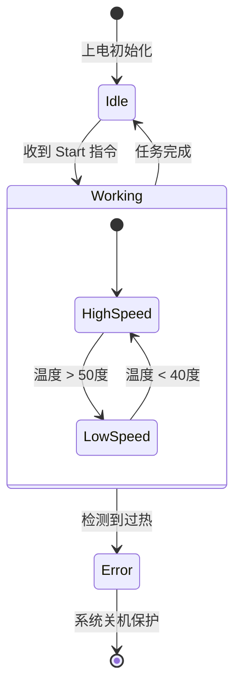
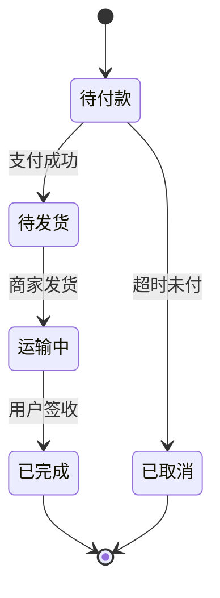

流程图

```mermaid
graph TD

    A(开始: 用户点击登录) --> B{输入格式正确?}
    B -- 是 --> C[发送 API 请求]
    B -- 否 --> D[显示错误提示 “格式无效”]
    C --> E{服务器响应 200?}
    E -- Yes --> F[登录成功, 跳转首页]
    E -- No --> G[显示后端返回的 ErrorMsg]
    G -.-> B
```
---

```mermaid
graph TD
A(开始：检查电源)-->B{电源亮了？}
B --没亮-->C[插电源]
B --亮了-->D[检查纸张]
D -->E{有纸吗？}
E --没有-->G[加纸]
E --有-->H[检查驱动]
```
---

```mermaid
sequenceDiagram
    participant U as 用户 (Browser)
    participant S as 服务器 (Server)
    participant D as 数据库 (DB)

    U->>S: GET /api/users/1
    activate S
    Note right of S: 解析 Token 验证身份
    
    S->>D: SELECT * FROM users WHERE id=1
    activate D
    D-->>S: 返回用户数据 JSON
    deactivate D

    S-->>U: 200 OK (Data)
    deactivate S
```
---
时序图

```mermaid
sequenceDiagram
    participant I as 手机 (phone)
    participant S as 微信服务器 (server)

    Note over I: 扫描二维码    

    I->>S: 发送支付请求

    activate S

    Note over S: 扣款

    S-->>I: 支付成功

    deactivate S

```

---
状态图

```mermaid

stateDiagram-v2
    [*] --> Idle: 上电初始化
    
    Idle --> Working: 收到 Start 指令
    Working --> Idle: 任务完成
    
    Working --> Error: 检测到过热
    Error --> [*]: 系统关机保护
    
    state Working {
        [*] --> HighSpeed
        HighSpeed --> LowSpeed : 温度 > 50度
        LowSpeed --> HighSpeed : 温度 < 40度
    }


```
---

```mermaid
stateDiagram-v2
[*] --> 待付款
待付款 --> 待发货: 支付成功
待发货 --> 运输中: 商家发货
运输中 --> 已完成: 用户签收
待付款 --> 已取消: 超时未付
已完成 --> [*]
已取消 --> [*]
```