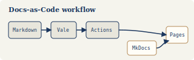
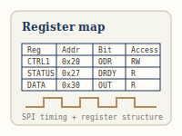
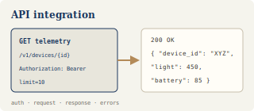

---
hide:
  - navigation
  - toc
---

# 作品总览

我整理这页时，最怕的一件事，是把做过的页面排得很满，读者进来以后仍要自己猜：这是什么文档，写给谁，又该从哪里开始看。

所以这里先回答一个更实际的问题：如果你想看我怎样处理某一类文档，应该点进哪一页。下面的内容都可以直接打开；模拟项目和个人原型会明确标出来。

## 我处理文档时，最常遇到的四类问题

- **让文档可以被检查和维护**

    我把 Markdown、Vale、GitHub Actions 和 MkDocs 串在一起，让写作规则、构建和发布不只停留在人工提醒里。

- **让读者第一次就能走通**

    写 Quick Start 和 Troubleshooting 时，我更关心读者会在哪一步犹豫、怎样确认成功，以及失败以后还能往哪里走。

- **把接口字段连成一次完整调用**

    Endpoint 和字段表只是基础。我会继续补上认证、请求示例、响应结果、错误处理和调试路径。

- **把密集资料整理成可查找的路径**

    面对数据手册、产品原型和用户流程，我会先找到读者要完成的任务，再决定哪些内容适合放进表格、图示、步骤和参考页。

## 按文档类型查看

    <section class="work-index-group">
        
01<h3>文档工程化</h3>

        
从写作规则到自动检查，关注文档怎样被长期维护。

        

            <a href="../01-automation/" class="work-index-item">项目概览<strong>文档质量自动化流水线</strong></a>
            <a href="../install/" class="work-index-item">Quick Start<strong>搭建本地文档质量检查环境</strong></a>
            <a href="../style-guide/" class="work-index-item">Style Guide<strong>技术文档写作风格指南</strong></a>
            <a href="../github-actions-workflow/" class="work-index-item">Workflow<strong>GitHub Actions 文档检查流程</strong></a>
            <a href="../troubleshooting/" class="work-index-item">Troubleshooting<strong>文档质量流水线故障排查</strong></a>
            <a href="../changelog/" class="work-index-item">Changelog<strong>文档项目更新记录</strong></a>
        

    </section>

    <section class="work-index-group">
        
02<h3>开发者与硬件文档</h3>

        
从第一次调用、第一次读取和第一个可运行示例进入技术细节。

        

            <a href="../02-hardware/" class="work-index-item">硬件文档 · 模拟<strong>XYZ-2024 数据手册重构</strong></a>
            <a href="../03-api/" class="work-index-item">API Guide · 模拟<strong>IoT 接口集成指南</strong></a>
            <a href="../04-openclaw-quickstart/" class="work-index-item">Quick Start · 模拟<strong>OpenClaw 开发者快速入门</strong></a>
        

    </section>

    <section class="work-index-group">
        
03<h3>产品与用户文档</h3>

        
围绕个人小程序原型，整理产品范围、用户操作和版本变化。

        

            <a href="../mini-programs/" class="work-index-item">产品文档集<strong>三个小程序产品总览</strong></a>
            <a href="../05-miniprogram-task-decomposer/" class="work-index-item">User Guide<strong>微步 ACTION 用户文档</strong></a>
            <a href="../05-miniprogram-task-decomposer/api-reference/" class="work-index-item">API Reference · 原型<strong>微步 ACTION API 参考</strong></a>
            <a href="../05-miniprogram-task-decomposer/prd/" class="work-index-item">PRD · 原型<strong>微步 ACTION 产品需求文档</strong></a>
            <a href="../05-miniprogram-task-decomposer/release-notes/" class="work-index-item">Release Notes · 原型<strong>微步 ACTION 版本日志</strong></a>
            <a href="../dot-collage/" class="work-index-item">截图型用户文档<strong>PopDots 波点拼贴帮助</strong></a>
            <a href="../photo-background/" class="work-index-item">截图型用户文档<strong>照片换底色小程序帮助</strong></a>
        

    </section>

    

        

            

                
                

                    

                        01
                        Docs-as-Code
                    

                    <h3 class="card-title">文档质量自动化流水线</h3>
                    
一个轻量级 Docs-as-Code 案例，展示文档如何被编写、检查、发布和持续维护。

                    

                        <strong>项目性质：</strong>个人搭建并持续维护的公开文档项目。
                        <strong>解决的问题：</strong>降低人工检查成本，提升术语、格式和发布流程的一致性。
                        <strong>目标读者：</strong>技术文档工程师、文档维护者、需要接入自动化检查的协作者。
                        <strong>交付物形式：</strong>项目概览、Quick Start、Style Guide、Workflow、Troubleshooting、Changelog。
                        <strong>主要证据：</strong>Vale 规则、GitHub Actions 工作流、故障排查和版本记录。
                    

                    

                        <a href="../01-automation/" class="action-link">项目概览 &rarr;</a>
                        <a href="../install/" class="action-link">Quick Start &rarr;</a>
                        <a href="../style-guide/" class="action-link">Style Guide &rarr;</a>
                        <a href="../github-actions-workflow/" class="action-link">Workflow &rarr;</a>
                        <a href="../troubleshooting/" class="action-link">Troubleshooting &rarr;</a>
                    

                

            

        

        

            

                
                

                    

                        02
                        Hardware Docs
                    

                    <h3 class="card-title">硬件数据手册重构</h3>
                    
把静态 PDF 数据手册中的 SPI 时序、寄存器信息和驱动配置，改写成适合开发者阅读和复用的 Web 文档。

                    

                        <strong>项目性质：</strong>基于虚构传感器 <code>XYZ-2024</code> 的模拟资料重构案例。
                        <strong>解决的问题：</strong>减少翻 PDF、手抄参数和误解时序图的成本。
                        <strong>目标读者：</strong>嵌入式开发者、硬件工程师、技术支持人员。
                        <strong>交付物形式：</strong>硬件资料重构、寄存器表、协议时序说明、C 代码示例。
                        <strong>主要证据：</strong>SPI 时序图、寄存器字段表、bit 定义和 C 初始化示例。
                    

                    

                        <a href="../02-hardware/" class="action-link">查看样稿 &rarr;</a>
                    

                

            

        

        

            

                
                

                    

                        03
                        API Docs
                    

                    <h3 class="card-title">IoT 接口集成指南</h3>
                    
模拟开发者通过 RESTful API 获取传感器数据的接入场景，覆盖认证流程、Endpoint、参数、响应和错误处理。

                    

                        <strong>项目性质：</strong>基于虚构 IoT 设备场景的模拟开发者文档。
                        <strong>解决的问题：</strong>让开发者知道一次完整 API 调用如何跑通和排错。
                        <strong>目标读者：</strong>前端 / 后端开发者、集成方、技术支持人员。
                        <strong>交付物形式：</strong>API Reference、开发者接入指南、错误码说明、curl 示例。
                        <strong>主要证据：</strong>OAuth 风格鉴权流程、请求与响应示例、错误码表和调试建议。
                    

                    

                        <a href="../03-api/" class="action-link">查看样稿 &rarr;</a>
                    

                

            

        

        

            

                
                

                    

                        04
                        Product Docs
                    

                    <h3 class="card-title">小程序产品文档集</h3>
                    
围绕 AI 任务拆解、照片换底色和波点拼贴工具，整理用户手册、PRD、API 参考、版本日志和截图型帮助文档。

                    

                        <strong>项目性质：</strong>基于个人小程序原型整理的产品文档集。
                        <strong>解决的问题：</strong>把可点击原型转化成可阅读、可维护、可交付的产品文档。
                        <strong>目标读者：</strong>C 端用户、产品协作者、面试官。
                        <strong>交付物形式：</strong>用户手册、PRD、Release Notes、产品说明、截图流程。
                        <strong>主要证据：</strong>真实操作截图、用户任务路径、PRD、API 参考和版本日志。
                    

                    

                        <a href="../mini-programs/" class="action-link">产品总览 &rarr;</a>
                        <a href="../05-miniprogram-task-decomposer/" class="action-link">用户文档 &rarr;</a>
                        <a href="../05-miniprogram-task-decomposer/api-reference/" class="action-link">API 参考 &rarr;</a>
                        <a href="../dot-collage/" class="action-link">PopDots &rarr;</a>
                        <a href="../photo-background/" class="action-link">照片换底色 &rarr;</a>
                    

                

            

        

    

    <a href="../" class="pager-link">返回首页</a>
    <a href="../case-studies/" class="pager-link pager-link-primary">下一篇：案例复盘</a>

