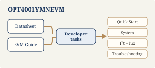
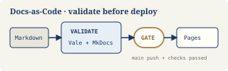

---
hide:
  - navigation
  - toc
---

# 作品总览

这页优先展示三个核心项目。它们分别对应一条求职证据链：读懂复杂技术资料、围绕用户任务设计文档、让文档可以持续检查和发布。模拟项目和个人产品会继续明确标注。

## 三个核心项目

    

        

            

                
                

                    

                        01
                        技术理解 · Hardware Docs
                    

                    <h3 class="card-title">硬件数据手册重构</h3>
                    
把模拟芯片资料中的 SPI 时序、寄存器信息和驱动配置，改写成开发者更容易查找和使用的 Web 文档。

                    

                        <strong>解决的问题：</strong>减少开发者翻找 PDF、手抄参数和拼接初始化顺序的成本。
                        <strong>主要交付物：</strong>项目概览、SPI 时序图、寄存器表、C 初始化示例和信息架构说明。
                        <strong>能证明的能力：</strong>硬件资料理解、技术信息提取、图表与代码说明、开发者任务组织。
                        <strong>项目边界：</strong>基于虚构传感器 <code>XYZ-2024</code> 的模拟重构案例。
                    

                    

                        <a href="../core-projects/hardware/" class="action-link action-link-primary">进入项目 &rarr;</a>
                    

                

            

        

        

            

                
                

                    

                        02
                        用户路径 · Product Docs
                    

                    <h3 class="card-title">小程序产品文档集</h3>
                    
以微步 ACTION 为主案例，把一个个人小程序组织成面向用户、产品判断和技术维护的文档集。

                    

                        <strong>解决的问题：</strong>让用户知道怎样开始和推进任务，也让协作者找到产品范围、流程和数据边界。
                        <strong>主要交付物：</strong>用户指南、PRD、系统流程、云函数调用说明、隐私边界和迭代记录。
                        <strong>能证明的能力：</strong>读者区分、任务导向写作、产品信息架构、代码与文档核对。
                        <strong>项目边界：</strong>微步 ACTION 为主案例，PopDots 和照片换底色为同组补充样本。
                    

                    

                        <a href="../mini-programs/" class="action-link action-link-primary">进入项目 &rarr;</a>
                    

                

            

        

        

            

                
                

                    

                        03
                        文档工程 · Docs-as-Code
                    

                    <h3 class="card-title">文档质量自动化流水线</h3>
                    
用 Vale、MkDocs 和 GitHub Actions 把写作检查、严格构建、验证和发布接进同一条工作流。

                    

                        <strong>解决的问题：</strong>让真实文档进入检查范围，并让部署明确等待验证结果。
                        <strong>主要交付物：</strong>项目概览、Quick Start、Style Guide、Workflow、验证结果、Troubleshooting 和 Changelog。
                        <strong>能证明的能力：</strong>Docs-as-Code、CI/CD、质量门禁、故障排查和证据核对。
                        <strong>项目性质：</strong>真实运行并持续维护的个人公开文档项目。
                    

                    

                        <a href="../01-automation/" class="action-link action-link-primary">进入项目 &rarr;</a>
                    

                

            

        

    

## 更多样本

- **IoT 接口集成指南**

    模拟一次 RESTful API 接入路径，覆盖认证、请求、响应、错误处理和调试建议。

    [查看样稿](03-api.md)

- **OpenClaw Quick Start**

    根据官方资料核验安装、首次配置、Gateway 和 Control UI 路径；未虚构本机端到端结果。

    [查看样稿](04-openclaw-quickstart.md)

想按文档任务查看单篇样稿，可以继续打开[写作样稿索引](writing-samples/index.md)。

    <a href="../" class="pager-link">返回首页</a>
    <a href="../case-studies/" class="pager-link pager-link-primary">下一步：案例复盘</a>

