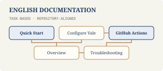

---
hide:
  - navigation
  - toc
---

# 作品总览

  
这里放的是我目前最核心的四个项目：硬件开发者文档、产品文档、Docs-as-Code 和英文开发者文档。

  
<strong>想看完整项目，可以从下面四个项目进入；想查看全部文档样稿，请看<a href="../writing-samples/">写作样稿索引</a>。</strong>

<h2>四个核心项目</h2>

<article class="project-card">
  

    
  

  

    
01 · 硬件开发者文档

    <h3 class="project-card__title">OPT4001YMNEVM 开发者文档重构</h3>
    
基于 TI 官方 Datasheet 与 EVM Guide，将器件资料重组为面向开发者任务的文档。

    

      Quick Start
      I²C
      Troubleshooting
    

    <a href="../02-hardware/" class="project-card__cta">查看项目 →</a>
  

</article>

<article class="project-card">
  

    
  

  

    
02 · 产品文档

    <h3 class="project-card__title">小程序产品文档集</h3>
    
从真实小程序原型出发，为用户、产品、开发和维护场景建立完整文档体系。

    

      User Docs
      PRD
      Technical Docs
    

    <a href="../mini-programs/action/" class="project-card__cta">查看项目 →</a>
  

</article>

<article class="project-card">
  

    
  

  

    
03 · Docs-as-Code

    <h3 class="project-card__title">文档质量检查自动化流水线</h3>
    
将 Vale、MkDocs 与 GitHub Actions 接入文档工作流，在部署前自动完成质量检查。

    

      Vale
      MkDocs
      GitHub Actions
    

    <a href="../01-automation/" class="project-card__cta">查看项目 →</a>
  

</article>

<article class="project-card">
  

    
  

  

    
04 · English Documentation

    <h3 class="project-card__title">GitHub REST API Developer Documentation</h3>
    
基于真实 GitHub REST API，完成经过验证的英文 Quick Start 与 Troubleshooting。

    

      REST API
      Quick Start
      Troubleshooting
    

    <a href="../core-projects/english-documentation/" class="project-card__cta">View project →</a>
  

</article>

<h2>快速看写作能力</h2>

如果时间有限，建议先看这三篇：

<ol class="featured-writing-list">
  <li>
    <a href="../02-hardware/">
      01
      
        <strong>采集第一组环境光数据</strong>
        硬件 Quick Start / 任务设计
      
    </a>
  </li>
  <li>
    <a href="../core-projects/english-documentation/github-rest-api/quickstart/">
      02
      
        <strong>Get repository details with the GitHub REST API</strong>
        English Quick Start / API documentation
      
    </a>
  </li>
  <li>
    <a href="../core-projects/english-documentation/github-rest-api/troubleshooting/">
      03
      
        <strong>Troubleshoot repository metadata requests</strong>
        English Troubleshooting / failure recovery
      
    </a>
  </li>
</ol>

<a href="../writing-samples/">查看全部写作样稿 →</a>

  <a href="../" class="pager-link">返回首页</a>
  <a href="../case-studies/" class="pager-link pager-link-primary">下一步：复盘与方法</a>

